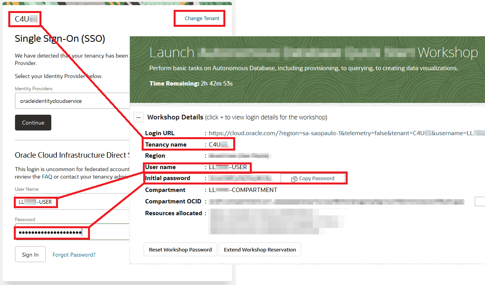
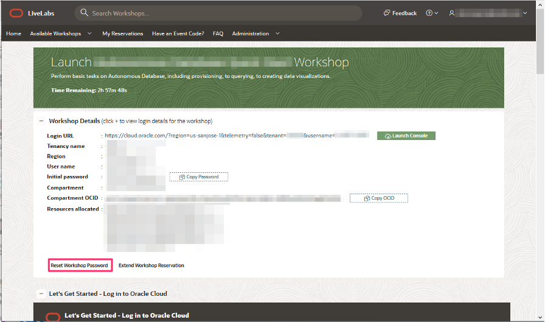

# I can't log into the Oracle Cloud account assigned in LiveLabs reservation?

Duration: 1 minute

Double-check that you are using the correct information and credentials provided to you in the workshop details section of your LiveLabs reservation. If you continue to have issues signing into the account, contact the Oracle LiveLabs support team.

## Details to provide to sign in to Oracle Cloud account

1. Navigate to **My Reservations** on [Oracle LiveLabs](http://developer.oracle.com/livelabs) home page.

2. Then click on **Launch Workshop** of your active reservation.

3. Make sure you use the tenancy, username, and password provided to you in the workshop details section of your reservation.

    

4.  If you have forgotten the Oracle cloud account password of your LiveLabs reservation, you can reset it to the default lab password provided in the workshop details section of the reservation.

    

## Learn More

* [Experience Oracle's best technology, live!](http://developer.oracle.com/livelabs)