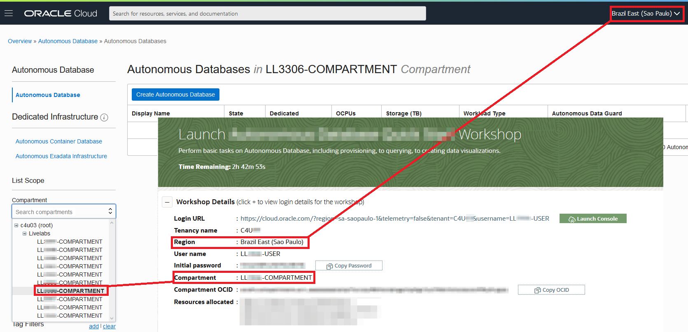

# I can't see my compartment assigned in the LiveLabs reservation?

Duration: 1 minute

## Navigate to the assigned compartment

Check if you are in the tenancy and region assigned to you in the LiveLabs reservation. If you continue to have issues signing into the account, contact the Oracle LiveLabs support team.

1.  Make sure you are in the assigned tenancy of your LiveLabs reservation.

2.  Then, under **List Scope**, copy and paste the compartment name in the **Compartment** drop-down and select the correct compartment provided to you from the compartment drop-down list.

    

3.  If you still can't find your compartment in the drop-down box, change your region to the one provided in the workshop details section of your reservation. Now, try checking for the compartment by following step 2.

## Learn More

* [Experience Oracle's best technology, live!](http://developer.oracle.com/livelabs)