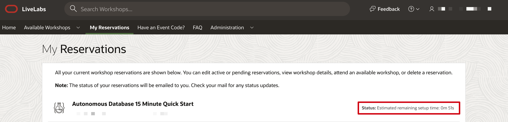

# How can I check my Oracle LiveLabs reservation status?

Duration: 1 minute

You can always check your workshop reservation status or the estimated time to complete provisioning at any point in time after you have requested the reservation.

## Check your reservation status

1. Navigate to **My Reservations** on [Oracle LiveLabs](http://developer.oracle.com/livelabs) home page.

2. Look at the status of the workshop reservation you requested.

    

## Learn More

* [Experience Oracle's best technology, live!](http://developer.oracle.com/livelabs)