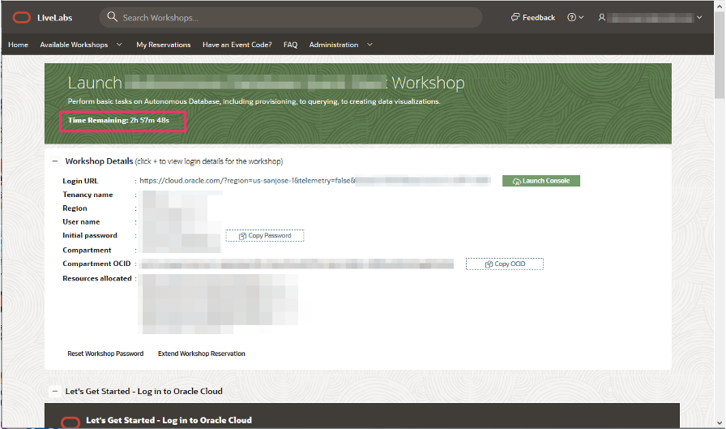

# How can I check the time remaining for my Oracle LiveLabs reservation?

Duration: 1 minute

You can always check the time remaining on your active reservation at any point in time during your workshop execution.

## Check time remaining on your reservation

1. Navigate to **My Reservations** on [Oracle LiveLabs](http://developer.oracle.com/livelabs) home page.

2. Then click on **Launch Workshop** of your active reservation for which you want to check the time remaining on the reservation.

3. Look at the **Time Remaining** below the workshop title and description.

    

## Learn More

* [Experience Oracle's best technology, live!](http://developer.oracle.com/livelabs)