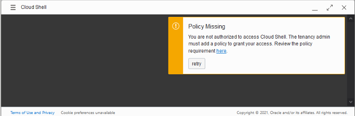

# I get an unauthorized message while accessing Cloud Shell; what do I do?

Duration: 1 minute

## Navigate to the assigned compartment

For LiveLabs users, Cloud Shell access is restricted to the compartment assigned to the user. You get the unauthorized error if you are not in the compartment assigned to you.

Error:

1.  Make sure you set your region to the one provided in the workshop details section of your reservation.

2.	Then, under **List Scope**, copy and paste the compartment name in the **Compartment** drop-down and select the correct compartment provided to you from the compartment drop-down list.

    

3.	In the compartment, click the resource assigned to you and click **Retry** in Cloud Shell to connect.

## Learn More

* [Experience Oracle's best technology, live!](http://developer.oracle.com/livelabs)