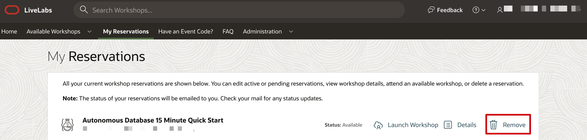
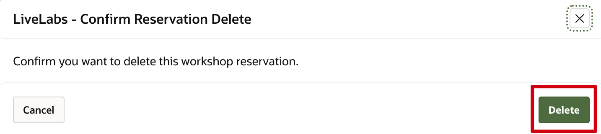

# How can I delete my Oracle LiveLabs reservation?

Duration: 1 minute

You can delete a completed workshop or your active reservation at any point in time during your workshop execution.

## Delete your reservation

1. Navigate to **My Reservations** on [Oracle LiveLabs](http://developer.oracle.com/livelabs) home page.

2. Then click on **Remove** of your active reservation or the completed workshop you want to delete from your My Reservations page.

    

3. On the dialog box, confirm to delete your reservation by clicking on **Delete**.

    

## Learn More

* [Experience Oracle's best technology, live!](http://developer.oracle.com/livelabs)