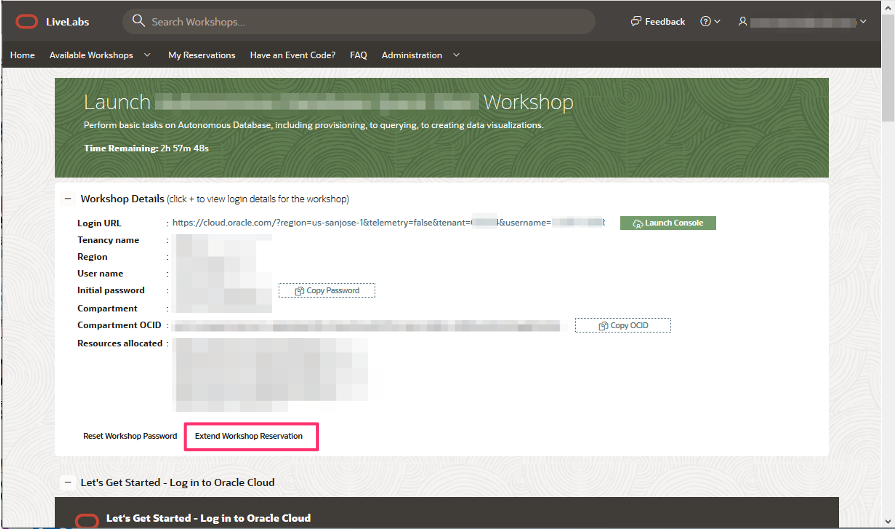

# How can I extend my Oracle LiveLabs reservation?

Duration: 1 minute

You can extend your active reservation by up to two times the original allotted time.

## Extend your reservation

1. Navigate to **My Reservations** on [Oracle LiveLabs](http://developer.oracle.com/livelabs) home page.

2. Then click on **Launch Workshop** of the active reservation you want to extend.

3. Now, click on **Extend Workshop Reservation** to extend your reservation.

    

## Learn More

* [Experience Oracle's best technology, live!](http://developer.oracle.com/livelabs)