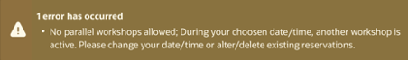

# How many reservations can I have at a time?

Duration: 1 minute

You can only have one reservation at a time.

If you try to reserve a workshop by clicking on the **Reserve Workshop on LiveLabs** button while having another active reservation running (in Available state), you will get an error.

Error:

You can always delete your active reservation at any point during your workshop execution and request a new reservation.
