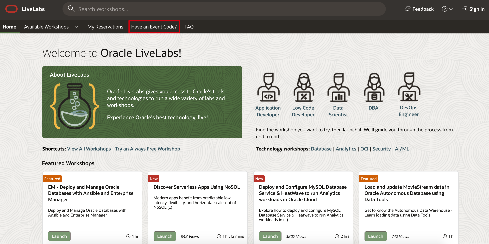
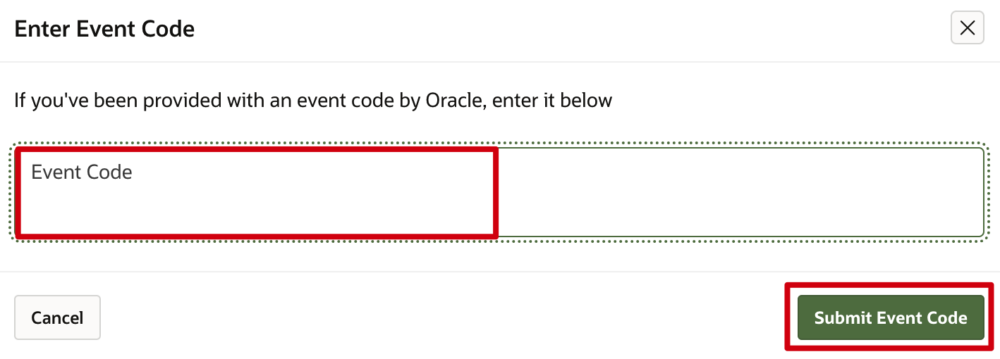

# Where do I insert the event code?

Duration: 1 minute

## Insert event code

1. If you have been provided with an event code by Oracle, navigate to the [Oracle LiveLabs]((http://developer.oracle.com/livelabs)) home page.

2.  Click on **Have an Event Code?**

    

3.  Type or paste your 16 characters' alphanumeric event code (format - XXXX-XXXX-XXXX-XXXX) in the Enter Event Code dialog box and click on **Submit Event Code** to access the workshop of the event.

    

## Learn More

* [Experience Oracle's best technology, live!](http://developer.oracle.com/livelabs)