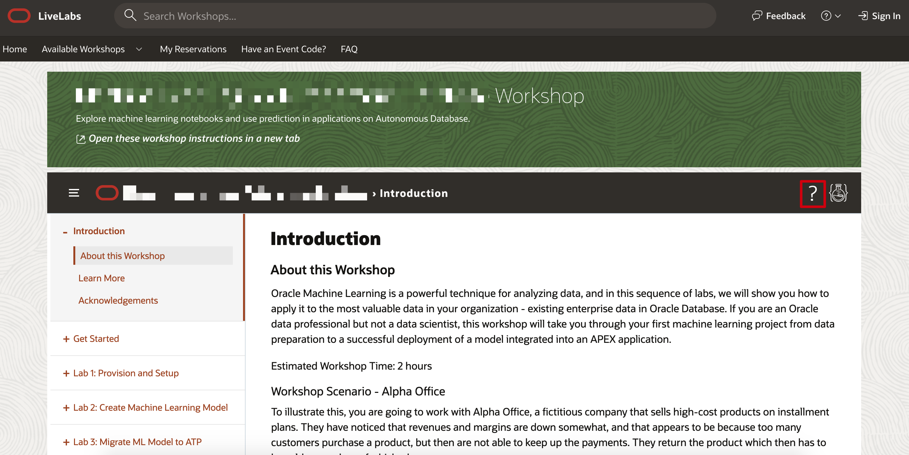
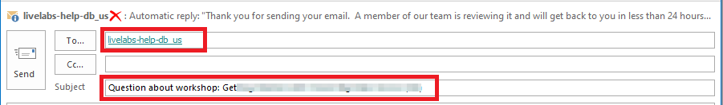
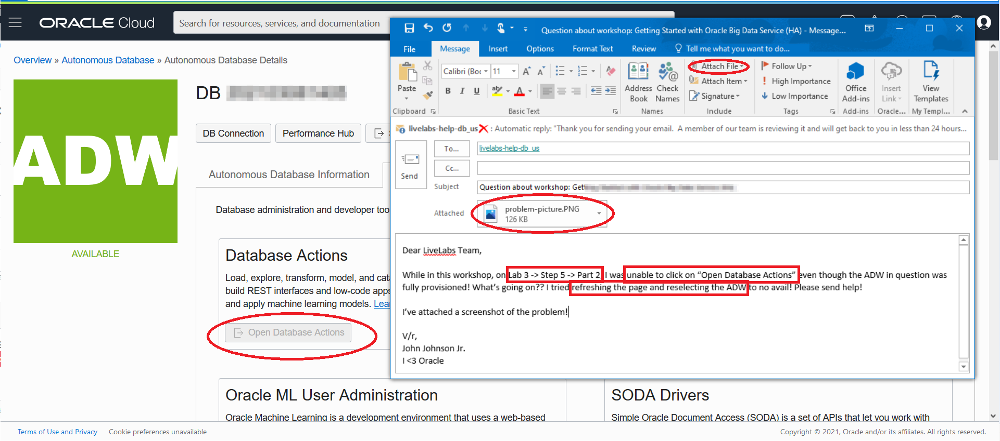

# How can I request support from the Oracle LiveLabs team?

Duration: 1 minute

If you find yourself stuck in a workshop or would like to report an issue with the workshop or have any concerns with the workshop, you can always request support from the Oracle team by sending an email.

Follow the steps below to contact us and get a quick resolution to your issue.

## Request support

1. In your workshop, click the question mark icon on the upper left corner to contact the LiveLabs team directly via email.

    

2. This will construct an email in your default mail application that is auto-populated to the email address of our LiveLabs support inbox and will also include your current workshop title in the subject line.

    

3. Do not change the subject line of the email. This will help us identify the workshop you are looking for help.

4. In the body of your email, include the **Lab Number**, **Task Number**, and **Step Number** where you have encountered the issue or have concerns.

5. In addition to the details above, provide a detailed description of your issue or concern and any pertinent information in the contents on your email.

6.  Attach a **Screenshot** and **Any Troubleshooting Steps** you have tried so that we can recreate the issue and provide a timely and accurate solution.

    

7.  A member from the Oracle LiveLabs team will review your email and will get back to you in less than 24 hours. Responses may be delayed on the weekends.

## Learn More

* [Experience Oracle's best technology, live!](http://developer.oracle.com/livelabs)