# How do I create alerts on logs with Logging Analytics?

Estimated Time: 10 minutes.

To set up an alarm, you must first create a detection rule to detect an event. The detected events can emit metrics to the Monitoring service. Managing alarms is part of the Monitoring service. Ensure that the required IAM policies are present when you create a detection rule, which will be sufficient to use the alarm feature in the Monitoring service.

## Create an alarm

1. Navigate to **Create Alarm Page**:

    * From **Navigation Menu**  > **Observability & Management** > **Logging Analytics** > **Administration** > **Detection Rules box** > **Center of box**.
    
    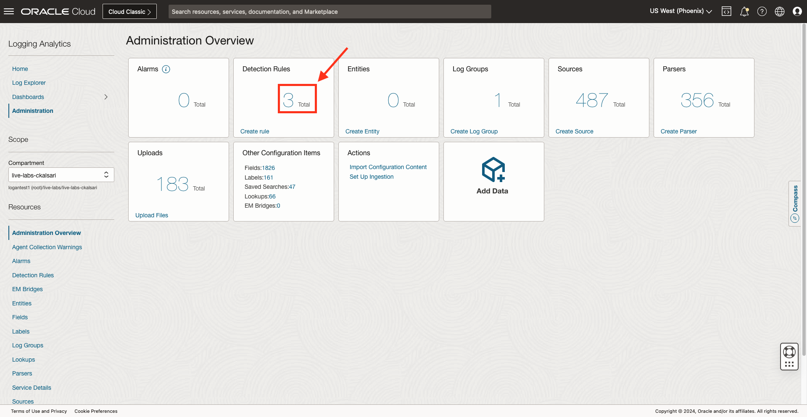

    * For example, select **Livelab\_detection\_rule**, made in [How do I create and trigger an ingest time detection rule in Logging Analytics?](?lab=sprint-create-and-trigger-ingest-time-detection-rule).
        

    * Click on the **Create Alarm** button, as seen in the figure. The Create Alarm dialog box opens.
    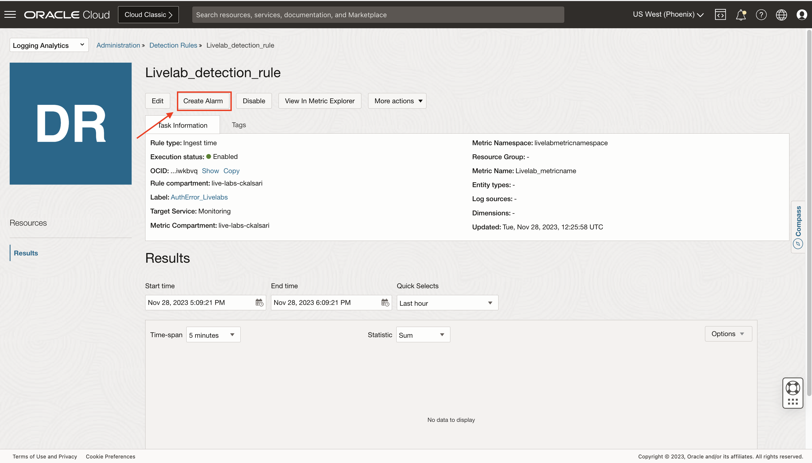

2. Specify the **Alarm name**. For example, **"Livelab_alarm"**.

3. For **Alarm severity**, select the perceived type of response required when the alarm is in the firing state. There are four options for it:
    * Critical (by default)
    * Error
    * Warning
    * Info

4. (Optional) For **Alarm body**, enter the human-readable content of the notification.
It is recommended to guide operators in resolving the alarm condition.

5. (Optional) In the **Tags (optional)** area, enter one or more tags for the alarm.
If you have permission to create a resource, you can also apply free-form tags to that resource. To apply a defined tag, you must have permission to use the tag namespace. If you're unsure whether to apply tags, skip this option or ask an administrator. You can apply tags later.
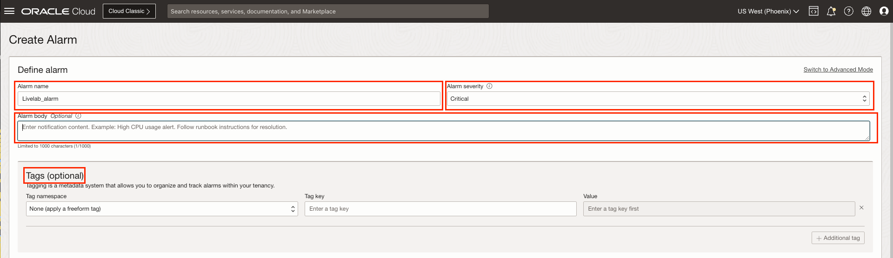

6. In the **Metric description** area, enter values to specify the metric to evaluate for the alarm.

    1. **Compartment:** Select the compartment containing the resources that emit the metrics evaluated by the alarm. The selected compartment is also the storage location of the alarm. By default, the first accessible compartment is selected.
    2. **Metric namespace:** Select the service or application that emits the metrics for the resources you want to monitor. The Metric namespace list shows metric namespaces for the selected compartment. You selected **"**livelabmetricnamespace"**, which you created while creating a detection rule.
    3. (Optional) **Resource group:** Select the group that the metric belongs to. A resource group is a custom string provided with a custom metric and does not apply to service metrics.
    4. **Metric name:** Select the name of the metric that you want to evaluate for the alarm. You selected **"**Livelab_metricname"**, which you created while creating the detection rule.
    5. **Interval:** Select the aggregation window or the frequency at which data points are aggregated. You can create a custom interval, for example, 15 minutes if needed.
    6. **Statistic**: Select the function to use to aggregate the data points.
        * Mean - The value of Sum divided by Count during the specified time period.
        * Rate - The per-interval average rate of change.
        * Sum - All values added together.
        * Max - The highest value observed during the specified time period.
        * Min - The lowest value observed during the specified time period.
        * Count - The number of observations received in the specified time period.
        * P50 - The value of the 50th percentile.
        * P90 - The value of the 90th percentile.
        * P95 - The value of the 95th percentile.
        * P99 - The value of the 99th percentile.

    For example, select **count** statistic, which will tell the count of Livelab_label in logs.

    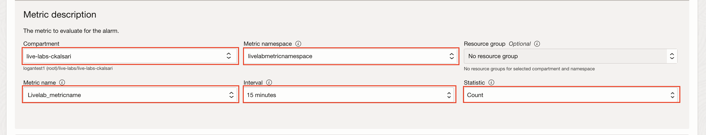

7. In the **Metric dimensions** area, specify optional filters to narrow the metric data that's evaluated.
    * **Dimension value:** Select the value to use for the specified dimension.
    * **Additional dimension:** Add another name-value pair for a dimension, as needed.
    * **Aggregate metric streams:** Select this check box to return the combined value of all metric streams for the selected statistic.

    Let's say we provide an extra dimension name as **"label"**, which has Dimension value as **"AuthError_Livelabs"**.
    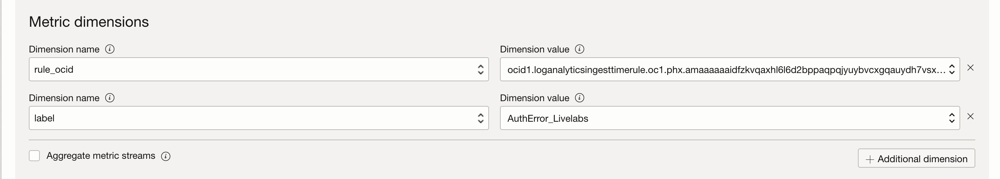

    >**NOTE :** Metric dimension must have **"rule_ocid"** as one dimension or else this alarm will not be of Logging Analytics and will not show in firing alarm page.

8. In the **Trigger rule** area, specify the condition that must be satisfied for the alarm to be in the firing state.
    * **Operator:** Select the operator to use in the condition threshold.
    * **Value:** Enter the value to use for the condition threshold. For the between and outside operators, enter both values for the range.
    * **Trigger delay minutes:** Enter the number of minutes the condition must be maintained before the alarm is in the firing state.
    Let's say, you have selected operator as **"greater than or equal"**, value as **"30"**, and trigger delay minutes as **"1"**. So, the alarm will be triggered when the count of "AuthError_Livelabs" is greater than or equal to 30 with a delay of 1 minute.
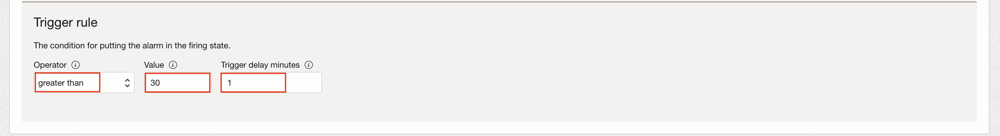

9. In the **Destination area** under **Define alarm notifications**, select the provider of the destination to use for alarm notifications.
    1. **Destination service:** Select one of the following values:
        * **Notifications:** Send alarm notifications to a topic. Each subscription in the topic receives an alarm message.
        * **Streaming:** Send alarm messages to a stream.
        Let's say you want to send Notifications.
    2. **Compartment:** Select the compartment containing the resources that emit the metrics evaluated by the alarm. The selected compartment is also the storage location of the alarm. By default, the first accessible compartment is selected.
        * Stream (for Streaming only): The stream to use for alarm notifications.
        * Topic (for Notifications only): The topic to use for notifications. You can create topics if there are no topics—for example, **Topic_Livelab**.
    3. To create a new topic (and a new subscription) in the selected compartment, click **Create a topic** and then enter the following values:
        * **Topic name:** A user-friendly name for the topic.
        * **Topic description:** Description of the new topic.
        * **Subscription protocol:** Medium of communication to use for the new topic. Select the type of subscription that you want to create, then enter values in the associated fields. For details about each subscription type, click the links.
            1. Email: Enter an email address.
            2. Function: Select the compartment and application containing the function that you want, and then select the function.
            3. HTTPS (Custom URL): Enter the URL you want to use as the endpoint.
            4. PagerDuty: Enter the integration key portion of the URL for the PagerDuty subscription.
            5. Slack: Enter the Slack endpoint, including the webhook token.
            6. SMS: Select the country for the phone number, and then enter the phone number.
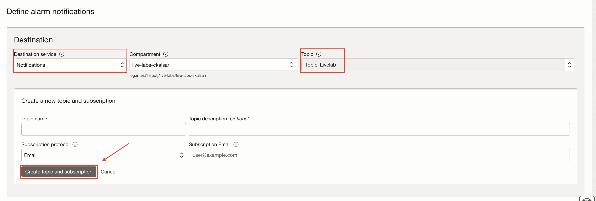

10. For **Message grouping**, select one of the following options.
    * **Group notifications across metric streams:** Collectively track metric status across all metric streams. Send a message when metric status across all metric streams changes.
    * **Split notifications per metric stream:** Individually track metric status by metric stream. Send a message when metric status for each metric stream changes.

11. For **Message Format**, select an option for the appearance of messages you receive from this alarm (for Notifications only).
    * **Send formatted messages:** Simplified, user-friendly layout. To view supported subscription protocols and message types for formatted messages (options other than Raw), see Friendly formatting.
    * **Send Pretty JSON messages (raw text with line breaks):** JSON with new lines and indents.
    * **Send raw messages:** Raw JSON blob.

12. (Optional) If you want to receive notifications at regular intervals when the alarm is firing, select **Repeat notification?** and then select **Notification frequency** to wait before resending the notification.
(Optional) To suppress evaluations and notifications for a specified length of time, select **Suppress notifications**. This option helps avoid alarm notifications during system maintenance periods. Specify a start time, end time, and an optional description.

13. (Optional) To save the alarm without starting to evaluate metric data, clear the **Enable this alarm?** check box.
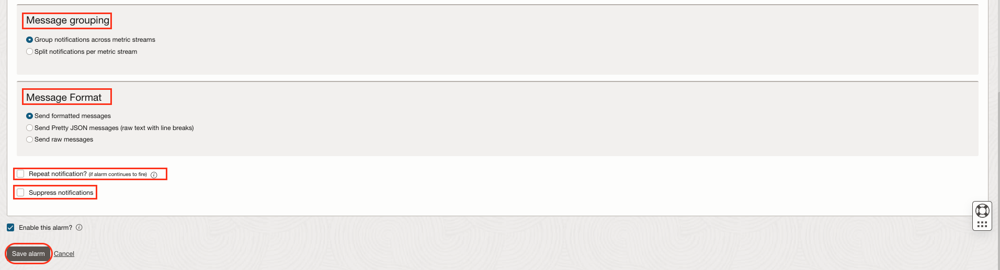

14. Click **Save alarm**.

The **Alarm Definitions** page lists the new alarm. If the alarm is enabled, then Monitoring begins evaluating the configured metric, sending alarm messages when the metric data satisfies the trigger rule.

## Upload a file

To verify the alarm, you need to upload log records, which will be parsed by the parser, attaching a label to the log record that satisfies the condition. The detection rule will detect the label and post the data into metric. The alarm will be triggered when the metric data meets the trigger rule.

1. Upload some log records to the console so that it will get parsed, the label will get attached to it as per the condition, and it will get detected in the detection rule.

2. You will use log records on which the **livelab\_mushop\_api\_logs** parser is created.

3. Navigate to **OCI Cloud Shell**, as shown in the image.


4. Run the following commands in **OCI Cloud Shell**.

    ```script
    <copy>
    mkdir Livelab_Lab_08
    cd Livelab_Lab_08
    python <(curl -s https://raw.githubusercontent.com/oracle-quickstart/masteroci-observability-and-management/master/utils/api-logs-generator.py)
    </copy>
    ```

5. A file named **livelab\_logs.txt** is created at the location where python script is executed. This file will contain 1000 random log records, generated in intervals of your current UTC and 2 hours before your current UTC.

6. Run the following command in **OCI Cloud Shell**,

    ```text
    <copy>
    python <(curl -s https://raw.githubusercontent.com/oracle-quickstart/masteroci-observability-and-management/master/utils/upload-logs-file-to-oci.py) -f ~/Livelab_Lab_08/livelab_logs.txt -s livelab -l Livelab_source -n Livelab
    </copy>
    ```

    where,
    * -f : file location
    * -s : file name (Give any name)
    * -l : source to be associated with the uploaded file (Livelab_source was created in **Task: 5**)
    * -n : name of upload (Give any name)

7. Script will ask for an index of compartment where to upload file. Make sure the source and log group are in the same compartment.

8. Script will ask for an index of the log group present in the compartment. If there are no log groups, it will ask to create a new log group, enter **"y"**.

9. If you entered **"y"**, repeat the **Step 5 and Step 6**, and you will see a log group named **Live Labs Log Group** created, provide the index 0 in OCI Shell.

10. The file will get uploaded.

## Verify an alarm

1. From **Navigation Menu**  > **Observability & Management** > **Logging Analytics** > **Administration** > **Alarms box**.
    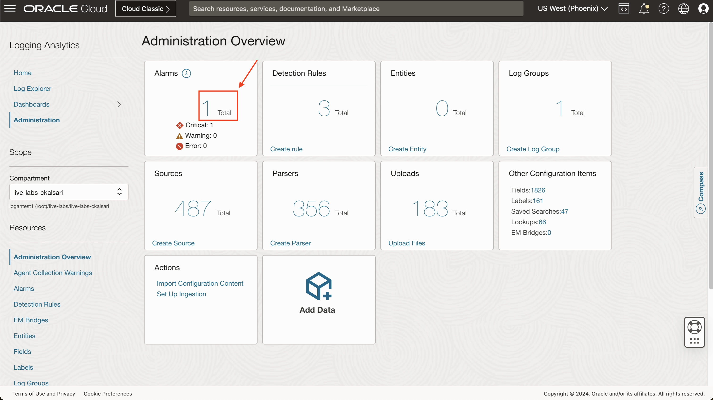

    >**NOTE :** Wait for 1-2 minutes, to trigger an alarm after uploading the file, keep on refreshing the page.

2. **Firing alarm** page will appear. It will show all fired alarms of Logging Analytics. Click on **Livelab\_alarm**.
    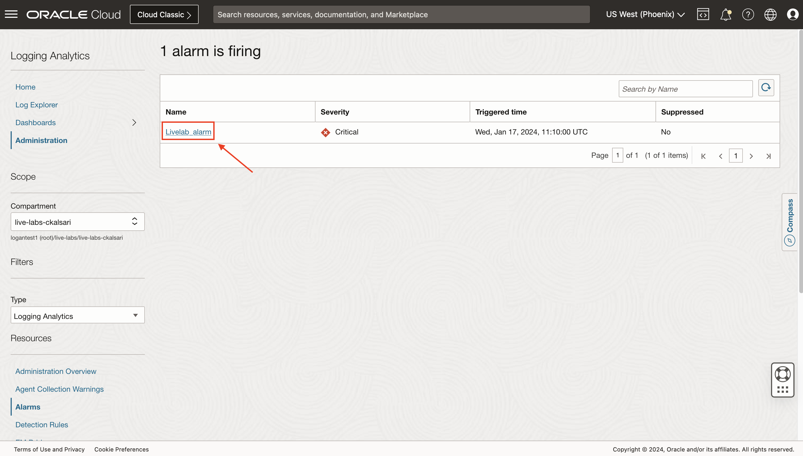

3. All the information regarding the alarm will be shown there. You can change **Quick select** based on the requirement. The graph will show the details. You can hover over the graph know in details. Click on **Show Data Table** to see the timestamp and value.
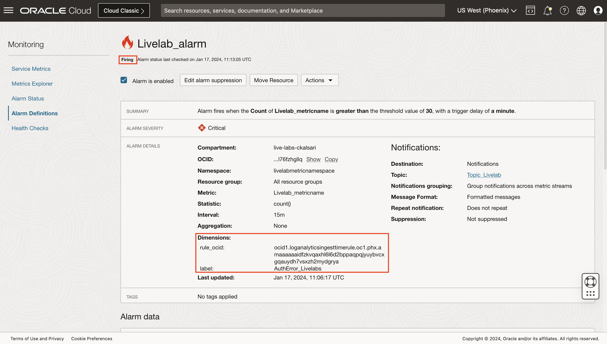

4. Details of logs can be seen from the last six hours. Your threshold value was 30. The value of **AuthError_Livelabs** label can be seen every 15 minutes from 09:00:00 UTC to 11:15:00 UTC. Initially, the alarm was in **Ok** state, then the alarm went into firing state.
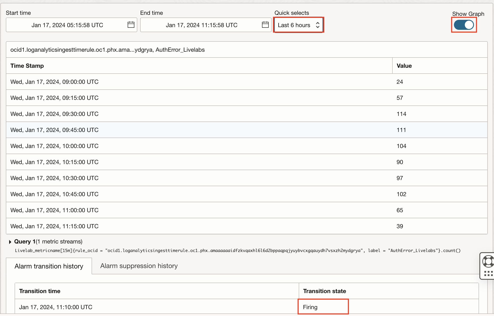

5. Hence, the alarm is verified.

## Learn More

[Updating an Alarm] (<https://docs.oracle.com/en-us/iaas/Content/Monitoring/Tasks/update-alarm.htm#top>)

[Viewing an Alarm Metric Chart] (<https://docs.oracle.com/en-us/iaas/Content/Monitoring/Tasks/create-edit-alarm-chart.htm#top>)

[Example Alarm Messages] (<https://docs.oracle.com/en-us/iaas/Content/Monitoring/alarm-message-examples.htm>)

[Best Practices for Your Alarms] (<https://docs.oracle.com/en-us/iaas/Content/Monitoring/Concepts/alarmsbestpractices.htm>)

[Suppressing an Alarm] (<https://docs.oracle.com/en-us/iaas/Content/Monitoring/Tasks/add-alarm-suppression.htm>)

## Acknowledgements

* **Author** - Chintan Kalsaria, OCI Logging Analytics
* **Contributors** -  Chintan Kalsaria, Kiran Palukuri, Ashish Gor, Kumar Varun, OCI Logging Analytics
* **Last Updated By/Date** - Chintan Kalsaria, Jan 2024
