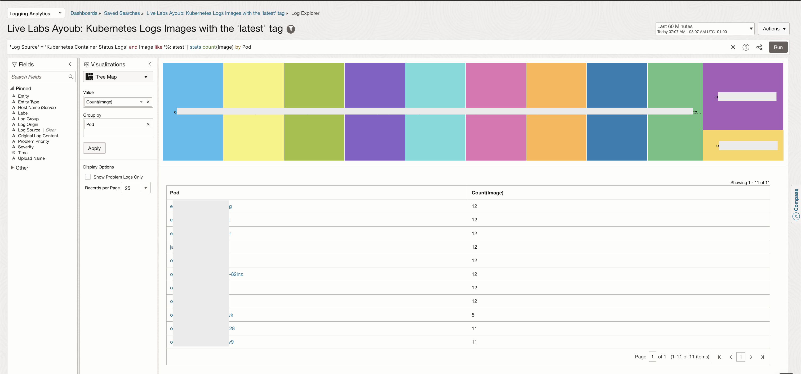
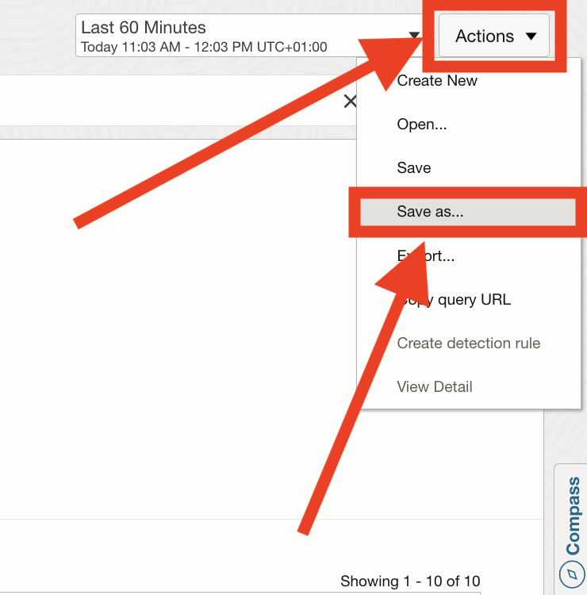
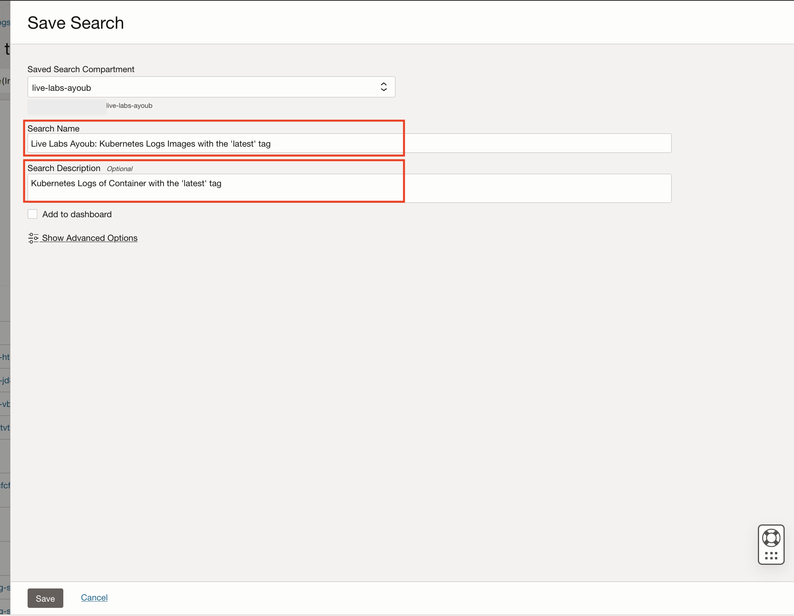
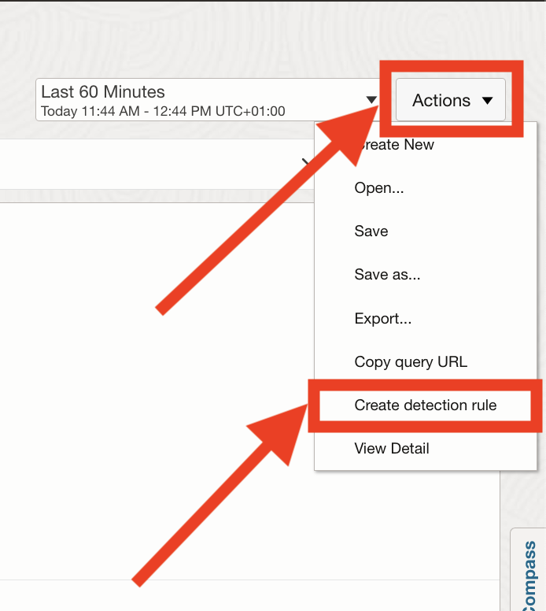
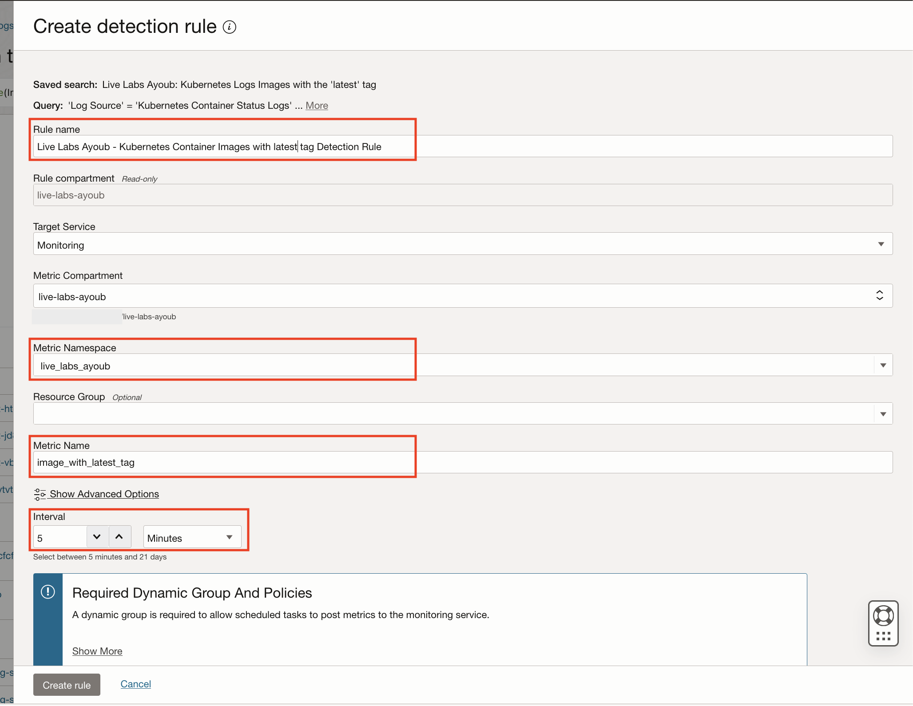
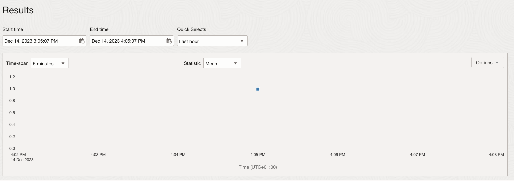
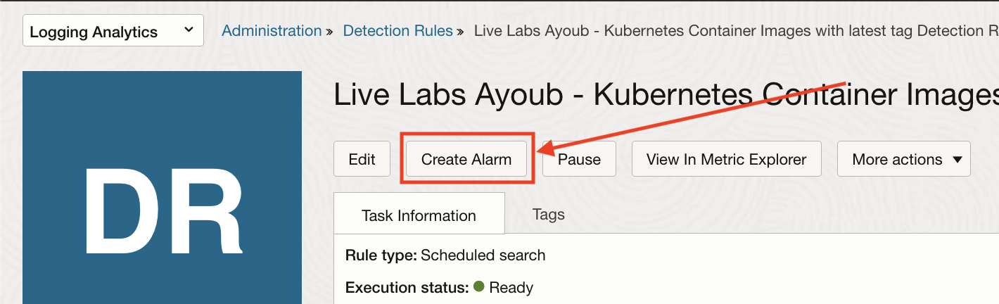

# How do I generate an alert for detecting changes in Kubernetes Workloads Image Pull Policy and ensuring policy compliance using Logging Analytics?

Duration: 15 minutes

This lab will walk you through the steps to create schedule tasks to detect when a **Container Image is Pulled with the latest Tag**.
This lab explains how to schedule search tasks to identify if a container image was pulled manually in Kubernetes.

The images pulled by Kubernetes can be found in the Oracle **"Kubernetes Event Object Logs"** out-of-the-box source. These logs can be monitored from the Log Explorer.

1. Navigate to the Log Explorer (Refer to [How to use Log Explorer for analytics and visualizations?](?lab=sprint-log-explorer-for-analytics-and-visualizations) for more info) and run this query:

    ```MQL
      <copy>
      'Log Source' = 'Kubernetes Container Status Logs' and Image like '%:latest' | stats count(Image) by Pod, Container
      </copy>
    ```

  

  **P.s:** If you can't see any results, this is probably because you still have no Kubernetes logs of containers using images with "latest" tag ingested.
2. Save the log explorer search by clicking on "Actions" and Selecting "Save As..."
  
3. Fill the name, the description and Click on "Save":
  
4. Create a Scheduled Detection Rule by clicking on "Actions" and Selecting "Create detection rule":
  
5. Fill the Detection Rule form showing up (Refer to [How to create and trigger an ingest time detection rule?](?lab=sprint-create-and-trigger-ingest-time-detection-rule) for more details):
  

Prepare the logs to upload and trigger the Detection Rule making its metrics available to the alarms service:

1. Open your OCI Cloud Shell Console.
2. In your console, Navigate to a directory you have the read/write/execute access to and Paste and run this command:

     ```bash
      <copy>
        source <(curl -s https://raw.githubusercontent.com/oracle-quickstart/oci-observability-and-management/master/utils/create-sprint-container-image-pulled-manually-logs-script.sh) > kubernetes-live-labs-logs.json && python <(curl -s https://raw.githubusercontent.com/oracle-quickstart/oci-observability-and-management/master/utils/upload-logs-file-to-oci.py) -s "kubernetes-live-labs-logs.json" -n "Live Labs Upload - You can delete it once you are done" -l "Kubernetes Container Status Logs" -f "kubernetes-live-labs-logs.json"
      </copy>

    ```

    **Explanation:** This script generates dummy logs into a new file & uploads them into your OCI Logging Analytics Service to trigger your Detection Rule.

    Once successfully triggered, the results section of your Detection rule page should show a graph similar to this one:
    

Create the alarm from the Detection Rule:

1. Create the alarm (Refer to [How to create alerts on logs with Logging Analytics?](?labs=sprint-alerts-on-logs-with-logging-analytics) for how to do so):
  

2. Fill the Alarm Form (Refer to [How to create alerts on logs with Logging Analytics?](?labs=sprint-alerts-on-logs-with-logging-analytics) for more info), Be sure to set:
    - The Metrics Interval to: 1 minute
    - The Statistic to: count
    

3. To verify your alarm, repeat the **"Step 6."** to re-upload the script and wait for the notification.

## Learn More

- [Detect Predefined Events at Ingest Time](https://docs.oracle.com/en-us/iaas/logging-analytics/doc/detect-predefined-events-ingest-time.html#GUID-D28CF994-288F-48C3-8CE5-28CE29C3482C)

## Acknowledgements

- **Author:** Ayoub BELMEHDI, OCI Logging Analytics

- **Contributors:** Ashish GOR, Kiran PALUKURI, Vikram REDDY, Kumar Varun, OCI Logging Analytics

- **Last Updated By/Date:** Ayoub BELMEHDI, October 2023
