# How do I create alerts on statistical outliers and deviations with Logging Analytics?

Estimated Time: 10 minutes.

You will create an alarm for a real-life application. The API logs used in this lab will be classified into **Livelab Passed API** and **Livelab Failed API**. An alarm will be triggered at 15-minute intervals if more than 30% of Livelab Failed APIs exist.

## Create labels

You will create two labels, one labeled as **Livelab Passed API** and the other as **Livelab Failed API**. Using these two labels, you will create a detection rule for each. From the two detection rules, you will generate an alarm.

1. From **Navigation Menu**  > **Observability & Management** > **Logging Analytics** > **Administration** > **Sources box**.
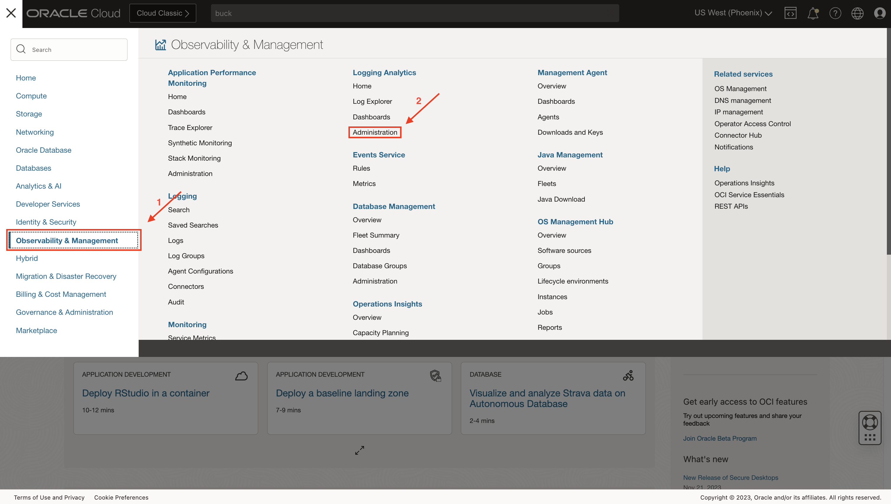
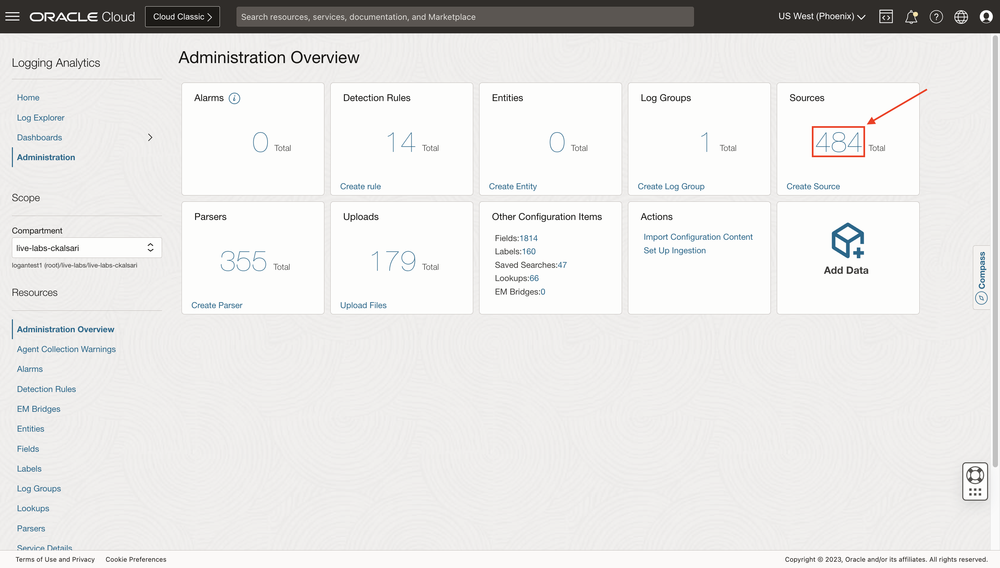

2. Search for **Livelab API Mushop Log Source**, created in [How do I create a user-defined source in Logging Analytics?](?lab=sprint-create-source). Click on it.

3. Click on **Edit** button.
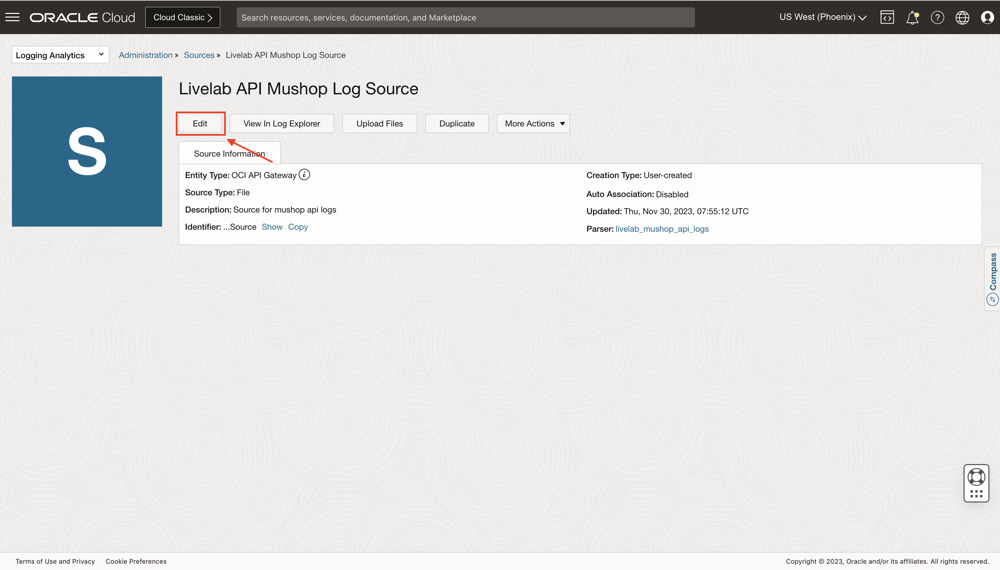

4. Click on **Labels**, to add a label. Click on **Add conditional label**.
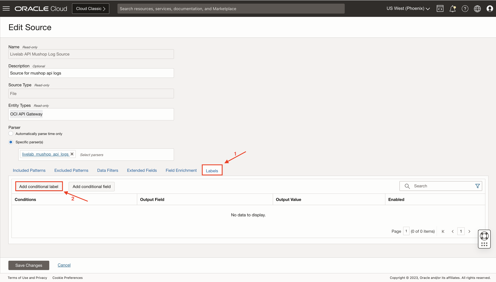

5. You will create a label for Failed API. In the Conditions section:
    * Select the log field to apply the condition from the Input Field list. Select **Status** from the dropdown list.
    * Select the operator from the Operator list. Select **Contains** or **Equals**. Both can be used in the given use case.
    * In the Condition Value field, specify the value of the condition to be matched for applying the label. For failed APIs, values of Status can be **401, 400, 404, 406, 408**, which we extracted using parsers from log records.
    * Under Actions, select from the already available Oracle-defined or user-created labels. If required, you can create a new label by clicking **Create Label**.
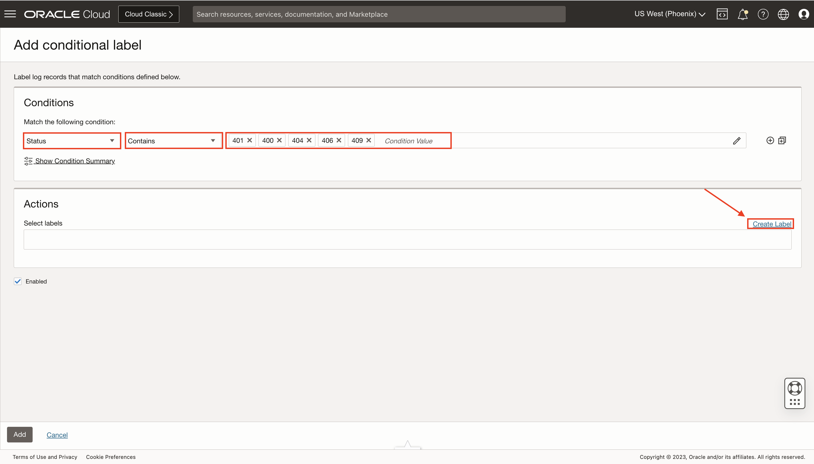

6. **Create Label** dialog box will appear. Fill in the details:
    * **Label Name:** Enter the label name—for example, **Livelab Failed API**.
    * (Optional) **Description:**  Enter the details about the label.
    * Labels can be marked as a problem with a priority to make those log entries more prominent in the Log Explorer. To assign priority to the label, under Livelab Failed API, select **Yes** check box.
    * In the Problem Priority field, click the down arrow and select a priority. For example, choose **Medium**.
    * A log entry will be assigned a problem priority based on the labels that get attached to the log entry. In this case, if Livelab Failed API has a problem priority of Medium, any log entry that matches a condition such that it gets the Livelab Failed API label would have a problem priority of Medium.
    * In the **Related Terms** field, enter the related terms into the log entry.
    * Click on **Create**.
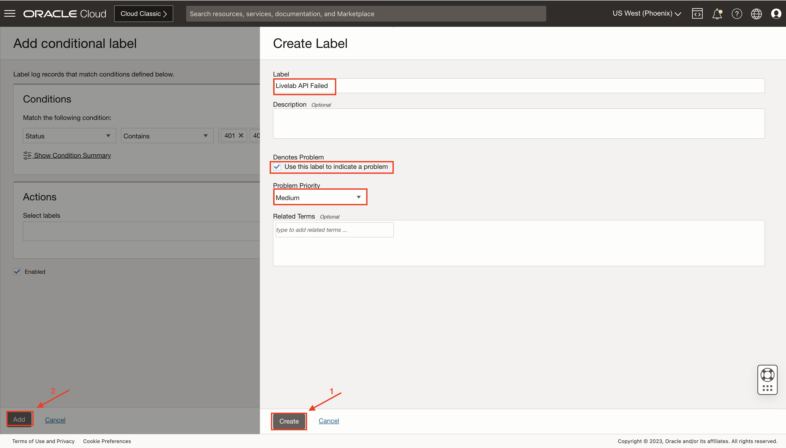

7. Similarly, add another label named **Livelab API Passed**. Uncheck the **Use this label to indicate a problem**, as there are no problems for passed APIs. For adding condition:
    * If the **Status** does not contain or is not equal to **401, 400, 404, 406, 408**, the log record can be labeled as passed.
    * Select **Status** from the dropdown list in the Input Field List. Select **Not Contain** operator. Add **401** as the condition value.
    * **Not Contain** operator only allows for one value, so add more conditions by clicking the Add Condition icon, marked as 2 in the image below.
    * Select the logical operation to apply on the multiple conditions. Select **AND**.
    * Similarly, add other four conditions where Status does not contain **406,409,400,404**.
    * Click on **Add**.
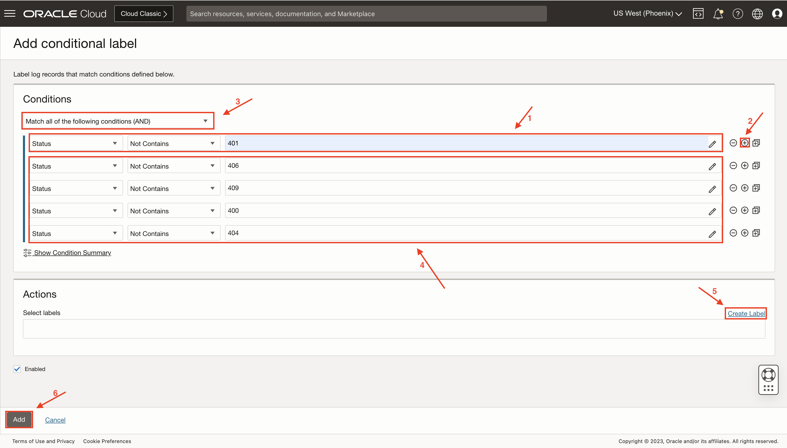

8. In the **Edit Source**, you will be able to see the two conditions with their associated label. Click on **Save Changes**.
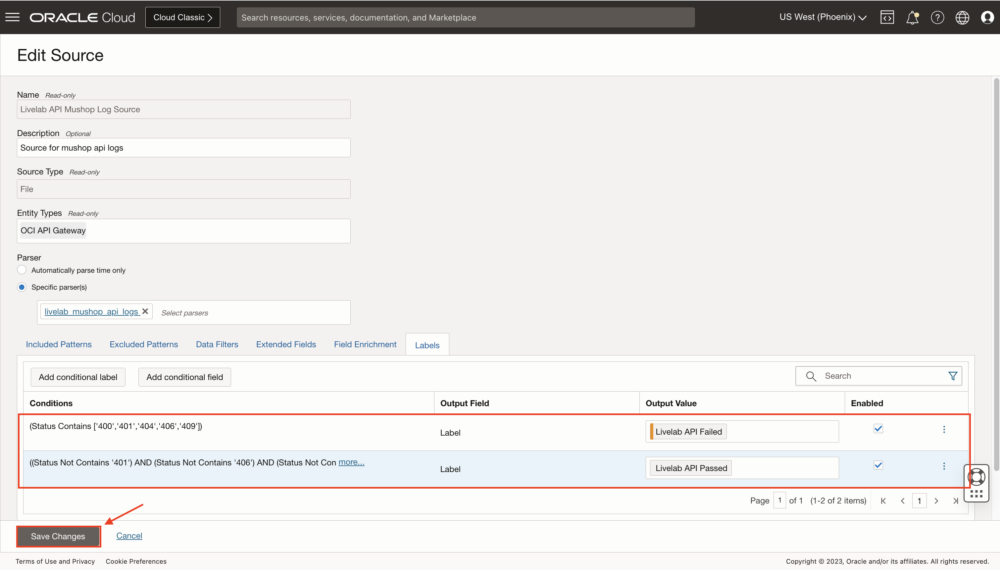

## Create detection rules

Create two ingest time detection rules, as discussed in [How do I create and trigger an ingest time detection rule in Logging Analytics?](?lab=sprint-create-and-trigger-ingest-time-detection-rule).

1. One rule for detecting **Livelab API Passed** label. Fields to be filled in Create detection rule page:
    * **Rule name:** Livelab Detect Passed API.
    * **Metric Namespace:** livelabmetricnamespace.
    * **Metric Name:** livelab_name.
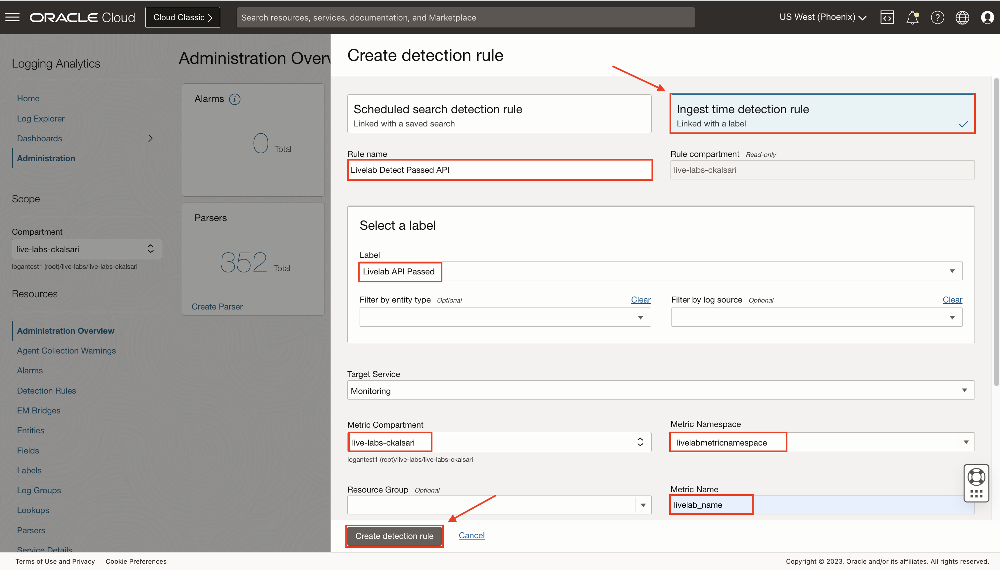
    * Click on **Create detection rule**.

2. Other rule for detecting **Livelab Detect Failed API**. Fields to be filled in Create detection rule page:
    * **Rule name:** Livelab Detect Failed API.
    * **Metric Namespace:** livelabmetricnamespace.
    * **Metric Name:** livelab_name.
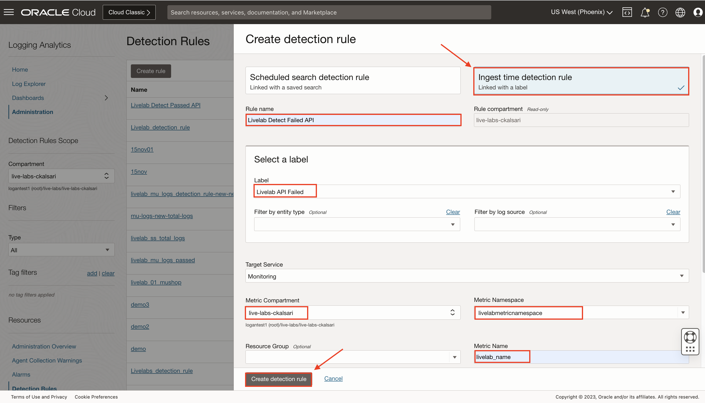
    * Click on **Create detection rule**.

>**NOTE :** Make sure that Metric Namespace and Metric Name remains the same throughout the task, or else results may not appear.

## Create an alarm

1. Navigate to **Create Alarm page** as discussed in [How do I  create alerts on logs with Logging Analytics?](?lab=sprint-alerts-on-logs-with-logging-analytics) using any of the detection rule made above.

2. Provide alarm name as **Livelab Failed APIs more than 30%**. Click on **Switch to Advanced Mode**, as a complex query will be required, using two labels from the detection rule to create this alarm.
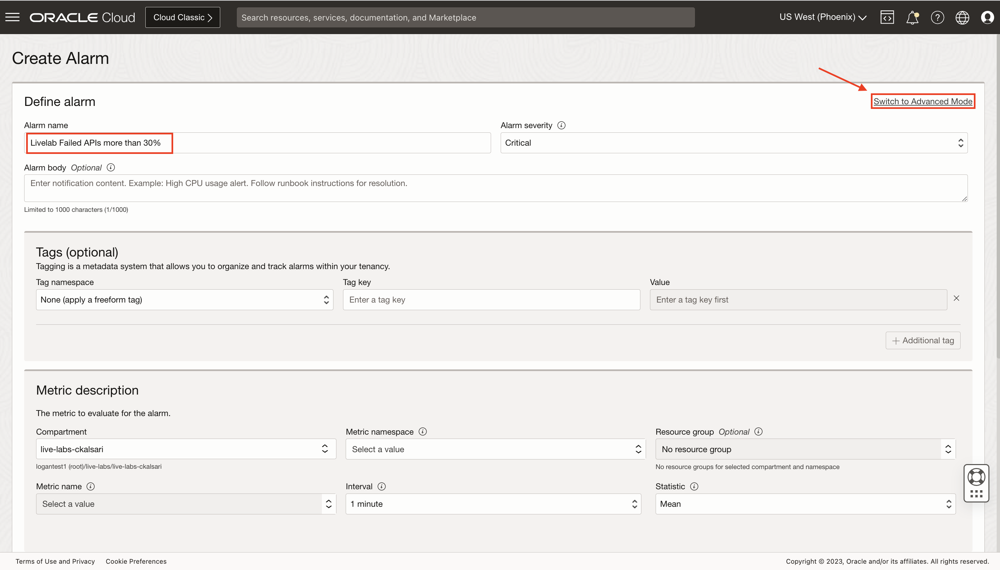

3. Make sure that the compartment and metric name are the same as given for detection rules. Inside the query editor, paste this query:

    ```text
    <copy>livelab_name[15m]{rule_ocid = "<Detection rule ocid detecting Livelab API Failed label>"}.grouping().sum() / (livelab_name[15m]{rule_ocid = "<Detection rule ocid detecting Livelab API Passed label>"}.grouping().sum() + livelab_name[15m]{rule_ocid = "<Detection rule ocid detecting Livelab API Failed label>"}.grouping().sum()) > 0.3</copy>
    ```

    Copy the value of ocids of respective detection rule and replace it in above query. The value of ocid can be found in the **Detection Rule** created.

4. From **Navigation Menu** > **Observability & Management** > **Logging Analytics** > **Administration** > **Detection Rules box** > **Center of box** > **Respective Detection rule** > **Copy the OCID**.

    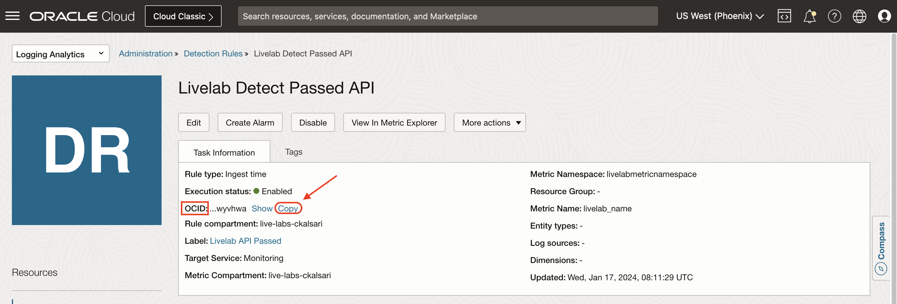

    This query is the condition when the alarm will trigger. Query implies if the total no of log records with failed labels divided by the total no of log records (failed labels and passed labels) is greater than 0.3 i.e. more than 30%, then the alarm will trigger.

    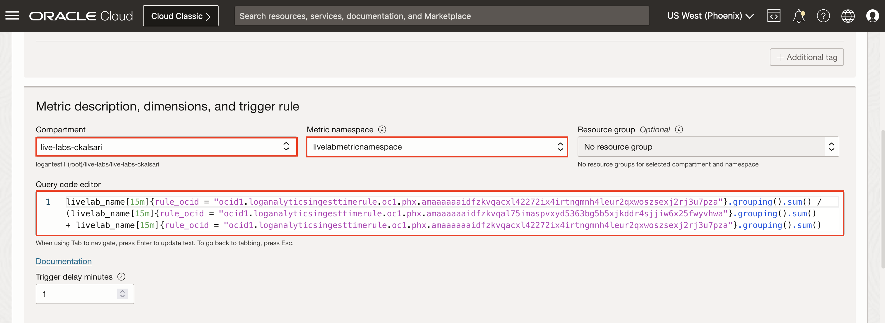

5. Now, **Define alarm notification** and select the **Destination service**, **compartment**, and **Topic**. If there are no existing topics, you can create a new one by clicking on **Create a topic**. For more information regarding these options, you can refer [How do I  create alerts on logs with Logging Analytics?](?lab=sprint-alerts-on-logs-with-logging-analytics)
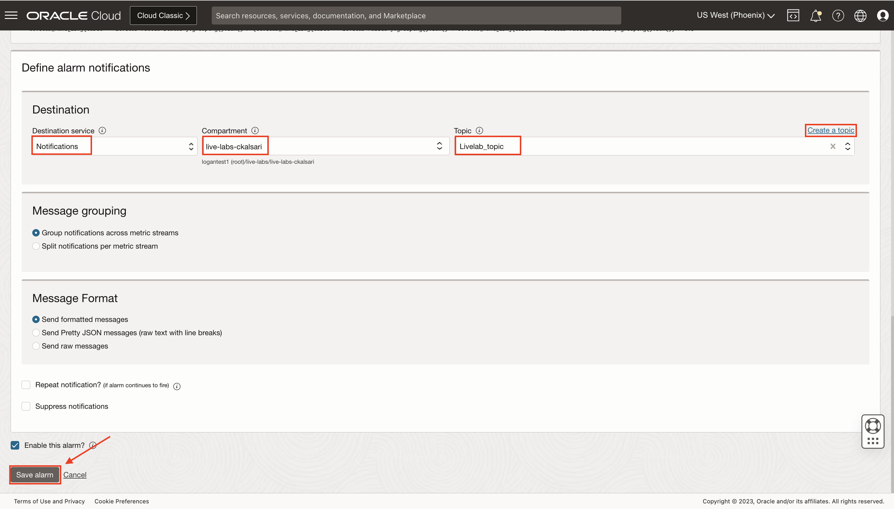

6. Click on **Save alarm**. **Alarm Definitions page** will show up, providing the details of alarm, with a **Ok** mark.
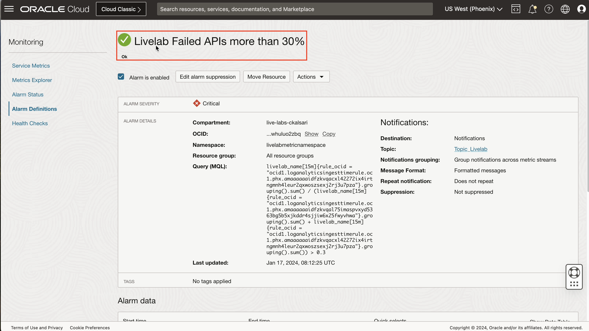

7. Now, your alarm is ready. To test it, you will have to give some log records.

## Upload a file

1. Upload some log records from the desktop to the console so that they will get parsed, the label will get attached to it as per the condition, and get detected in the detection rule.

2. You will use log records on which the **livelab\_mushop\_api\_logs** parser is created.

3. Navigate to **OCI Cloud Shell**, as shown in the image.


4. Run the following commands in **OCI Cloud Shell**.

    ```script
    <copy>
    mkdir Livelab_Lab_16
    cd Livelab_Lab_16
    python <(curl -s https://raw.githubusercontent.com/oracle-quickstart/masteroci-observability-and-management/master/utils/api-logs-generator.py)
    </copy>
    ```

5. A file named **livelab\_logs.txt** is created at the location where python script is executed. This file contains 1000 random log records, generated in intervals of your current UTC and 2 hours before your current UTC.

    >**NOTE :** Alarm only works if the logs are not more than 2 hours older.

6. Run the following command in **OCI Cloud Shell**,

    ```text
    <copy>
    python <(curl -s https://raw.githubusercontent.com/oracle-quickstart/masteroci-observability-and-management/master/utils/upload-logs-file-to-oci.py) -f ~/Livelab_Lab_16/livelab_logs.txt -s livelab -l Livelab_source -n Livelab
    </copy>
    ```

    where,
    * -f : file location
    * -s : file name (Can give any name)
    * -l : source to be associated with the uploaded file (Livelab_source was created in **Task: 5**)
    * -n : name of upload (Can give any name)

    >**NOTE :** Make sure to have correct parameters f, s, l and n.

7. Script will ask for an index of compartment where to upload file. Make sure the source and log group are in the same compartment.

8. Script will ask for an index of the log group present in the compartment. If there are no log groups, it will ask to create a new log group, enter **"y"**.

9. If you entered **"y"**, repeat the **Step 5 and Step 6**, and you will see a log group named **Live Labs Log Group** created, provide the index 0 in OCI Shell.

10. The file will get uploaded.

## Verify an alarm

1. The log records will also be parsed with the provided parser as the file is processed. All logs will be labelled as **Livelab Failed API** or **Livelab Passed API**. The alarm will check all the logs in interval of 15mins, runs it query, and be triggered as soon as the queries satisfy.

2. From **Navigation Menu**  > **Observability & Management** > **Logging Analytics** > **Administration** > **Alarms box**.
    

    >**NOTE :** Wait for 1-2 minutes, to trigger an alarm after uploading the file, keep on refreshing the page.

3. **Firing alarm** page will appear. It will show all fired alarms of Logging Analytics. Click on **Livelab Failed APIs more than 30%** alarm.
    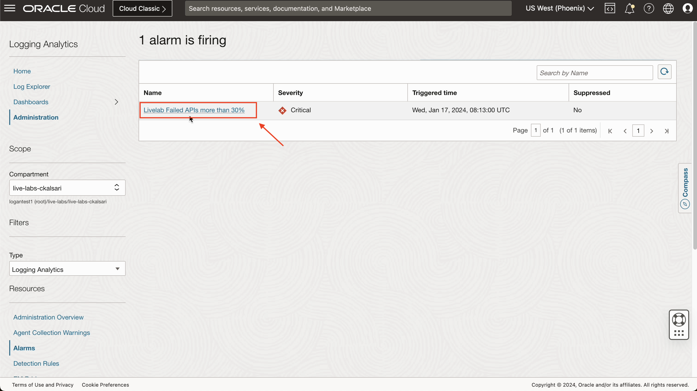

4. The alarm has changed its state from **Ok** to **Firing**. A graph can be seen under **Alarm data** as shown in image. Click on **Show Data Table**
    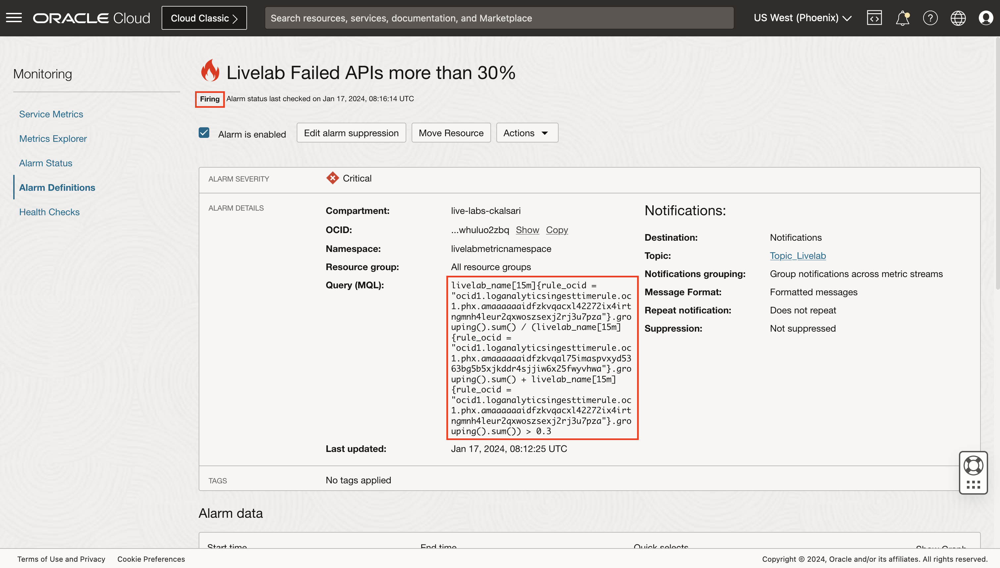

5. Click on **Quick selects** dropdown, and change time to **Last 6 hours**. From data table, you can clearly observe, the alarm has been triggered 8 times, in interval of 15 minutes, in last 6 hours and sent a notification to selected destination.
    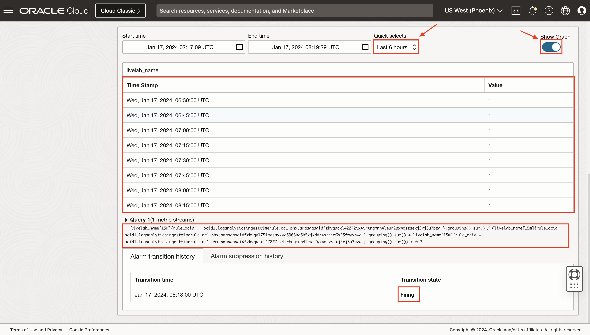

    You can also observe, that the alarm was initially in **Ok** state, then it went to **Firing** state, after some time, it will go to **Reset** state, waiting to go to **Firing** state again.

## Learn More

[Create a Parser] (<https://docs.oracle.com/en-us/iaas/logging-analytics/doc/create-parser.html>)

[How to use a RegEx Parser Builder?] (<https://www.youtube.com/watch?v=EoBJkaq9Png>)

[Create a Source] (<https://docs.oracle.com/en-us/iaas/logging-analytics/doc/create-log-source.html>)

[Upload Logs on Demand] (<https://docs.oracle.com/en-us/iaas/logging-analytics/doc/upload-logs-demand.html>)

[Managing Alarms] (<https://docs.oracle.com/en-us/iaas/Content/Monitoring/Tasks/managingalarms.htm>)

## Acknowledgements

* **Author** - Chintan Kalsaria, OCI Logging Analytics
* **Contributors** -  Chintan Kalsaria, Kiran Palukuri, Ashish Gor, Kumar Varun, OCI Logging Analytics
* **Last Updated By/Date** - Chintan Kalsaria, Jan 2024