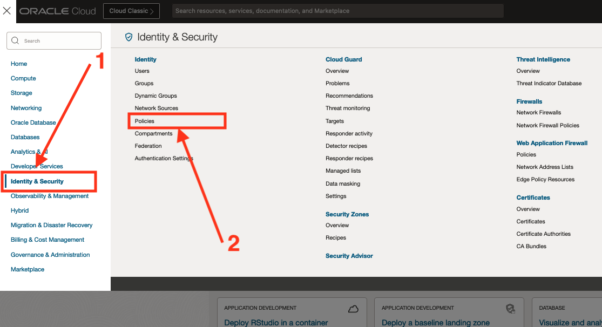
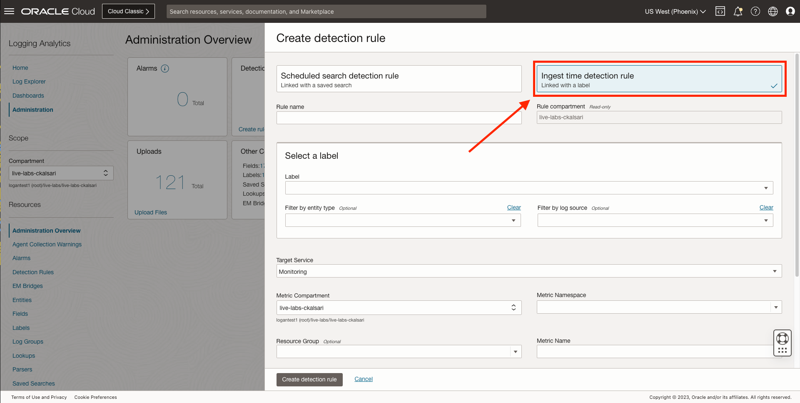
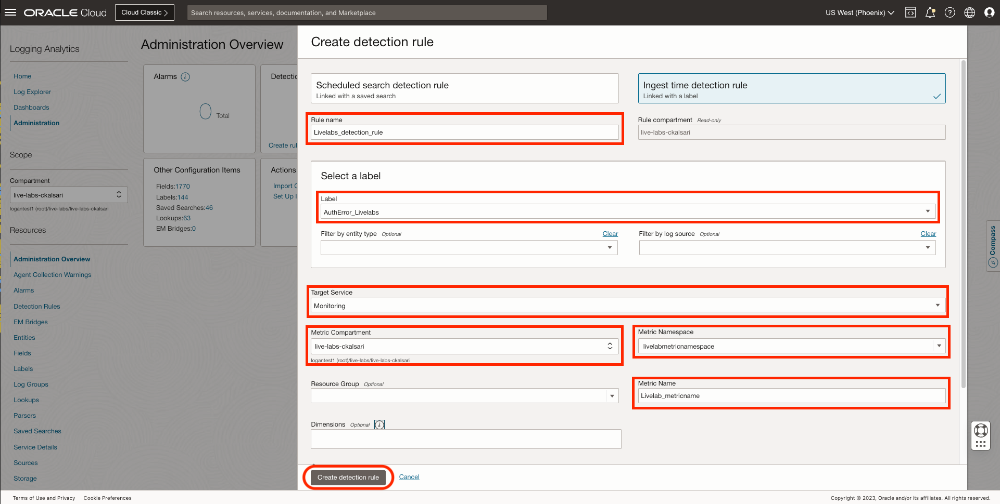
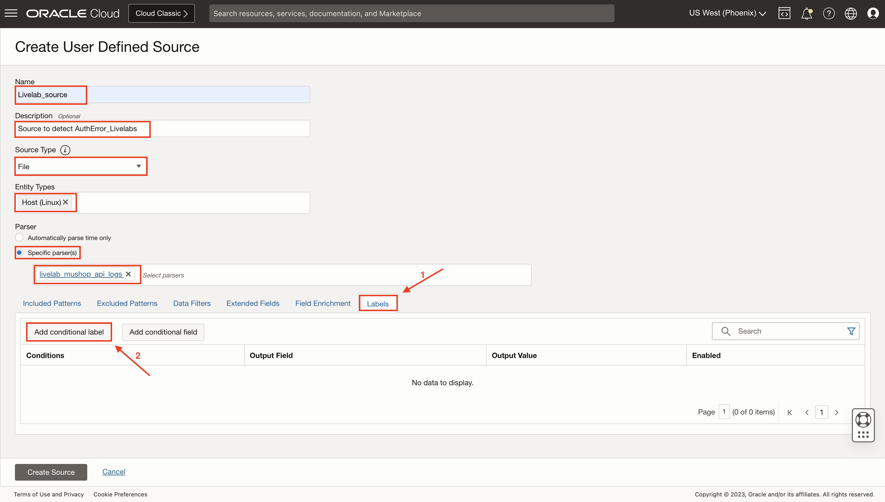
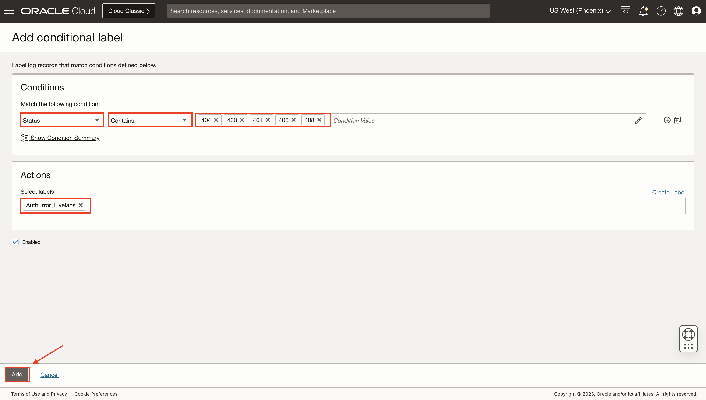
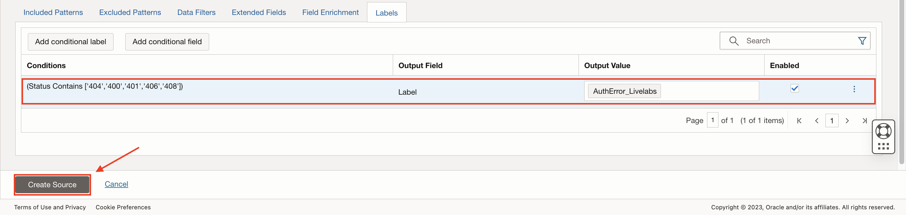
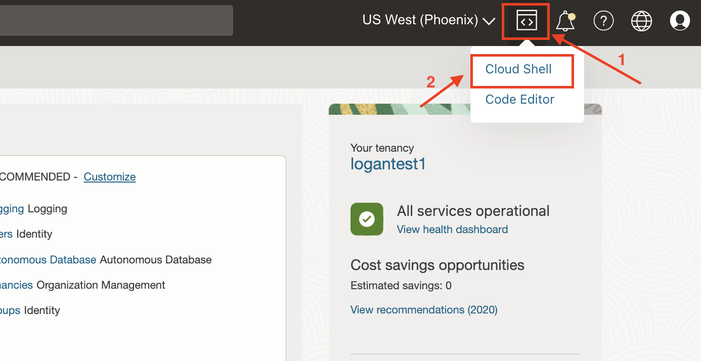
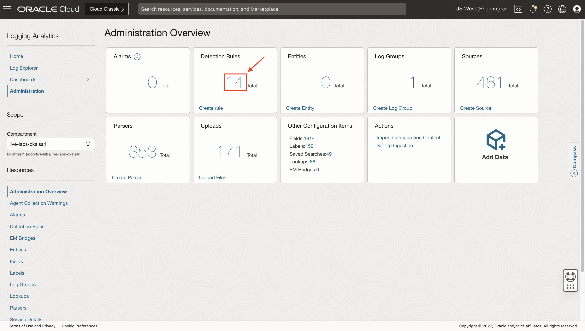
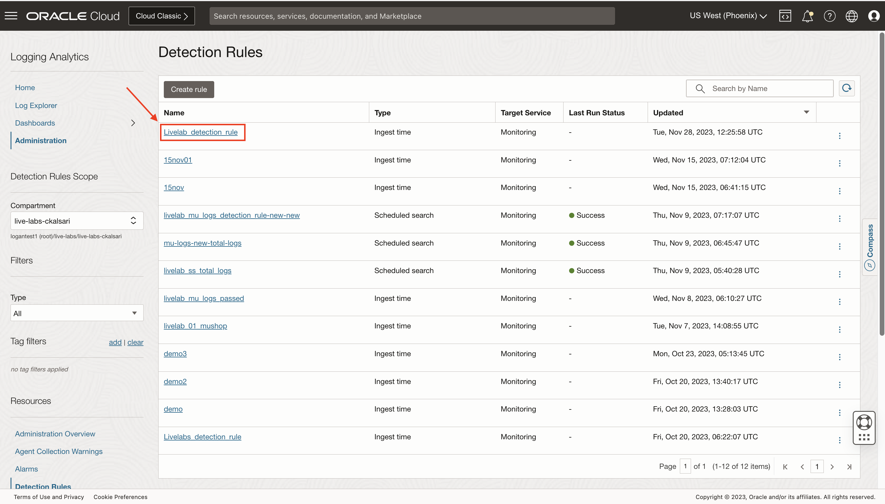
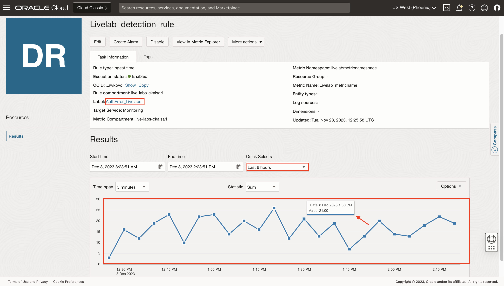

# How do I create and trigger an ingest time detection rule in Logging Analytics?

Estimated Time: 10 minutes.

Let's say you want to detect an authentication error in your log content. It can be done by creating a detection rule.

## Check the policies

1. Correct policies need to be set to create and manage detection rules and use them in the Monitoring Service:

    ```text
      <copy>allow group &lt;group name&gt; to manage loganalytics-ingesttime-rule in tenancy
      allow service loganalytics to use metrics in tenancy</copy>
    ```

   Replace the group name with whatever group fills your needs, and ensure your user is part of that group.

2. To set the policies, go to **"Identity & Security"** > **"Identity"** > **"Policies"**


  You can create a new policy or edit an existing one to contain the needed policies.

## Create an ingest time detection rule

You need a log source and associated entity to create a detection rule. You also need a specific parser corresponding to the type of logs that will be collected and parsed. You also need a label associated with particular content of log records so you can create a detection rule on that specific label.

1. From **Navigation Menu**  > **Observability & Management** > **Logging Analytics** > **Administration** > **Detection Rules box** > **Create Detection Rule**.


2. Create detection rule dialog box opens. Click on **Ingest time detection rule**.


3. Specify a **Rule name** for the ingest time detection rule. Let's say you named it **Livelabsdetection**. Verify the **Rule compartment** as it is read-only.

4. In the **Select a label** section, from the dropdown, select the label that must be detected in the log records. You can choose a predefined label or can create a custom label. Let's say you selected a custom label named **AuthError_Livelabs**, which has a specific condition on which it will get associated with logs if that condition matches any log record. You can refer to [How do I  create a user-defined label in Logging Analytics?](?lab=sprint-create-label) to create custom labels.

5. (Optional) You can specify the **Entity Type** and **Log Source** to filter the log records.

6. Specify the **Target Service** where the alert must be reported. Select **Monitoring service**. The metric generated in the Monitoring service with the information of the alerts generated.

7. Select the **Metric Compartment** where the metrics must be stored.

8. Select **Metric Namespace**, the metric namespace where you want to put the new metric. The scope of options available for selecting the namespace is defined by the selection of the Metric Compartment in the previous step. If options are unavailable, you can also enter a new value for the namespace. Let's say you have named Metric Namespace as **"livelabmtericnamespace"**.

9. (Optional) You can specify the **Resource Group**, the group that the metric belongs to. A resource group is a custom string provided with a custom metric.

10. Specify a **Metric Name**, the name of the metric, used in the Monitoring service explorer to view the metrics. Let's say you named it **"Livelab_metricname"**.

11. (Optional) By default, Label and Rule OCID are used as **Dimensions**. Additionally, if required, you can select more values from the available field options for Dimensions. These are the values that can be used to filter the metric data. The field options available for selection depend on the log source you specified in **Step 4** and some commonly used fields. If no log source is identified, then all fields are available.


12. Click **Create detection rule**.

When the match specified in the log source is encountered in the log record while ingesting, a metric value is posted to the OCI Monitoring service. As demonstrated in a further lab, you can get alerts from the OCI Monitoring service by configuring an alarm on that metric.

> **Note** : **It is required to trigger the ingest time detection rule one time, to post the metric and register the Metric Namespace in the system.**

## Create a source

1. You will have to create a source by referring to [How do I create a user-defined source in Logging Analytics?](?lab=sprint-create-source).

2. Details for the source are mentioned below:
    * **Name:** Livelab_source
    * **Description:** Source to detect AuthError_Livelabs
    * **Source Type:** File
    * **Entity Types:** Select any entity type. For example, Host(Linux)
    * **Parser:** livelab\_mushop\_api\_logs (Created in [How do I create a user-defined REGEX parser using guided mode in Logging Analytics?](?lab=sprint-create-parser))

3. You have made the above detection rule to detect the **AuthError_Livelabs** label so that you will add a condition. This condition will help to attach the log record with a label after getting parsed by the parser.

4. Click on **Labels**. Now, click on **Add conditional label**.


5. In the Conditions section:
    * Select the log field on which you want to apply the condition from the Input Field list. Select **Status** from the dropdown list.
    * Select the operator from the Operator list. Select **Contains** or **Equals**. Both can be used in the given use case.
    * In the Condition Value field, specify the value of the condition to be matched for applying the label. For failed APIs, values of Status can be **401, 400, 404, 406, 408**, which we extracted using parsers from log records.
    * Under Actions, select from the already available Oracle-defined or user-created labels. If required, you can create a new label by clicking **Create Label**. You can refer to [How do I create a user-defined label in Logging Analytics?](?lab=sprint-create-label) to create a label. You will select **AuthError_Livelabs**, as you have made a detection rule to detect it.
    * Click on **Add**.


6. Click on **Create Source**.


## Upload a file

1. Upload some log records to the console using python script so that it will get parsed, the label will get attached to it as per the condition, and get detected in the detection rule.

2. You will use log records on which the **livelab\_mushop\_api\_logs** parser is created.

3. Navigate to **OCI Cloud Shell**, as shown in the image.


4. Run the following commands in **OCI Cloud Shell**.

    ```script
    <copy>
    mkdir Livelab_Lab_06
    cd Livelab_Lab_06
    python <(curl -s https://raw.githubusercontent.com/oracle-quickstart/masteroci-observability-and-management/master/utils/api-logs-generator.py)
    </copy>
    ```

5. A file named **livelab\_logs.txt** will be created at the location where python script is executed. This file will contain 1000 random log records, generated in intervals of your current UTC and 2 hours before your current UTC.

6. Run the following command in **OCI Cloud Shell**,

    ```text
    <copy>
    python <(curl -s https://raw.githubusercontent.com/oracle-quickstart/masteroci-observability-and-management/master/utils/upload-logs-file-to-oci.py) -f ~/Livelab_Lab_06/livelab_logs.txt -s livelab -l Livelab_source -n Livelab
    </copy>
    ```

    where,
    * -f : file location
    * -s : file name (Give any name)
    * -l : source to be associated with the uploaded file (Livelab_source was created in **Task: 5**)
    * -n : name of upload (Give any name)

7. Script will ask for an index of compartment where to upload file. Make sure the source and log group are in the same compartment.

8. Script will ask for an index of the log group present in the compartment. If there are no log groups, it will ask to create a new log group, enter **"y"**.

9. If you entered **"y"**, repeat the **Step 5 and Step 6**, and you will see a log group named **Live Labs Log Group** created, provide the index 0 in OCI Shell.

10. The file will get uploaded.

## Trigger an ingest time detection rule

1. From **Navigation Menu**  > **Observability & Management** > **Logging Analytics** > **Administration**.

2. Click on the **Detection Rule box** on the **Administration Overview** page.


3. Click on **Livelab\_detection\_rule**.


4. In the **Results** section, a graph will be shown. You can change the time frame from **Quick Selects** to **Last 6 hours**. You can also select a different **Statistic**.


5. Hence, your labels are detected in the ingest time detection rule.

## Learn More

[Allow Users to Perform Ingest Time Alert Rule Operations] (<https://docs.oracle.com/en-us/iaas/logging-analytics/doc/detect-predefined-events-ingest-time.html#GUID-4D1BB2CD-D69F-4966-BAEB-B291677D7F1E:~:text=Detected%20Events.-,Allow%20Users%20to%20Perform%20Ingest%20Time%20Alert%20Rule%20Operations,-%F0%9F%94%97>)

## Acknowledgements

* **Author** - Chintan Kalsaria, OCI Logging Analytics
* **Contributors** -  Chintan Kalsaria, Kiran Palukuri, Ashish Gor, Kumar Varun, OCI Logging Analytics
* **Last Updated By/Date** - Chintan Kalsaria, Jan 2024

