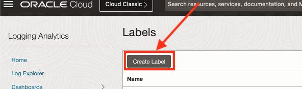
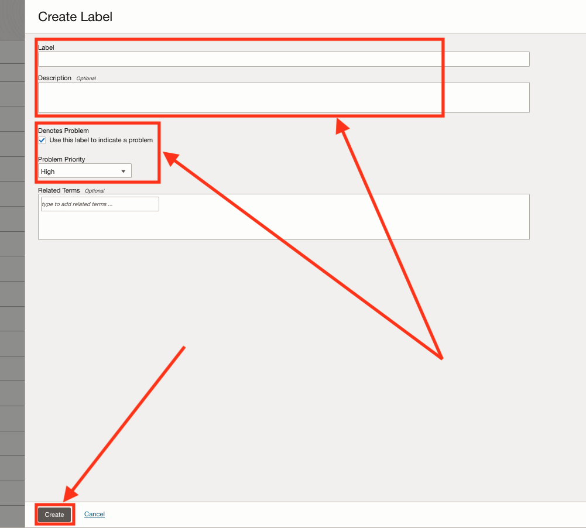
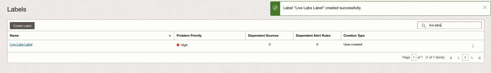

# How to create a user defined Label?

Duration: 5 minutes

This lab will walk you through the steps to **"Create a Label"**.

1. Navigate to the labels page.

2. Click on "Create Labels":

3. Fill the Label Fields and click on "Create":

  **Explanation:**
    1. **Label (required):** The name of the label to create.
    2. **Description:** A description for the label.
    3. **Denotes a problem:** Check for the label to denote a problem.
    4. **Problem Priority:** The level of priority of the log problem.

Your label should be created and you will see a screen similar to this one:

## Learn More

* [Create a label in OCI Logging Analytics](https://docs.oracle.com/en-us/iaas/logging-analytics/doc/create-label.html)

## Acknowledgements

* **Author:** Ayoub BELMEHDI, OCI Logging Analytics

* **Contributors:** Ashish GOR, Kiran PALUKURI, Vikram REDDY, Kumar VARUN, Jolly KUNDU, OCI Logging Analytics

* **Last Updated By/Date:** Ayoub BELMEHDI, October 2023
