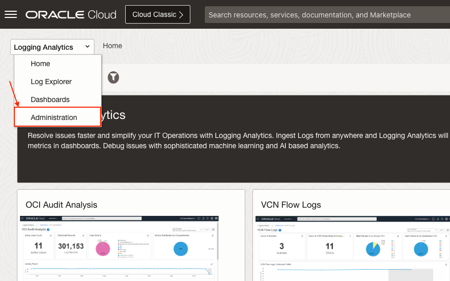
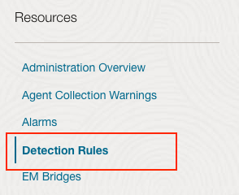
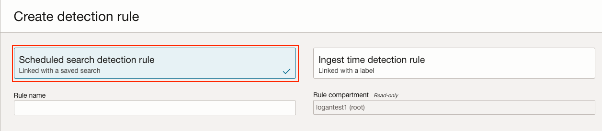

# How to create scheduled search detection rules?

Duration: 3 minutes

## Navigate to Detection Rules

1. Navigate to **Administration**

2. Click on **Detection Rules** inside **Resources** menu.

## Create Scheduled Search Detection Rule

1. Click on **Create rule**.

2. Make sure **Scheduled search detection rule** option is selected.

3. Specify a **Rule name**.

4. Then select a **Saved search compartment** and a **Saved search**.

5. Select **Monitoring** as **Target Service**.

6. Specify a **Metric Compartment**, **Metric Namespace** and **Metric Name**.

7. Set the **Interval** to any time you want your detection rule to be scheduled.

8. Then click on **Create detection rule**.

## Learn More

* [Create a Schedule to Automatically Run a Saved Search Query](https://docs.oracle.com/en-us/iaas/logging-analytics/doc/create-schedule-run-saved-search.html#GUID-A37A3F93-BE74-4850-859D-C8D293781036)

## Acknowledgements
* **Author** - Oswaldo Osuna, Logging Analytics Development Team
* **Contributors** -  Kumar Varun, Logging Analytics Product Management - Kiran Palukuri, Logging Analytics Product Management - Vikram Reddy, Logging Analytics Development Team 
* **Last Updated By/Date** - Oswaldo Osuna, Dec 18 2023