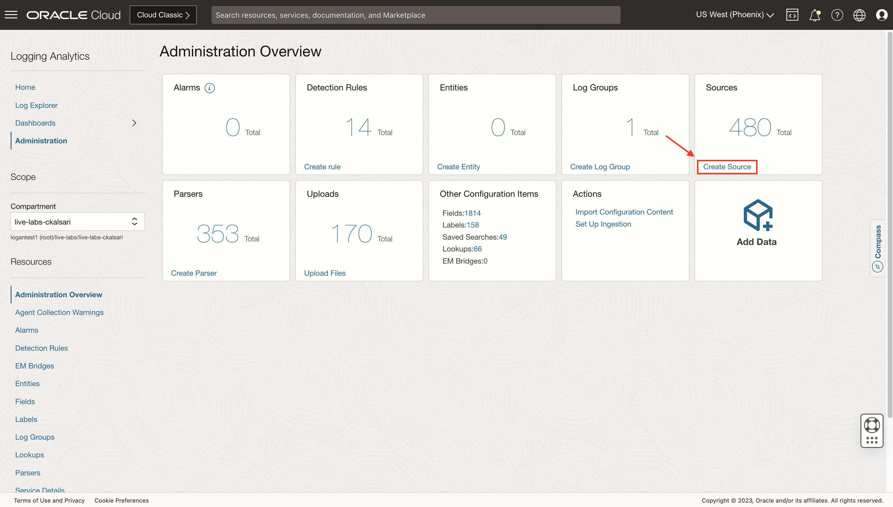
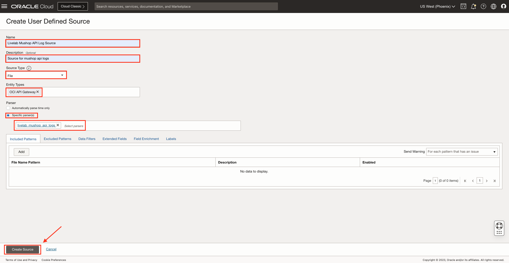

# How do I create a user-defined source in Logging Analytics?

Estimated Time: 10 minutes.

## Create a source

1. From **Navigation Menu**  > **Observability & Management** > **Logging Analytics** > **Administration** > **Sources box** > **Create Source**.

2. A **Create User Defined Source** page will appear. Fill in the details.

3. **Name:** Enter the name of the source—for example, **Livelab API Mushop Log Source**.

4. (Optional) **Description:** Add a short description to describe the source.

5. **Source Type:**  Oracle Log Analytics supports six log source types:
    * **File:** Use this type for collecting most types of logs, such as Database, Application, and Infrastructure logs.
    * **Oracle Diagnostic Logging (ODL):** Use this type for logs that follow the Oracle Diagnostics Logs format. These are typically used for diagnostic logs for Oracle Fusion Middleware and Oracle Applications.
    * **Syslog Listener:** This is typically used for network devices such as Intrusion Detection Appliances, Firewall, or other devices where a management agent could not be installed.
    * **Microsoft Windows:** Use this type for collecting Windows Event messages. Oracle Logging Analytics can collect all historic Windows Event Log entries. It supports Windows as well as custom event channels.
    * **Database:** Use this source type to collect the logs stored in the tables inside an on-premises database. With this source type, an SQL query is run periodically to collect the table data as log entries.
    * **REST API:** Use this source type to set up continuous REST API-based log collection from endpoint URLs that respond with log messages. With this source type, a GET or POST API call is made to the endpoint URL provided to get the logs.

    Select any of the above source types—for example, **File**.

6. **Entity Type:** Click the Entity Type field and select the entity type for this log source. Later, when you associate this source to an entity to enable log collection through the management agent, only entities of this type will be available for association. A source can have one or more entity types.
    * If you selected File, REST API, or Oracle Diagnostic Log (ODL), then it is recommended that you choose the entity type for your log source that most closely matches what you will monitor. Avoid selecting composite entity types like Database Cluster instead of the entity type Database Instance because the logs are generated at the instance level.
    * If you select the source type Syslog Listener, choose one of the variants of Host.
    * If you select the source type Database, the entity type is limited to eligible databases.
    * If you select Windows Event System source type, the default entity type Host (Windows) is chosen automatically and cannot be changed.

    When uploading the log file directly from the desktop, entity types do not matter—for example, **OCI API Gateway**.

7. **Parser:**
    * You can select multiple file parsers for the log files. This is particularly helpful when a log file has entries with different syntax and can not be parsed by a single parser.
    * The order in which you add the parsers is essential. When Oracle Logging Analytics reads a log file, it tries the first parser and moves to the second parser if the first one does not work. This continues until a working parser is found.
    * For ODL source type, the only parser available is Oracle Diagnostic Logging Format.
    * For Syslog source type, typically one of the variant parsers such as Syslog Standard Format or Syslog RFC5424 Format is used. You can also select from the Oracle-defined syslog parsers for specific network devices.
    * Parser is not available for Windows Event System and REST API source types. For the Windows Event System source type, Oracle Logging Analytics retrieves already parsed log data.

    You have made a parser in [How do I create a user-defined REGEX parser using guided mode in Logging Analytics?](?lab=sprint-create-parser), select **Specific parser(s)** button and select the user-defined parser that was created earlier, i.e. **livelabmushopapilogs**.

8. Enter the following information depending on the source type:
    * Syslog source type: Specify Listener Port.
    * Windows source type: Specify an event service channel name. The channel name must match with the name of the Windows event so that the agent can form the association to pick up logs.
    * Database source type: Specify SQL Statements and click Configure. Map the SQL table columns to the fields available in the menu. To create a new field for mapping, click the Add icon icon.
    * REST API source type: Click Add log endpoint to provide a single log endpoint URL or Add log list endpoint for multiple logs to provide a log list endpoint URL for multiple logs from which the logs can be collected periodically based on the time configuration in the UI.
    * File and ODL source types: Use the Include Patterns, Exclude Patterns, Data Filters, Field Enrichment, and Labels tab.

9. Click on **Create Source**.

## Learn More

[Oracle defined Sources] (<https://docs.oracle.com/en-us/iaas/logging-analytics/doc/oracle-defined-sources.html#GUID-7DB43543-E971-4797-8971-DC9700326CAA>)

[Use Labels in Source] (<https://docs.oracle.com/en-us/iaas/logging-analytics/doc/create-log-source.html#GUID-E53DEDE9-E50A-4129-A252-C34440104DA8:~:text=Labels%20for%20sources.-,Use%20Labels%20in%20Sources,-%F0%9F%94%97>)

[Use Extended Fields in Sources] (<https://docs.oracle.com/en-us/iaas/logging-analytics/doc/create-log-source.html#GUID-8811F443-3EC1-4465-9D44-6EA164CD112C:~:text=editing%20existing%20sources.-,Use%20Extended%20Fields%20in%20Sources,-%F0%9F%94%97>)

[Configure Field Enrichment Options] (<https://docs.oracle.com/en-us/iaas/logging-analytics/doc/create-log-source.html#GUID-7A645A48-D295-435A-9791-4E572A2F108C:~:text=to%20%7BStatus%3A%5Cw%2B%7D-,Configure%20Field%20Enrichment%20Options,-%F0%9F%94%97>)

[Use the Automatic Time Parser] (<https://docs.oracle.com/en-us/iaas/logging-analytics/doc/create-log-source.html#GUID-4CC65CCE-5FE7-4DEC-9DC0-8A448979B5C7:~:text=Enabled%20check%20box.-,Use%20the%20Automatic%20Time%20Parser,-%F0%9F%94%97>)

## Acknowledgements

* **Author** - Chintan Kalsaria, OCI Logging Analytics
* **Contributors** -  Chintan Kalsaria, Kiran Palukuri, Ashish Gor, Kumar Varun, OCI Logging Analytics
* **Last Updated By/Date** - Chintan Kalsaria, Jan 2024