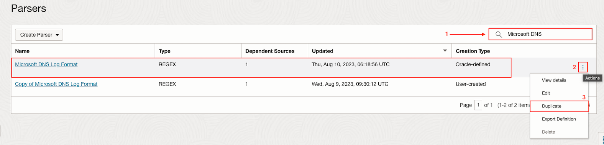
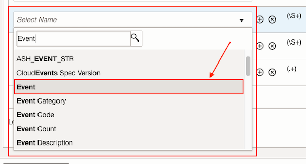
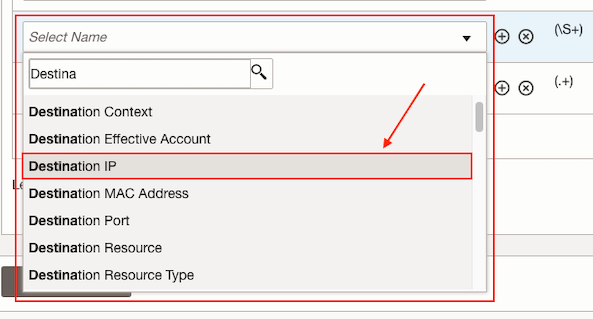
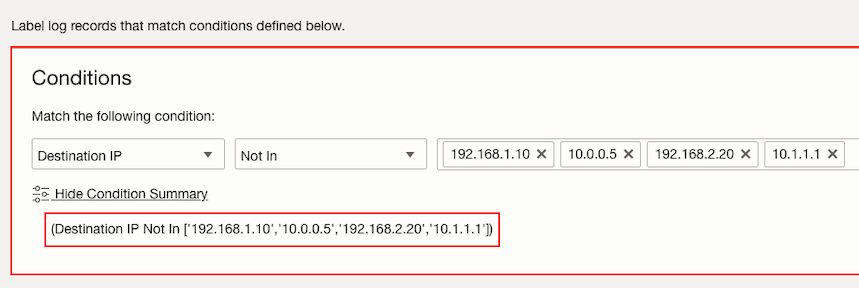
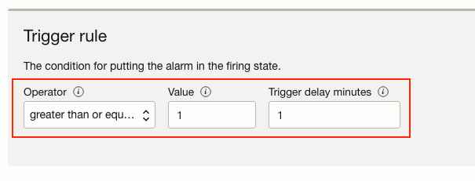
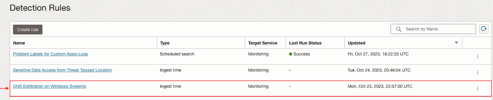
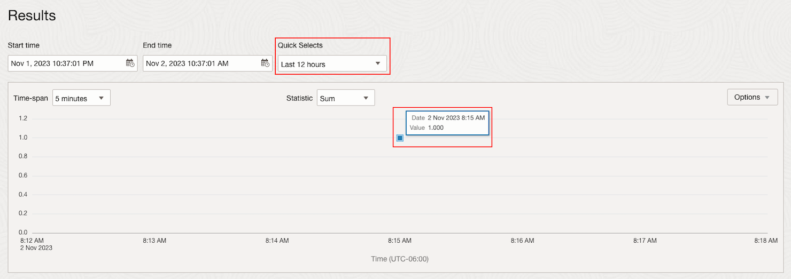
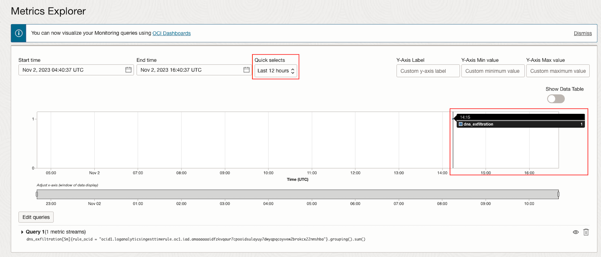
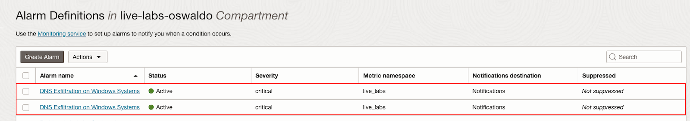
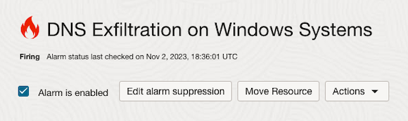

# How do I create an alert for DNS exfiltration events from Windows Systems using Logging Analytics?

Duration: 10 minutes

## Create Parser from Oracle-defined

1. Navigate to **Parsers**.

2. Search for **Microsoft DNS**. In the **Oracle-defined** one, click on **Actions** button and then on **Duplicate**.
   

3. Specify a **Name** and **Description (optional)**.

4. Specify the following at **Example log content**.
      ```Example log content
         <copy>
            01/11/2024 07:10:58 PM 03B4 EVENT 192.168.1.10 The DNS server has started.
         01/11/2024 07:12:26 PM 00DC PACKET 192.168.2.2  00000000016B80A0 UDP Rcv ::1             9ebb   Q [0001   D   NOERROR] SOA    (5)xyztu(4)labs(0)
          UDP question info at 00000000016B80A0
           Socket = 336
           Remote addr ::1, port 64329
           Time Query=588068, Queued=0, Expire=0
           Buf length = 0x0fa0 (4000)
           Msg length = 0x001c (28)
           Message:
            XID       0x9ebb
            Flags     0x0100
            QR        0 (QUESTION)
            OPCODE    0 (QUERY)
            AA        0
            TC        0
            RD        1
            RA        0
            Z         0
            CD        0
            AD        0
            RCODE     0 (NOERROR)
            QCOUNT    1
            ACOUNT    0
            NSCOUNT   0
            ARCOUNT   0
            QUESTION SECTION:
            Offset = 0x000c, RR count = 0
            Name      "(5)xyztu(4)labs(0)"
            QTYPE   SOA (6)
            QCLASS  1
            ANSWER SECTION:
            empty
            AUTHORITY SECTION:
            empty
            ADDITIONAL SECTION:
            empty
         </copy>
      ```

5. Specify the following regular expression at **Parser regular expression**.
      ```Regular expression
         <copy>{TIMEDATE}\s+(\S+)\s+(\S+)\s+(\S+)\s+(.+)</copy>
      ```

6. Select **Event** for the first field added.
   

7. Select **Destination IP** for the second field added.
   

8. To verify click on **Parser Test** and then on **Run Test**.

9. Click on **Create Parser**.

## Create User Defined Source

1. Refer to [How to create a user defined Source?](?lab=sprint-create-source)

   Select **File** as **Source Type** and **Microsoft DNS Server** at **Entity Types**. Specify the parser we created previously.

## Add conditional Label

1. Click on **Labels**.

2. Then click on **Add conditional label**.

3. Select **Destination IP** as **Input Field** and **Not In** as **Operator**. Add the following IPv4 addresses to **Condition Value**.
      ```IPv4 addresses
         192.168.1.10, 10.0.0.5, 192.168.2.20, 10.1.1.1
      ```
      

4. At **Select labels** select **DNS Exfiltration Attempt** label.

5. If it is not found click on **Create Label**.

6. Specify **DNS Exfiltration Attempt** for **Label** and add a **Description (optional)**. Check **Detonates Problem** and select **High** as **Problem Priority**.

7. Click on **Create**.

8. Then click on **Create Source**.

## Upload logs file

1. Refer to [Sprint: How to upload Files into a Source from the OCI console?](?lab=sprint-upload-log-file)

   Generate a logs file running the following Python script. You can use your **OCI Cloud Shell** to run the script.
      ```Python script
         <copy>python <(curl -s https://raw.githubusercontent.com/oracle-quickstart/oci-observability-and-management/master/utils/microsoft-dns-server-logs.py)</copy>
      ```

   Then upload the generated logs file running the following Python script. Use the **Log Source** created previously.
      ```Python script
         <copy>python <(curl -s https://raw.githubusercontent.com/oracle-quickstart/oci-observability-and-management/master/utils/upload-logs-file-to-oci.py) -f microsoft-dns-server-logs.log -s microsoft-dns-server-logs -l "<Name of the Log Source created>" -n microsoft-dns-server-logs</copy>
      ```

## Create a new Log Search

1. Navigate to **Log Explorer**.

2. Specify the following query.
      ```Query
         <copy>'Log Source' = '<Name of the Log Source created>' | timestats count as logrecords by 'Log Source'</copy>
      ```

3. Click on **Run**.

4. Open the **Actions** drop-down and click on **Save as...**.
   

5. Specify a **Search Name** and a **Search Description (optional)**.

6. Click on **Save** button.

## Create Scheduled search detection rule

1. Refer to [Sprint: How to create scheduled search detection rules?](?lab=sprint-create-scheduled-search-detection-rule)

   Create a scheduled search type detection rule using the saved search we created.

## Create Ingest time detection rule

1. Refer to [Sprint: How to create and trigger an ingest time detection rule?](?lab=sprint-create-and-trigger-ingest-time-detection-rule)

   Use the label and source we created previously.

## Create alarm for Detection Rules

1. Refer to [Sprint: How to create alerts on logs with Logging Analytics?](?lab=sprint-alerts-on-logs-with-logging-analytics)

   Create an alarm for the scheduled search type detection rule with the **Trigger rule** of **greater than or equal** to **1** in a **Trigger delay minutes** of **1**.
   

   Create a new **Topic** if needed.

2. Do the same process of **Create Alarm** for the ingest time type detection rule.

## Upload logs file to trigger Ingest Time Detection Rule

1. Refer to [Sprint: How to upload Files into a Source from the OCI console?](?lab=sprint-upload-log-file)

   Generate a logs file running the following Python script. You can use your **OCI Cloud Shell** to run the script.
      ```Python script
         <copy>python <(curl -s https://raw.githubusercontent.com/oracle-quickstart/oci-observability-and-management/master/utils/microsoft-dns-server-logs.py)</copy>
      ```

   Then upload the generated logs file running the following Python script. Use the **Log Source** created previously.
      ```Python script
         <copy>python <(curl -s https://raw.githubusercontent.com/oracle-quickstart/oci-observability-and-management/master/utils/upload-logs-file-to-oci.py) -f microsoft-dns-server-logs.log -s microsoft-dns-server-logs -l "<Name of the Log Source created>" -n microsoft-dns-server-logs</copy>
      ```
## See Detection Rules results

1. Navigate to **Detection Rules**.

2. Select the ingest time type detection rule we created for this lab.
   

3. At **Results** we can see there has been a **DNS Exfiltration Attempt**.
   

4. Click on **View In Metric Explorer**.

5. We can see the same result in the **Metrics Explorer** view.
   

7. Do the same process of **See Detection Rules results** for the scheduled search detection rule.

## See the Alarms results

1. Navigate to **Alarms**.

2. At **Alarm Definitions** click on the alarms we created.
   

3. We can see both alarms are **Firing**.
   

You may now proceed to [How can I generate an alert for suspicious access to sensitive data from specific IPs using Logging Analytics?](../sprint-sensitive-data-access-from-threat-tagged-location/)

## Acknowledgements
* **Author** - Oswaldo Osuna, Logging Analytics Development Team
* **Contributors** -  Kumar Varun, Logging Analytics Product Management - Kiran Palukuri, Logging Analytics Product Management - Vikram Reddy, Logging Analytics Development Team 
* **Last Updated By/Date** - Oswaldo Osuna, Jan 25 2024
