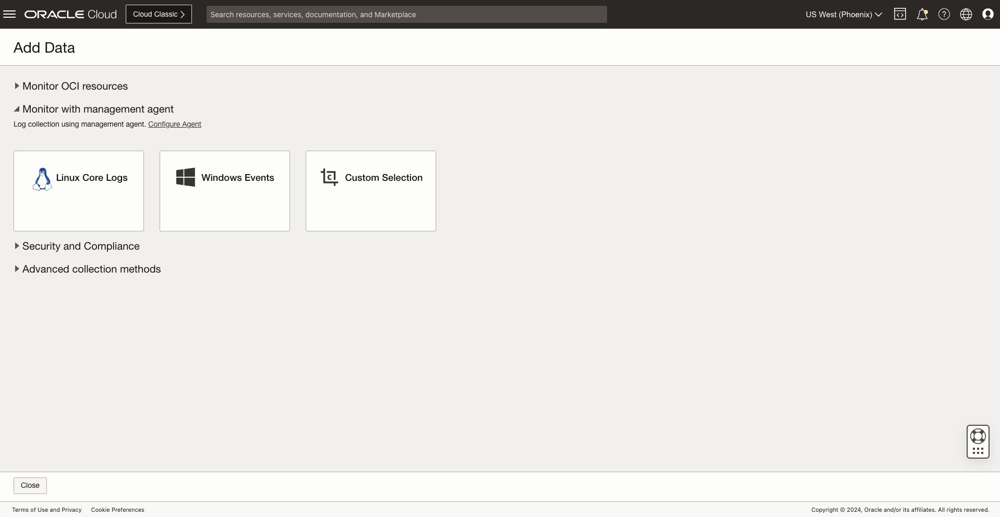
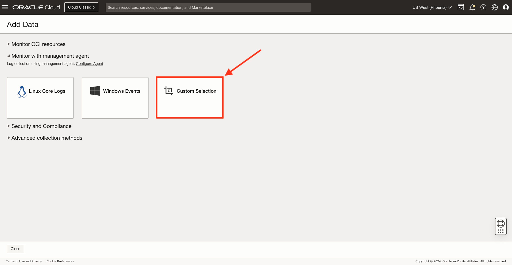
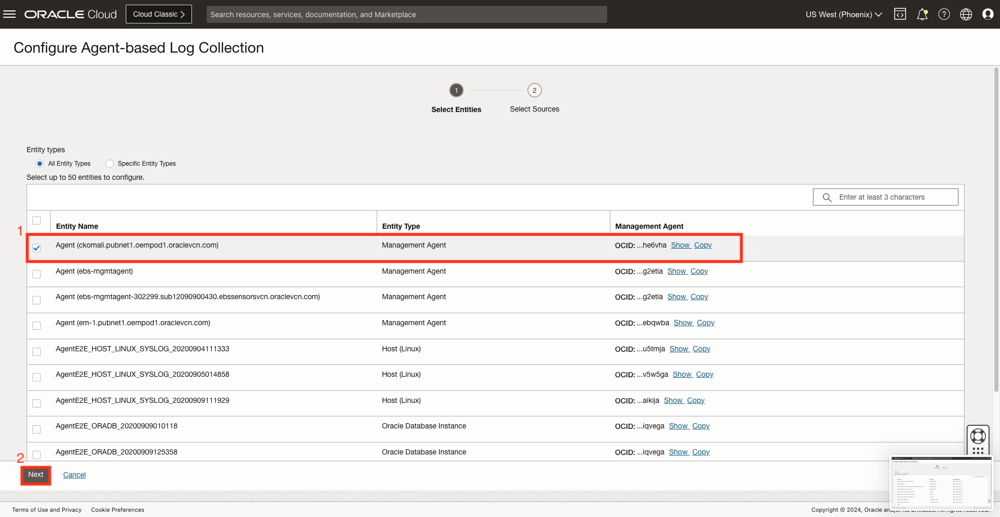
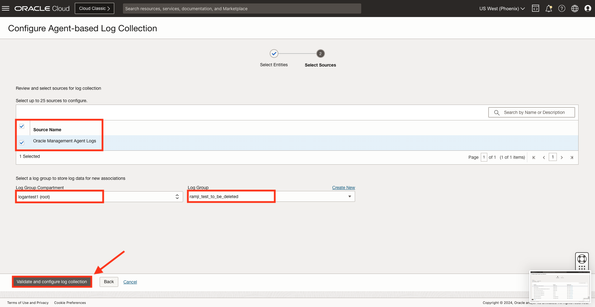
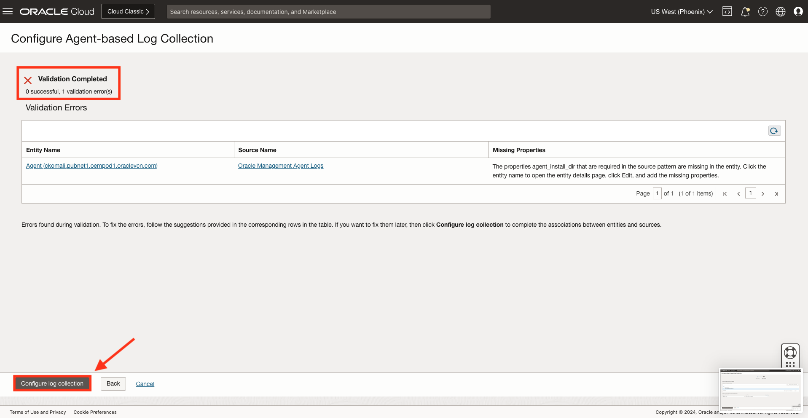
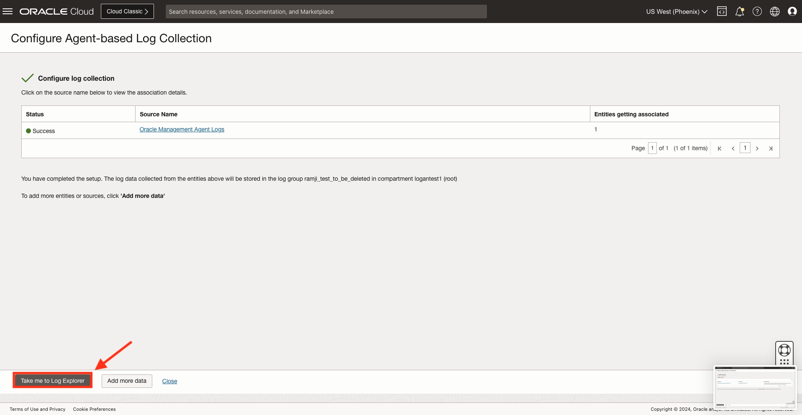
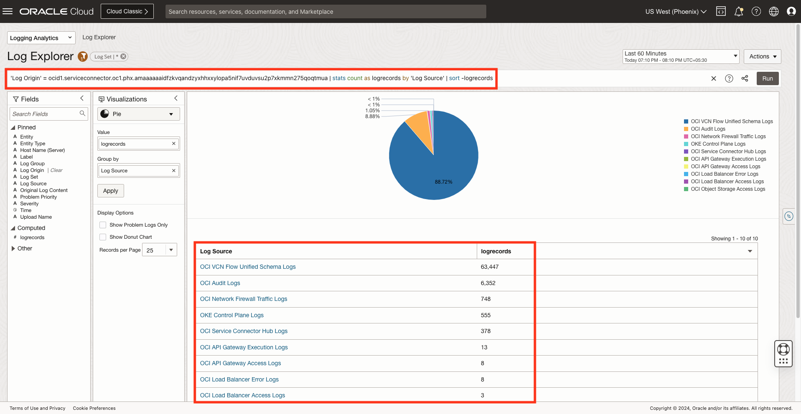

# How do I ingest logs in Logging Analytics?

Estimated Time: 10 minutes.

## Navigate to Add Data page from Compass or Administration

### **Option 1 : Using Compass icon**

1. In the Log Explorer page, click on the **Compass** icon.

2. A compass panel will be displayed. In the compass panel, click on the **Add Data** button.

3. Add Data page will be displayed.

### **Option 2 : Via Administration Overview Page**

1. In the Log Explorer page, click on the dropdown icon and select **Administration**.

2. Administration Overview page will be displayed. Click on **Add Data** button.

3. Add Data page will be displayed.

The Add Data Page lists the different mechanisms through which the user can ingest data to Logging Analytics.

1. **Monitor OCI core infrastructure:** Allows user setting up data ingestion using Service Connector.

2. **Monitor apps and on-premises infrastructure:** Allows user setting up data ingestion using Management Agent.

3. **Advanced collection methods:** Allows user to upload the data from there computer desktop. This mechanism will be used if user wants to ingest log files without continuously collecting them using the Service Connector or Management Agent.

4. **Security and Compliance:** Allows user to ingest OCI Audit logs from OCI Logging service using service connector.

## Ingest logs using Service Connector

The following setup is already done for this **Workshop**, no further action required.

1. Click on the **Monitor OCI core infrastructure** header. OCI Core Infrastructure section will be displayed.

2. Click on the **Configure log collection for OCI resources** button.

3. The **Configure log collection for OCI resources** page will be displayed and table will display all OCI Resources (entities) which your user has access (read) to and from which logs can be collected.

4. Load Balancer Flow

    * Under OCI resource types select the **Specific resource types** radio button. An empty textbox to select resource types will be displayed.
    

    * In the textbox enter the text **LoadBalancer**  and click on the resultant **LoadBalancer** text. A list of all available Load Balancers will be displayed.
    

    * Select the Load Balancer from which logs needs to be collected. Click **Next**
    

    * Configure Service Connector Panel will be displayed. Click on **Configure Log Collection** button.
    

    * In the next page Log Configuration will start. And the successful configuration will look like below.
    Click on **Take me to Log Explorer** button.
    

    * Log Explorer will display all the logs ingested using the **Service Connector**.
    

## Ingest logs using Management Agent

This task will walk you through the steps for setting up Log collection with Management Agent. As part of this lab the following tasks have already been done:

* Required entities have been created, entity properties have been set, and entity has been mapped with an agent which has access to the entity's logs.

* Users can select a specific entity type (database).

* Each Log Source has one or more target entity-types. This information is used to identify and configure which logs can be collected for an entity.

Follow the steps to ingest logs using management agent:

1. Click on **Custom Selection** on add data page.

2. A list of entities will be shown which are available for log ingestion. Select a entity with entity type as **Management Agent**. Click on **Next**.

3. Select the source from available sources in the select entity. Select a **Log group** under which the logs must be stored along with **Log Group Compartment**. Click on **Validate and configure log collection**.

4. There will be a validation check in the entity and source, the output can be seen. If there are any errors, it will be shown in **Validation Errors** table. Click on **Configure log collection** to solve the validation error and configure the log collection.

5. The entity and source passed the validation. Click on source name from available table yo view the association details. The setup for log ingestion using **Management Agent** has been successfully completed.

6. Click on **Take me to Log Explorer** to view the ingested logs in the log explorer.

## Ingest logs from computer desktop

Ingest logs from computer desktop is covered in [How to upload Files into a Source from the OCI console?](?lab=sprint-upload-log-file)

## Learn More

[Set Up Continuous Log Collection From Your Hosts] (<https://docs.oracle.com/en-us/iaas/logging-analytics/doc/set-continuous-log-collection-form-your-hosts.html>)

[Ingest Logs from Other OCI Services Using Service Connector] (<https://docs.oracle.com/en-us/iaas/logging-analytics/doc/ingest-logs-other-oci-services-using-service-connector.html>)

[Ingest Custom Logs from OCI Logging Service Using Service Connector] (<https://docs.oracle.com/en-us/iaas/logging-analytics/doc/ingest-custom-logs-oci-logging-service-using-service-connector.html>)

[Upload Logs on Demand] (<https://docs.oracle.com/en-us/iaas/logging-analytics/doc/upload-logs-demand.html>)

## Acknowledgements

* **Author** - Chintan Kalsaria, OCI Logging Analytics
* **Contributors** -  Chintan Kalsaria, Kiran Palukuri, Ashish Gor, Kumar Varun, OCI Logging Analytics
* **Last Updated By/Date** - Chintan Kalsaria, Jan 2024