# How to use Log Explorer for analyzing and visualizing logs in Logging Analytics?

Duration: 10 minutes

## Navigate to Log Explorer

From **Navigation Menu**  > **Observability & Management** > **Logging Analytics** > **Log Explorer**.
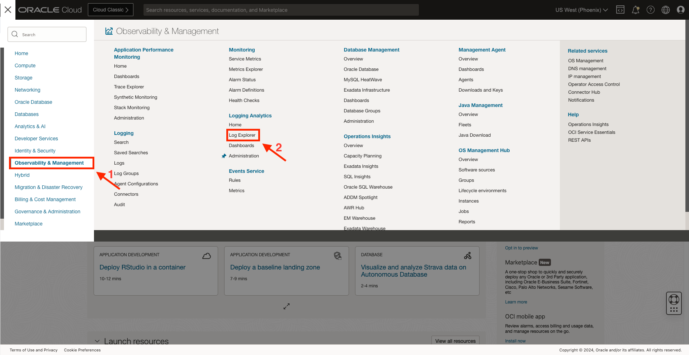
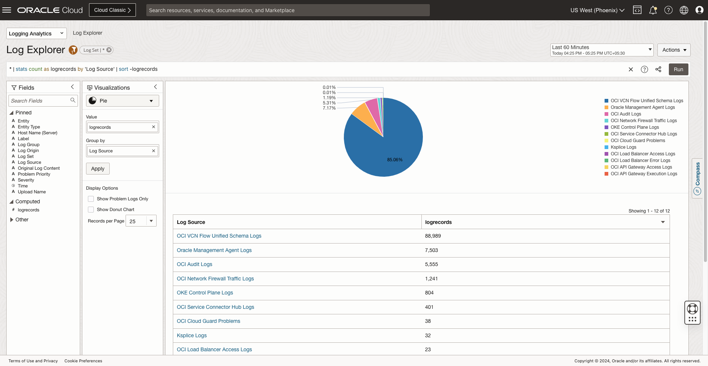

## User interfaces of Log Explorer

Here are the main parts of the user interface that will be used throughout this workshop.

1. **Scope Filter** for setting Entity and Log Group Compartment scope for exploration.

2. **Time range** picker, and **Actions** menu where you can find actions such as, Open, Save, and Save as.

3. **Query bar**, with **Clear**, **Search Help** and **Run** buttons at the right end of the bar.

4. **Fields panel**, where you can select sources and fields to filter your data.

5. **Visualization panel**, where you can select the way to view search data in a form that helps you.

6. **Main panel**, where the visualization output appears above the results of the query.

## Using Visualizations Panel and Fields Panel

**Visualization Panel**:

The interactive data visualizations in Oracle Logging Analytics enable you to get deeper insights into your log data. Based on what you want to achieve with your data set, you can select the visualization type that best suits your application.
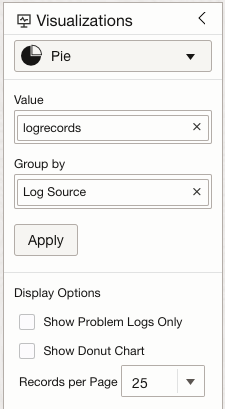

  1. **Visualizations:** There are different visualizations type available in this panel, examples are, Pie, Bar, Horizontal bar, Map, Line, World Cloud, Summary Table, Records, Table, Distinct, Tile, Records with histogram, Table with histogram, Sunburn, Treemap. Some of the visualizations are used to perform advanced analysis of large data set to figure out the root cause an issue, to identify potential issues, to view trends, or to detect an anomaly, examples are, Cluster, Link and Issues. Select any of the visualizations to show data according to it.
  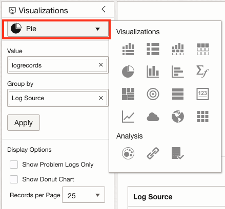
    - If **Word Cloud** is selected, output will be:
    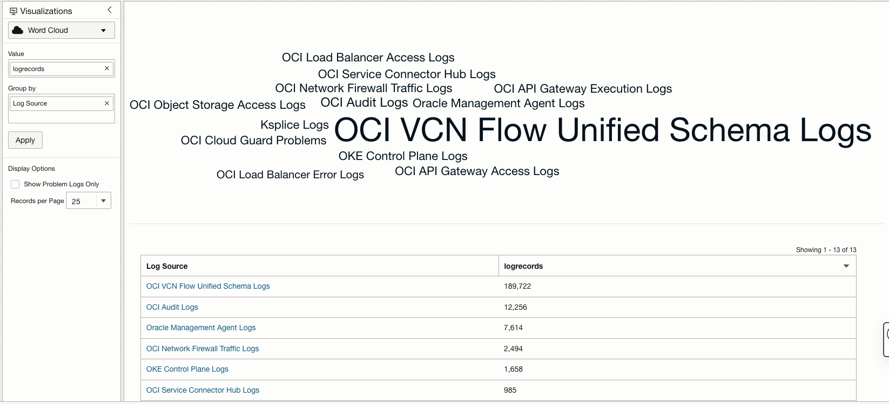
    - If **Records with Histogram** is selected, output will be:
    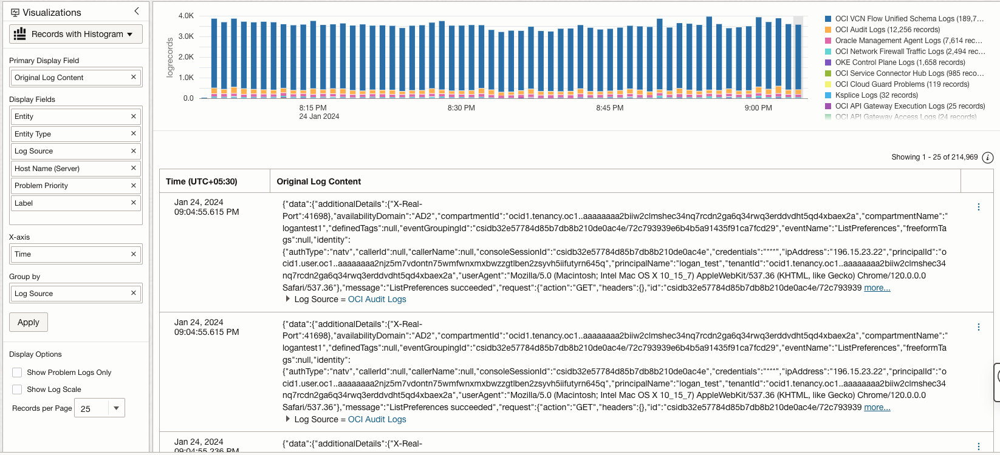
    There will be more options which changes the view of log records or filter the log records based on the visualization selected.

  2. **Display Options** filter the logs on based on options selected:

  3. **Show problem logs only:** If selected, it will only show the problem logs which are having any priority. As we can see, **'Problem Priority' != null** is added in the search query.
      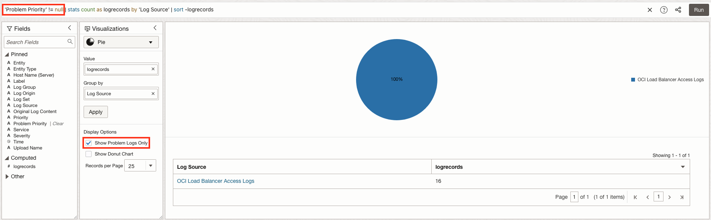

  4. **Show donut chart:** If select, log explorer will show a donut chart instead of pie chart.
      

  5. **Record per page** allows to modify the number of log records you want to see in a single page.
      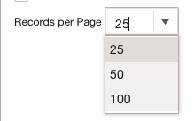

**Fields Panel**:

  It has different fields from which we can filter out the data as per the requirement. Some of the fields are Entity, Entity Type, Host name, Label, Log Origin, Log Source, Original Log Content, Problem Priority, Service and many more.
  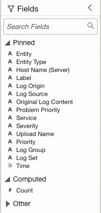

  Below are some examples, showing how we can filter log records using fields.

  1. Filtering of log records based on **Entity**:
    - Select **Entity** from Pinned Field. A Filter Entity popup will appear.
    - Select the Entity for which logs must be filtered.
    - Click on **Apply**.
    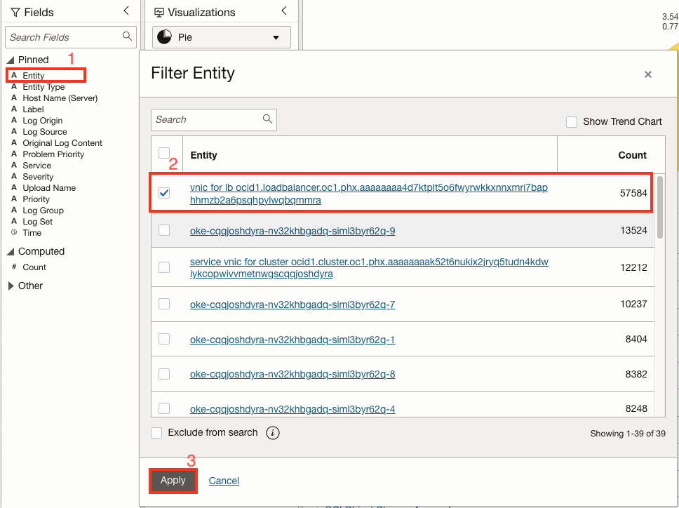
    - **Entity = ' '** is been added in the search query and result is shown in Pie Chart.
    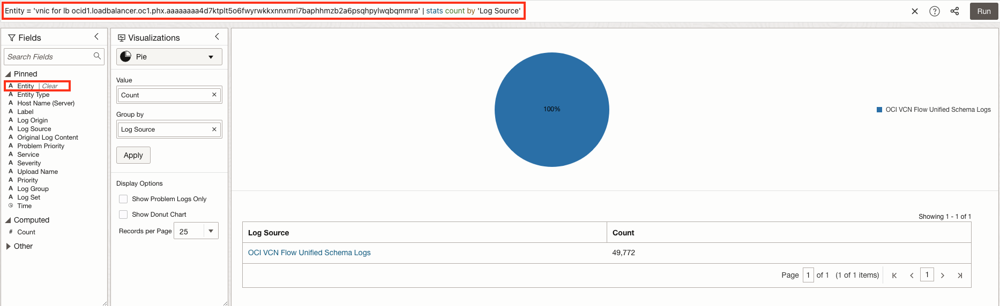

  2. Filtering of log records based on **Severity**:
    - Select **Severity** from Pinned Field. A Filter Severity popup will appear.
    - Select the Severity for which logs must be filtered, for example, **error**.
    - Click on **Apply**.
    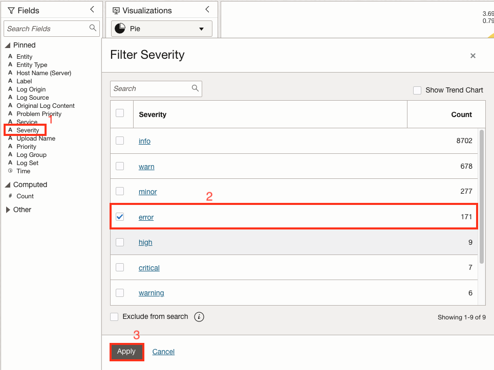
    - **Severity = error** is been added in the search query and result is shown in Pie Chart.
    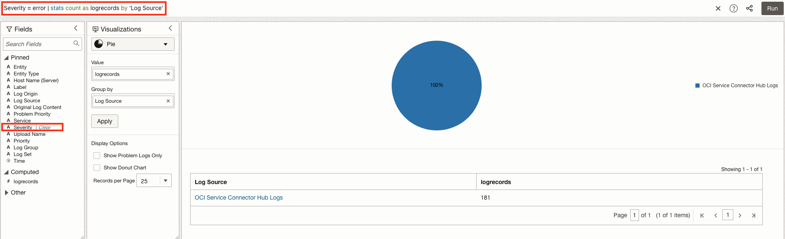

Some of the fields can change as per the visualization selected and the nature of log records.

## Finding distribution, trends of fields and group-by

Use the following visualizations to perform advanced analysis of the large data set to figure out the root cause an issue, to identify potential issues, to view trends, or to detect an anomaly:

* **Cluster:**

    * Clustering uses machine learning to identify the pattern of log records, and then to group the logs that have a similar pattern. Clustering helps significantly reduce the total number of log entries that you have to explore and easily points out the outliers.
    * Go to Visualization Panel -> Visualizations -> Analysis -> **Cluster**.
    * You can see that similar log records are grouped in clusters along with a histogram view of all the records grouped by time interval. You can zoom in to a particular set of intervals (records grouped by time intervals in this case) in the histogram by keeping your left mouse button pressed and drawing a rectangle over the required set of intervals. After you zoom in, the cluster records change based on the selected interval.
      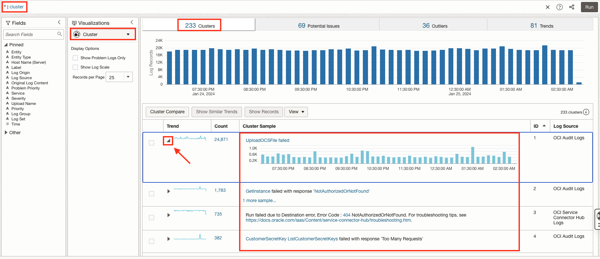
    * The Cluster view displays a summary banner at the top showing the following tabs:
      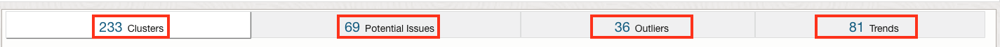

      * **Total Clusters:** Total number of clusters for the selected log records.
      * **Potential Issues:** Number of clusters that have potential issues based on log records containing words such as error, fatal, exception, and so on.
      * **Outliers:** Number of clusters that have occurred only once during a given time period.
      * **Trends:** Number of unique trends during the time period. Many clusters may have the same trend. So, clicking this panel shows a cluster from each of the trends.

* **Link:**

    * Link lets you perform advanced analysis of log records by combining individual log records from across log sources into groups, based on the fields you’ve selected for linking. You can analyze the groups by using the same fields as the ones you used for linking or additional fields for observing unusual patterns to detect anomalies
    * Go to Visualization Panel -> Visualizations -> Analysis -> **Link**.
      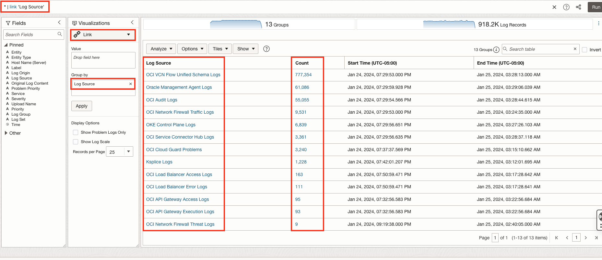
    * By default, Log Source is used in the Group By field to run the link command. You can change it if you want.
    * To analyze the fields that are relevant to your analysis, drag and drop one or more fields to Group By, remove Log Source which is the default field in Group By, and click the check mark to run the Link query.
    * You can use **Analyze**, **Options**, **Tiles** and **Show** options to perform more better analysis of log records.

**Group-by**

Group-by takes one/multiple fields as a parameter and shows the grouping of log records based on parameters. Group-by is supported by all visualizations except Table, Records and Cluster. For most of the cases, default field parameter of group-by is **Log Source**.

1. Only one field parameter is supported by Pie Chart, Heatmap, Line and Table with histogram.

  Pie Chart with group-by **Log Source** (default)
    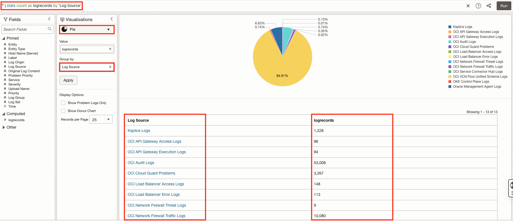

  Pie Chart with group-by **Entity Type**
    * Click on cross icon near Log Source under Group by.
    * Drag and drop the Entity Type field from Fields panel to Group by in Visualization panel.
    * Click on **Apply**.
    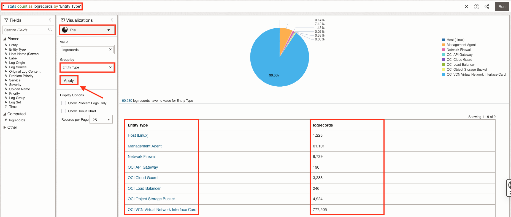

2. Multiple filed parameters are supported by Bar, Horizontal bar, Summary table, Treemap, Sunburst, Map, World cloud, Tile, Distinct, Link.

  Bar graph with group-by **Entity Type** and **Log Source**
    * Click on cross icon near Log Source under Group by.
    * Drag and drop the Entity Type and Log Source field from Fields panel to Group by in Visualization panel.
    * Click on **Apply**.
    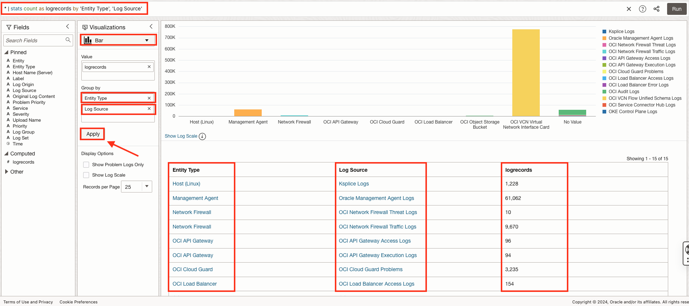

## Learn More

[Select the Visualization Type] (<https://docs.oracle.com/en-us/iaas/logging-analytics/doc/select-visualization-type.html>)

[Search in UI] (<https://docs.oracle.com/en-us/iaas/logging-analytics/doc/search-ui.html>)

[Cluster Visualization] (<https://docs.oracle.com/en-us/iaas/logging-analytics/doc/clusters-visualization.html>)

[Link Visualization] (https://docs.oracle.com/en-us/iaas/logging-analytics/doc/link-visualization.html>)

## Acknowledgements

* **Author** - Chintan Kalsaria, OCI Logging Analytics
* **Contributors** -  Chintan Kalsaria, Kiran Palukuri, Ashish Gor, Kumar Varun, OCI Logging Analytics
* **Last Updated By/Date** - Chintan Kalsaria, Nov 2023
