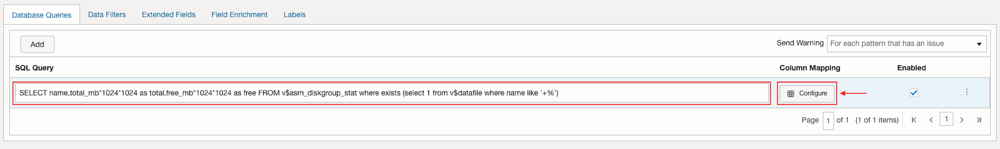
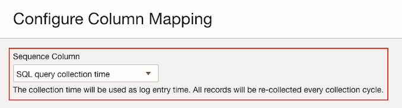
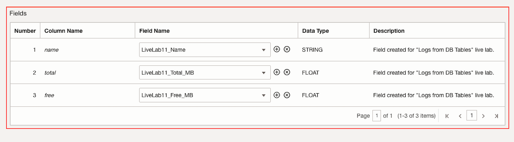
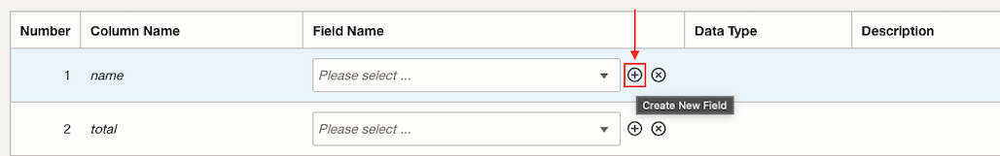
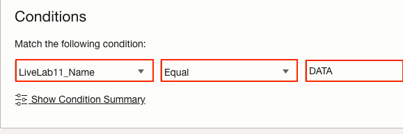
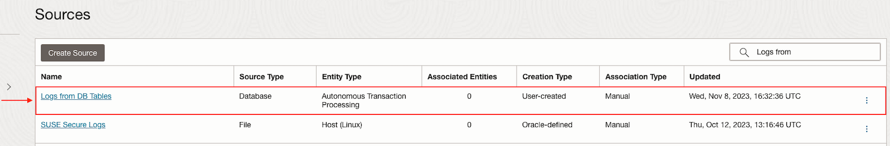
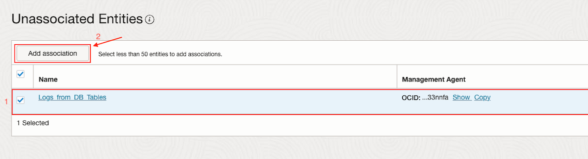
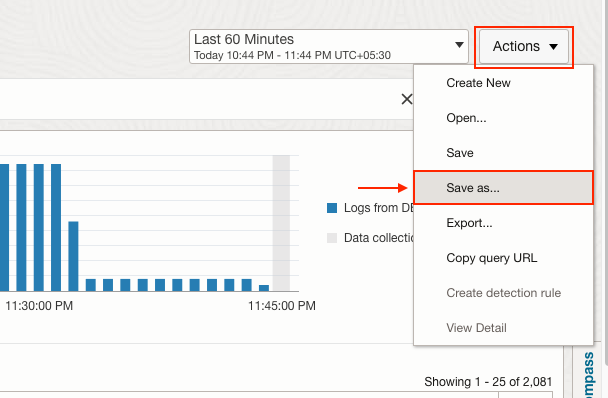

# How do I collect logs and performance data from Oracle Database tables using Logging Analytics?

Duration: 5 minutes

## Prerequisites

* Have an entity linked to a Oracle Database instance.

## Create Database Source type

1. Navigate to **Sources**.

2. Click on **Create Source**.

3. Specify the **Name** and **Description (optional)**.

4. Select **Database** as **Source Type** and **Autonomous Transaction Processing** as **Entity Types**.

5. Click on **Database Queries** and add the following query.
      ```Query
         <copy>SELECT name,total_mb*1024*1024 as total,free_mb*1024*1024 as free FROM v$asm_diskgroup_stat where exists (select 1 from v$datafile where name like '+%')</copy>
      ```
6. Then click on **Configure**.
   

## Configure Column Mapping

1. Select **SQL query collection time** as **Sequence Column**.
   

2. Then select the following fields: **LiveLab11\_Name** for **name** column, **LiveLab11\_Total\_MB** for **total** column and **LiveLab11\_Free\_MB** for **free** column.
   

3. If the **Fields** do not exist, click on **Create New Field** and specify the **Name**, **Data Type** and **Description (optional)**, then click on **Create**.
   

4. Make sure all the fields are mapped and click on **Done**.

## Add conditional label

1. Click on **Labels**.

2. Then click on **Add conditional label**.

3. If it is not found, create a **Label** with the name **Data storage**. Refer to [Sprint: How to create a user defined Label?](?lab=sprint-create-label)

4. Select **LiveLab11_Name** for the **Input Field**, **Equal** for **Operator** and **DATA** for **Condition Value**.
   

5. At **Select labels** select **Data storage** label.

6. Make sure **Enabled** option is marked and then click on **Add**.

7. Click on **Create Source**.

## Associate Entity to Source

1. Click on the source we created previously.
   

2. Then click on **Unassociated Entities** at **Resources** menu.

3. Select **Logs\_from\_DB\_Tables** which is the **Entity** for the **Autonomous Transaction Processing** Database and then click on **Add association**.
   

## Create a new Log Search

1. Navigate to **Log Explorer**.

2. Specify the following query.
      ```Query
         <copy>'Log Source' = '<Name of the Log Source created>' and Label = '<Name of the Label created>' | eval Free_Percentage = LiveLab11_Free_MB * 100 / LiveLab11_Total_MB | where Free_Percentage <= 30 | timestats count as logrecords by 'Log Source'</copy>
      ```
3. Click on **Run**.

4. Then click on **Actions** an select **Save as...**.
   

5. Specify a **Search Name** and a **Search Description (optional)**.

6. Click on **Save**.

## Create Scheduled Search Detection Rule

1. Refer to [Sprint: How to create scheduled search detection rules?](?lab=sprint-create-scheduled-search-detection-rule)

   Create a scheduled search type detection rule using the saved search we created.

## Create Alarm that fires if available free space is 30% or less

1. Refer to [Sprint: How to create alerts on logs with Logging Analytics?](?lab=sprint-alerts-on-logs-with-logging-analytics)

   Create an alarm for the detection rule with the **Trigger rule** of **greater than or equal** to **1** in a **Trigger delay minutes** of **1**.
   

   Create a new **Topic** if needed.

## See Alarm results

1. Navigate to **Alarms**.

2. At **Alarm Definitions** click on the alarm we created.

3. When available free space is 30% or less the alarm will fire.

## Learn More

* [Set Up Database Instance Monitoring](https://docs.oracle.com/en-us/iaas/logging-analytics/doc/set-database-instance-monitoring.html)
* [Collect Database Audit Logs to Analyze Using Oracle Log Analytics](https://docs.oracle.com/en/cloud/paas/management-cloud/collect-database-audit-logs/index.html)
* [Allow Continuous Log Collection Using Management Agents](https://docs.oracle.com/en-us/iaas/logging-analytics/doc/allow-continuous-log-collection-using-management-agents.html#GUID-AA23C2F5-6046-443C-A01B-A507E3B5BFB2)


## Acknowledgements
* **Author** - Oswaldo Osuna, Logging Analytics Development Team
* **Contributors** -  Kumar Varun, Logging Analytics Product Management - Kiran Palukuri, Logging Analytics Product Management - Vikram Reddy, Logging Analytics Development Team 
* **Last Updated By/Date** - Oswaldo Osuna, Jan 19 2024
