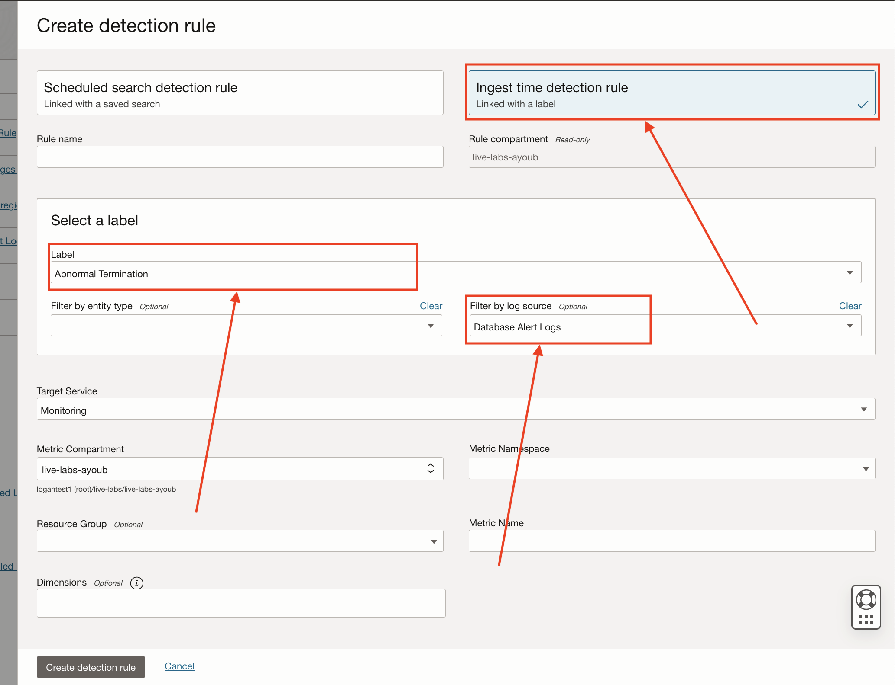
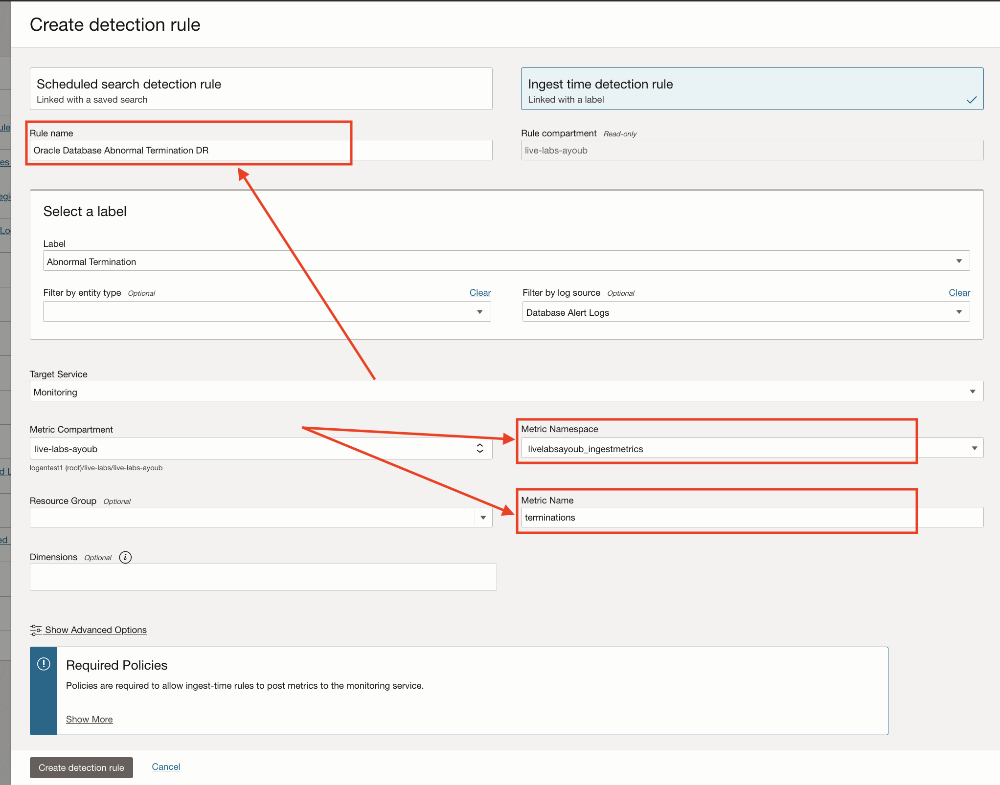
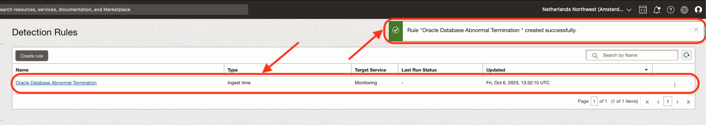
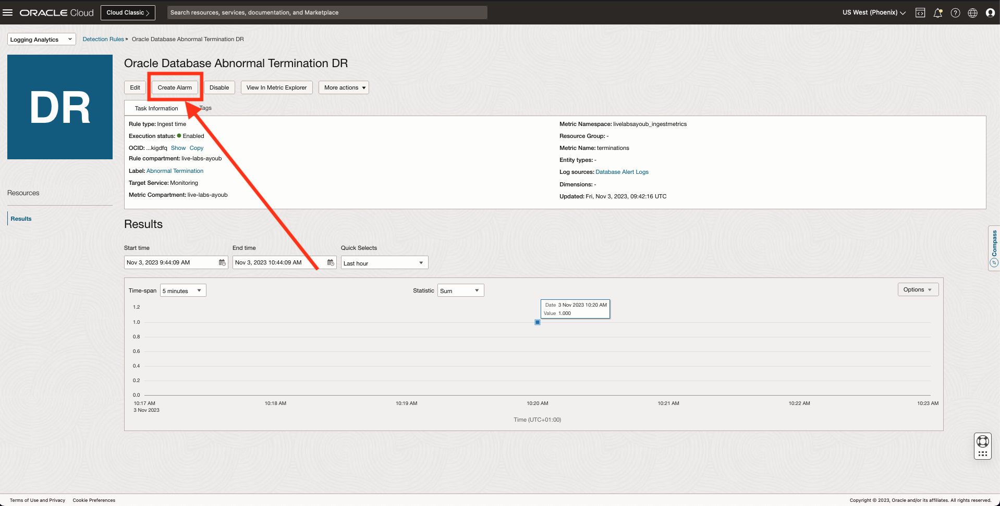

# How do I detect Oracle Database Abnormal Termination events like ORA-12547 using Logging Analytics?

Duration: 15 minutes

This lab explains how to associate OOTB Labels (Out of the Box Oracle defined labels) to log sources and entities. By the end of this Live Lab, You will create Detection Rules & alarms for **Oracle Database Abnormal Termination** incidents.

1. Create an "Ingest Time Detection Rule" with the following fields (Follow the instructions on [How to create and trigger an ingest time detection rule?](?lab=sprint-create-and-trigger-ingest-time-detection-rule)):

  **Consistent values for the lab (Use these exact values to get the same results as the live lab):**

    - **Label:** Abnormal Termination
    - **Filter by log source:** Database Alert Logs

    

  **Variable values (These fields do not alter the result of the live lab):**

    - **Rule Name:** Choose a name for your rule, ours will be "Oracle Database Abnormal Termination DR" for this Live Lab.
    - **Metric Namespace:** Pick a friendly name for your metric namespace to use later when creating your alarm, ours will be "livelabsayoub_ingestmetrics" for this Live Lab.
    - **Metric Name:** Pick a friendly name for your metric, ours will be "terminations" for this Live Lab.

    

Your Detection Rule should be up and ready and you should see a screen similar to this one:



Prepare the logs to upload and trigger the Detection Rule making its metrics available to the alarms service:

1. Open your OCI Cloud Shell Console.
2. In your console, Navigate to a directory you have the read/write/execute access to and Paste and run this command:

    ```bash
      <copy>
      source <(curl -s https://raw.githubusercontent.com/oracle-quickstart/oci-observability-and-management/master/utils/create-sprint-oracle-database-abnormal-termination-logs-script.sh) > abnormal-termination-live-lab-logs.aud && python <(curl -s https://raw.githubusercontent.com/oracle-quickstart/oci-observability-and-management/master/utils/upload-logs-file-to-oci.py) -s "abnormal-termination-live-lab-logs.aud" -n "Live Labs Upload - You can delete it once you are done" -l "Database Alert Logs" -f "abnormal-termination-live-lab-logs.aud"
      </copy>
    ```

    **Explanation:** This script generates dummy logs into a new file & uploads them into your OCI Logging Analytics Service to trigger your Detection Rule.

Create the alarm from the Detection Rule:

1. Go back to the Detection Rule's page and Click on "Create Alarm":


2. Fill the Alarm Form (Refer to [How to create alerts on logs with Logging Analytics?](?labs=sprint-alerts-on-logs-with-logging-analytics) for more info), Be sure to set:
    - The Metrics Interval to: 1 minute
    - The Statistic to: count
  

3. To verify the alarm, repeat the upload step with the OCI Cloud Shell Console.

## Learn More

- [Detect Predefined Events at Ingest Time](https://docs.oracle.com/en-us/iaas/logging-analytics/doc/detect-predefined-events-ingest-time.html#GUID-D28CF994-288F-48C3-8CE5-28CE29C3482C)
- [Create Alarm from a Detection Rule](https://docs.oracle.com/en-us/iaas/logging-analytics/doc/create-alerts-detected-events.html)

## Acknowledgements

- **Author:** Ayoub BELMEHDI, OCI Logging Analytics

- **Contributors:** Ashish GOR, Kiran PALUKURI, Vikram REDDY, Kumar Varun, OCI Logging Analytics

- **Last Updated By/Date:** Ayoub BELMEHDI, October 2023
