# How do I create an alert for sensitive configuration and privilege configuration changes in Oracle Database using Logging Analytics?

Duration: 15 minutes

This lab will walk you through the steps to Create & verify Scheduled Detection rules alarms to detect **Sensitive Configuration and Privilege Escalation**.
This lab explains how to create and manage single and multi-conditional labels for ingest time detection rules.

## Create a conditional label

1. Prepare and upload a log sample by copying and pasting this command into your oracle cloud shell:

    ```bash
      <copy>
        source <(curl -s https://raw.githubusercontent.com/oracle-quickstart/oci-observability-and-management/master/utils/create-sprint-sensitive-configuration-and-privilege-escalation-logs-script.sh) > sensitive-configuration-and-privilege-escalation-live-lab-logs.log && python <(curl -s https://raw.githubusercontent.com/oracle-quickstart/oci-observability-and-management/master/utils/upload-logs-file-to-oci.py) -s "sensitive-configuration-and-privilege-escalation-live-lab-logs.log" -n "Live Labs Upload - You can delete it once you are done" -l "Database Audit Logs" -f "sensitive-configuration-and-privilege-escalation-live-lab-logs.log"
      </copy>
    ```

    **Explanation:** This script generates dummy logs into a new file & uploads them into your OCI Logging Analytics Service to trigger your Detection Rule.

2. Go to **"Administration"** > **"Uploads"**, look for **"Live Labs Upload - You can delete it once you are done"** and select it.

    **P.S:** If you can't find it, Something probably went **wrong** during the first Step.

3. Click on **"View in Log Explorer"**:

  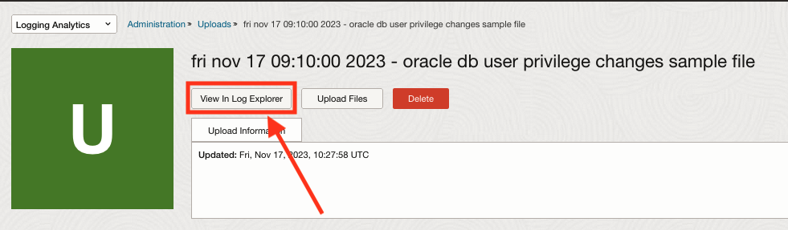
4. Go to one of the logs that should raise the label, click on the 3 dots at its far right and click on **"Add conditional label"**:

  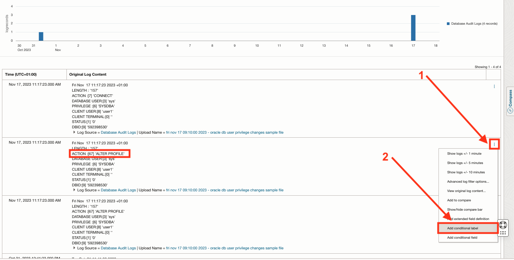
5. Fill the Condition's fields:
    1. Change "Original Log Content" to "Action"
    2. Change "equal" to "In"
    3. The condition value field should be populated with 'ALTER PROFILE', add these value one by one (These are the privileges names of database actions), hit enter after you enter each one in the field:
      - ALTER USER
      - CREATE PROFILE
      - CREATE USER
      - DROP PROFILE
      - DROP USER
    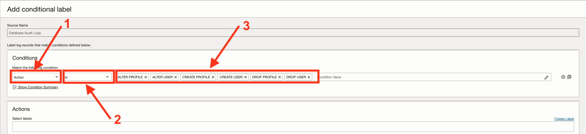
6. Associate a label(s) to your conditional label by creating one or using an existing one:
    1. Open the label creation panel:
    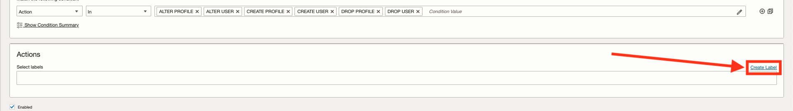
    2. Fill the label fields & Save the label:
    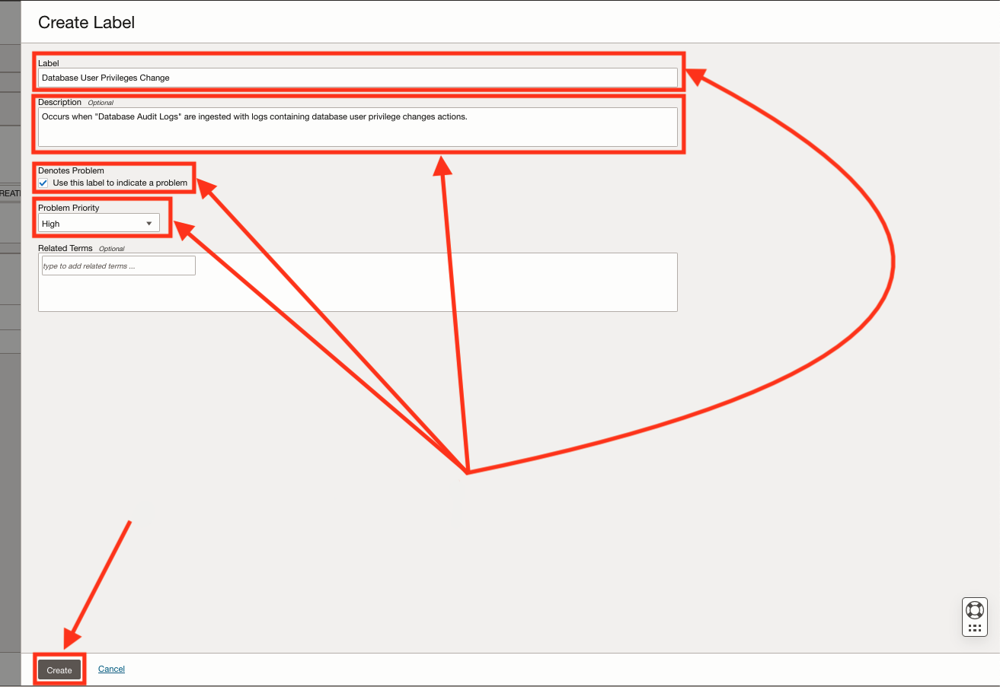
    3. Save the conditional Label:
    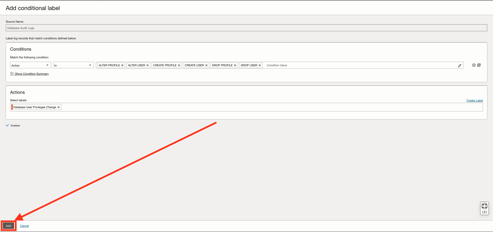

Your new conditional label should now be ready to be used in other Monitoring services.

## Create a Detection Rule

Create a Detection Rule:

1. Go to **"Administration"** > **"Label"**, Select the Label you just created for the Conditional Label and Click on **"Ingest time detection rule"** to move to the Detection Rules tab:
  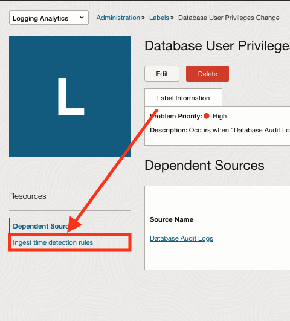

2. Click on **"Create rule"**

3. Fill the fields to create the Detection Rule (Refer to [How to create and trigger an ingest time detection rule?](?lab=sprint-create-and-trigger-ingest-time-detection-rule) for more info):
  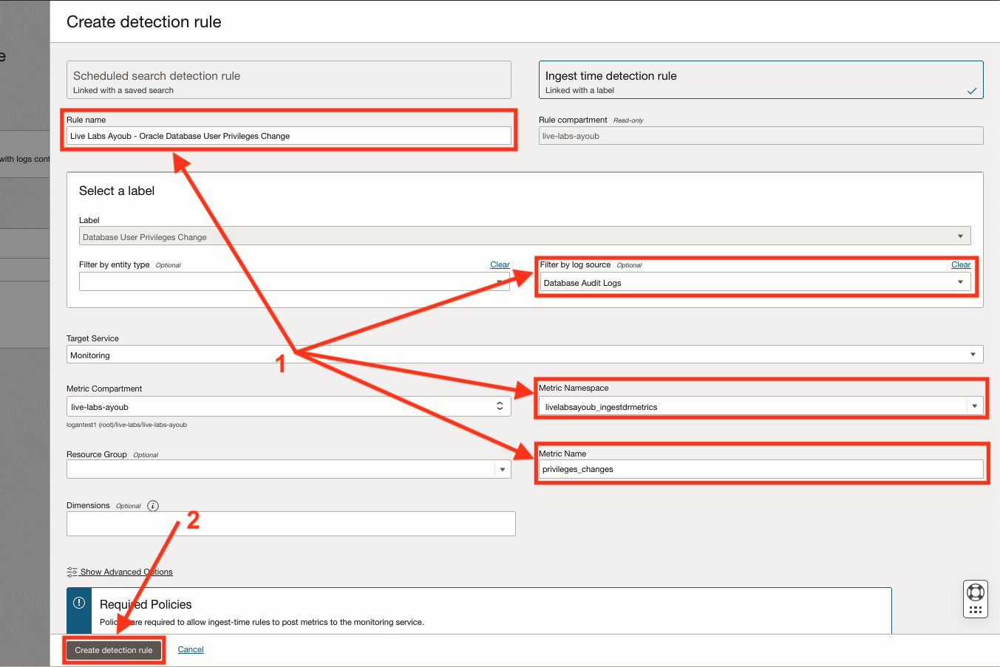
  **Explanation:**
    1. Fill the name, log source, Metric Namespace & Name.
    2. Click on **"Create Detection Rule"**.

Prepare the logs to upload and trigger the Detection Rule making its metrics available to the alarms service:

  Trigger the Detection Rule by repeating the steps in **1.** . When done you should expect a result similar to this figure:
    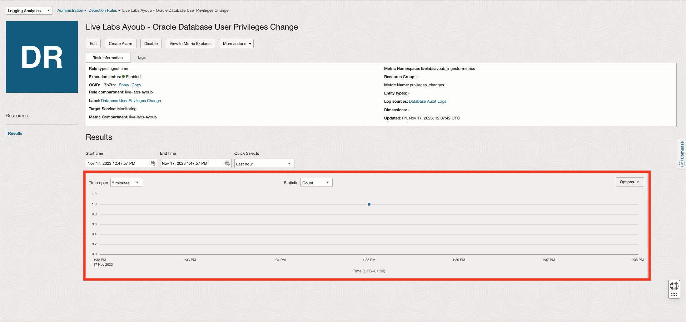

  The Detection Rule should be up and ready to be used in other Monitoring services.

## Create the Alarm

Create the alarm from the Detection Rule:

1. Create the alarm by going to **"Administration"** > **"Detection Rules"** and Select the Detection Rule you just created for your Label (you can use the breadcrumb) > Click on Create Alarm to open the alarm creation page:

  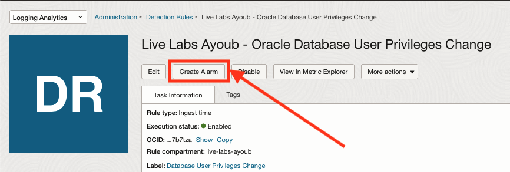
2. Fill the Alarm Form (Refer to [How to create alerts on logs with Logging Analytics?](?lab=sprint-alerts-on-logs-with-logging-analytics) for more info), Be sure to set:
    - The Metrics Interval to: 1 minute
    - The Statistic to: count

  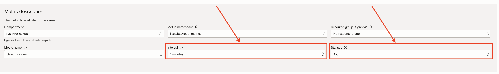
3. To Verify the alarm, repeat **"Step 1."** and wait for the logs to be processed and the alarm to be triggered.

## Learn More

- [Detect Predefined Events at Ingest Time](https://docs.oracle.com/en-us/iaas/logging-analytics/doc/detect-predefined-events-ingest-time.html#GUID-D28CF994-288F-48C3-8CE5-28CE29C3482C)
- [Create Alarm from a Detection Rule](https://docs.oracle.com/en-us/iaas/logging-analytics/doc/create-alerts-detected-events.html)

## Acknowledgements

- **Author:** Ayoub BELMEHDI, OCI Logging Analytics

- **Contributors:** Ashish GOR, Kiran PALUKURI, Vikram REDDY, Kumar Varun, OCI Logging Analytics

- **Last Updated By/Date:** Ayoub BELMEHDI, October 2023
