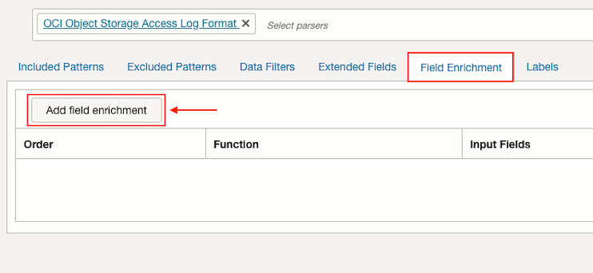
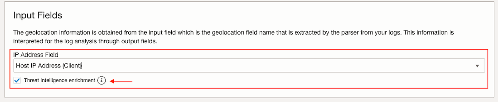
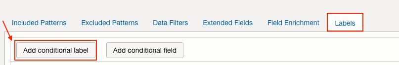
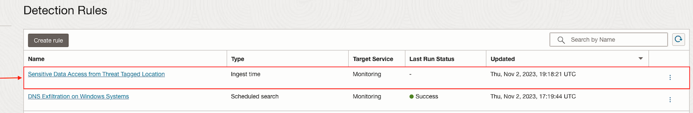
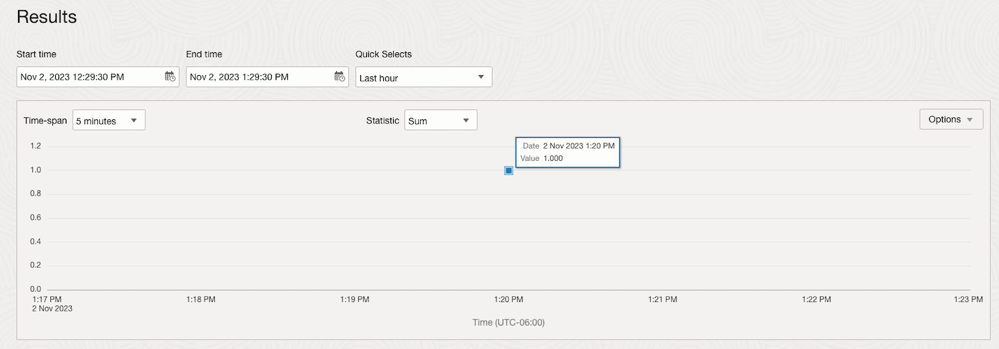
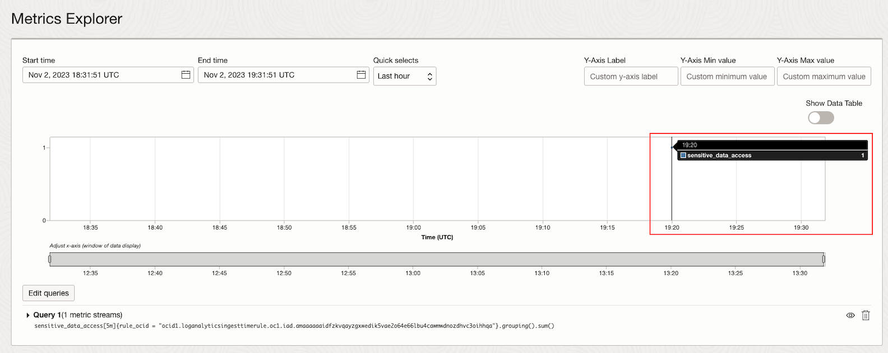
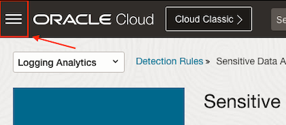
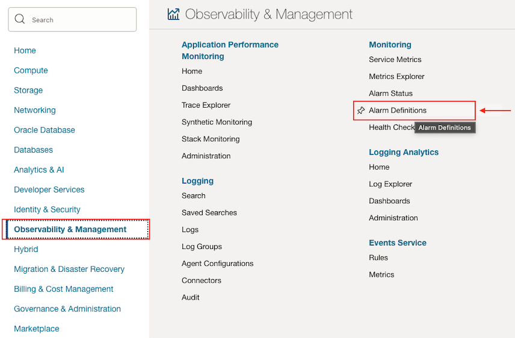
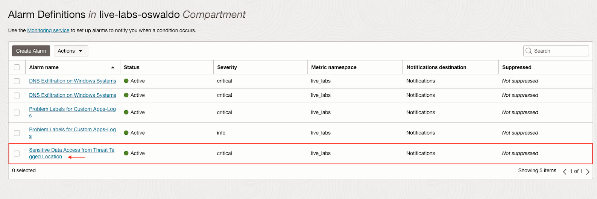

# How can I generate an alert for suspicious access to sensitive data from specific IPs using Logging Analytics?

Duration: 5 minutes

## Create Source with field enrichment

1. Navigate to **Sources**.

2. Click on **Create Source**.

3. Specify the **Name** and **Description (optional)**.

4. Select **File** as **Source Type** and **OCI Object Storage Bucket** at **Entity Types**.

5. Make sure the **Specific parser(s)** option is marked and select **OCI Object Storage Access Log Format**.
   ")

6. Click on **Field Enrichment** and on **Add field enrichment**.
   

7. Select **Geolocation** in **Function**.

8. Then select **Host IP Address (Client)** in **IP Address Field** and mark **Threat Intelligence enrichment** option.
   

9. Click on **Add field enrichment**.

## Add conditional label

1. Click on **Labels** and then on **Add conditional label**.
   

2. Select **Host IP Address (Client)** as **Input Field** and **Not In** as **Operator**. Add the following IPv4 addresses to **Condition Value**.
      ```IPv4 addresses
         192.168.0.100, 192.168.0.101, 192.168.0.102, 192.168.0.103
      ```
   

3. Click on **Create Label**.

4. Specify a **Label** and **Description (optional)**. Mark **Detonates Problem** option and select **High** as **Problem Priority**.

5. Click on **Create**.

6. Then click on **Create Source**.

## Create Ingest time detection rule

1. Refer to [Sprint: How to create and trigger an ingest time detection rule?](?lab=sprint-create-and-trigger-ingest-time-detection-rule)

   Use the source and label we created previously.

## Create Alarm

1. Refer to [Sprint: How to create alerts on logs with Logging Analytics?](?lab=sprint-alerts-on-logs-with-logging-analytics)

   Create an alarm for the detection rule with the **Trigger rule** of **greater than or equal** to **1** in a **Trigger delay minutes** of **1**.
   

   Create a new **Topic** if needed.

## Upload logs file

1. Refer to [Sprint: How to upload Files into a Source from the OCI console?](?lab=sprint-upload-log-file)

   Upload logs using the file generated by following Python script. You can use your **OCI Cloud Shell** to run the script.
      ```Python script
         <copy>python <(curl -s https://raw.githubusercontent.com/oracle-quickstart/oci-observability-and-management/master/utils/oci-storage-bucket-logs.py)</copy>
      ```

   Then upload the generated logs file running the following Python script. Use the **Log Source** created previously.
      ```Python script
         <copy>python <(curl -s https://raw.githubusercontent.com/oracle-quickstart/oci-observability-and-management/master/utils/upload-logs-file-to-oci.py) -f oci-storage-bucket-logs.log -s oci-storage-bucket-logs -l "<Name of the Log Source created>" -n oci-storage-bucket-logs</copy>
      ```

## See Detection Rules and Alarms results

1. Navigate to **Detection Rules**.

2. Click on the detection rule we created.
   

3. At **Results** we can see there has been a **Sensitive Data Access from Threat Tagged Location**.
   

4. Click on **View In Metric Explorer**.

5. We can see the same result in the **Metrics Explorer** view.
   

6. Click on the **Navigation menu**.
   

7. Click on **Observability and Management** and then click on **Alarm Definitions** inside **Monitoring**.
   

8. Click on the alarm we created.
   

9. We can see the alarm is **Firing**.

You may now proceed to [How can I setup alerts for occurrences of critical event signatures in custom application logs using Logging Analytics?](../sprint-problem-labels-for-custom-apps-logs/)

## Acknowledgements
* **Author** - Oswaldo Osuna, Logging Analytics Development Team
* **Contributors** -  Kumar Varun, Logging Analytics Product Management - Kiran Palukuri, Logging Analytics Product Management - Vikram Reddy, Logging Analytics Development Team 
* **Last Updated By/Date** - Oswaldo Osuna, Jan 25 2024
