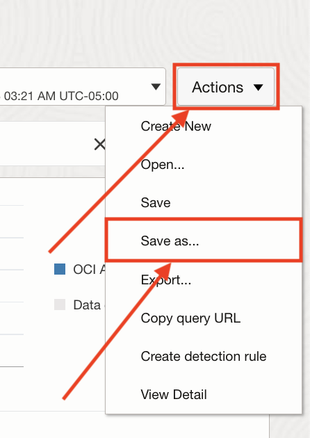
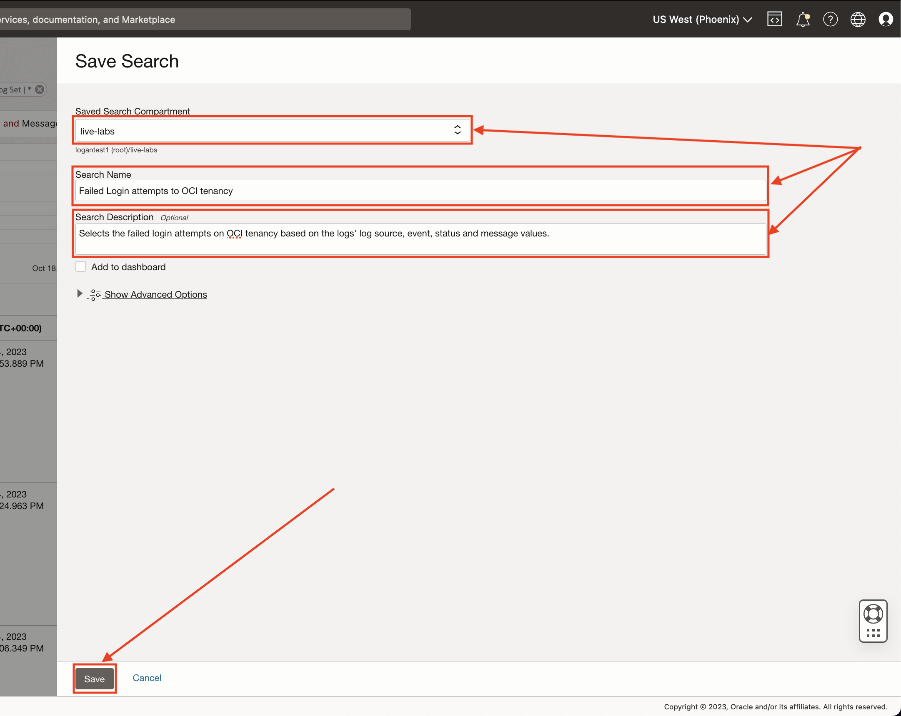
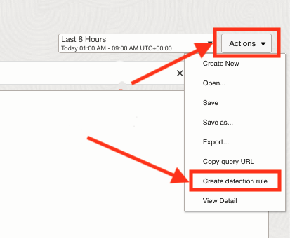
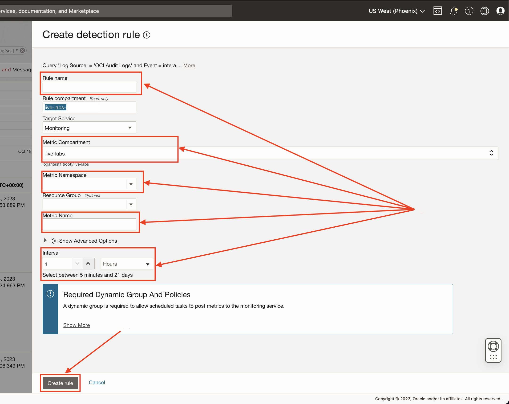
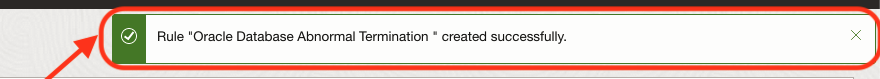
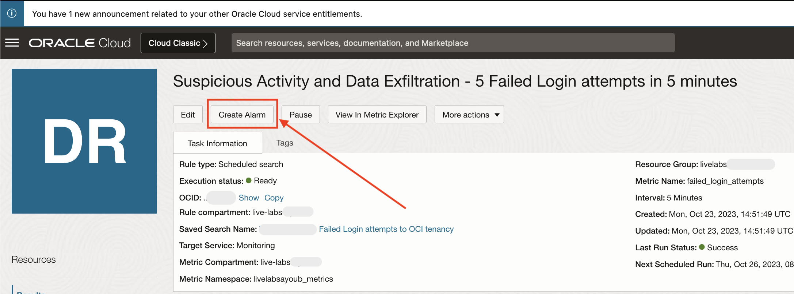
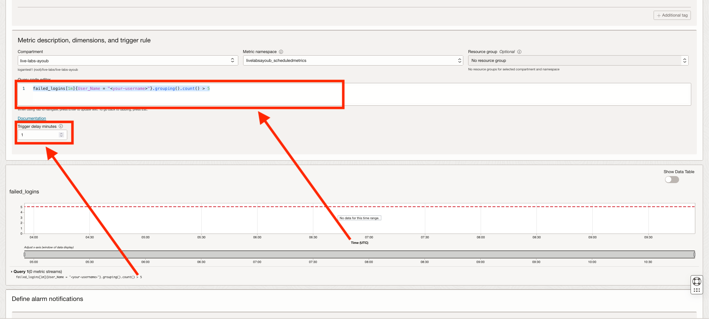

# How can I set up an alert for detecting suspicious activity and potential data exfiltration from logs using Logging Analytics?

Duration: 15 minutes

This lab will walk you through the steps to Create & verify Scheduled Detection rules alarms to detect **Suspicious Activity and Data Exfiltration**.

This lab explains scheduled task detection rules based on numerical thresholds.

## Create a Detection Rule

1. Navigate to the logs explorer (Refer to [How to use Log Explorer for analytics and visualizations?](?lab=sprint-log-explorer-for-analytics-and-visualizations) for more info) and run this query:

    ```MQL
    <copy>'Log Source' = 'OCI Audit Logs' and Event = interactivelogin and Status = '400' and Message = 'InteractiveLogin failed' | distinct 'Client Host City', 'User Name'</copy>
    ```

2. Save the search:

    1. Click on the **"Actions"** button and Choose **"Save as..."**:
    

    2. Fill the Saved Search creation form and click on **"save"**:
      - Choose a compartment
      - Fill the **name** field for the saved search (For the rest of this live lab, we will name it "Failed Login attempts to OCI tenancy")
      - Feel free to add a **description** to your saved search
    

3. Create the Detection Rule (Refer to [How to create and trigger an ingest time detection rule?](?lab=create-scheduled-search-detection-rule) for more details):

    1. Click on **"Actions"** and Select **"Create Detection Rule"**:
    

    2. Fill the form to create the Detection Rule and hit **"Save"**:

      - **Rule name:** The name of your Detection Rule.
      - **Metric Compartment:** Your metrics compartment.
      - **Metric Namespace:** A friendly name for your metrics Namespace.
      - **Metric Name:** A friendly name for your Metric, we will set it to *unsuccessful_logins* in this live lab.
      - **Interval:** The interval after which the Detection Rule should be re-run, We will set it to 5 min in this live lab.

      **P.S:** The metric namespace and metric name will be used to create the alarms in a later step in this live lab.

      

Your Detection Rule should be up and ready and you should see a notification similar to this one:



Trigger the Detection Rule and make its metrics available in the alarms service. The fastest way to achieve this is by signing in to your tenancy with a wrong password.

## Create the Alarm

Create an alarm and verify it:

1. Create an alarm for the Detection Rule by clicking on "Create Alarm" from the Detection Rule page to open the Alarm creation page > Fill the fields and save:
  

2. Fill the Alarm form fields:

    1. Fill the fields as described in the in [How to create alerts on logs with Logging Analytics?](?labs=sprint-alerts-on-logs-with-logging-analytics)
    2. Click on "Switch to Advanced Mode".
    3. From the query in your query code editor, save the resourceId (we will need it in the next step).
    4. Copy this query into your query code editor and replace **"unsuccessful_logins"**, **&lt;resource\_id>** and **&lt;your-username>** by your metric name, the resourceId you just saved and the username you want to monitor from the Detection Rule respectively:

      ```MQL
        <copy>
          unsuccessful_logins[1m]{resourceId = "<resource_id>", User_Name = "<your-username>"}.grouping().count() >= 5
        </copy>```

      **P.S:** If you can not see your metrics, it is probably because still no event was detected by your rule, and you might need to trigger your rule manually before the metric shows up here. In this example, you can try to authenticate to your tenancy with wrong ids so your Detection Rule starts ingesting logs.

      
    5. Select the Destination of your notification or create a new one by clicking on "Create a topic" button and following the instructions.

3. Prepare the logs to trigger and verify the alarm by creating sample logs and uploading them using this Bash script. Be sure to set **&lt;username>** to the username you want to monitor or keep it blank to monitor the current user.

    ```bash
      <copy>
        source <(curl -s https://raw.githubusercontent.com/oracle-quickstart/oci-observability-and-management/master/utils/create-sprint-suspicious-activity-and-data-exfiltration-logs-script.sh) <username> > suspicious-activity-and-data-exfiltration-logs.log && python <(curl -s https://raw.githubusercontent.com/oracle-quickstart/oci-observability-and-management/master/utils/upload-logs-file-to-oci.py) -s "suspicious-activity-and-data-exfiltration-logs.log" -n "Live Labs Upload - You can delete it once you are done" -l "OCI Audit Logs" -f "suspicious-activity-and-data-exfiltration-logs.log"
      </copy>
    ```

    **Explanation:** This script generates dummy logs into a new file & uploads them into your OCI Logging Analytics Service to trigger your Detection Rule.

4. Click on "Close" and wait a little while for the file to be processed and for its logs to show of in the services (Log Explorer, Detection Rule, etc...).

When the processing is done, your alarm should be triggered and you should receive a notification in the topic you choose.

## Learn More

- [OCI Audit Logs](https://docs.oracle.com/en-us/iaas/Content/Audit/Concepts/auditoverview.htm)
- [Scheduled Saved Search](https://docs.oracle.com/en-us/iaas/logging-analytics/doc/create-schedule-run-saved-search.html#GUID-A37A3F93-BE74-4850-859D-C8D293781036)
- [Query Search](https://docs.oracle.com/en-us/iaas/logging-analytics/doc/query-search.html)
- [Query Metric Landing](https://docs.oracle.com/en-us/iaas/Content/Monitoring/Tasks/query-metric-landing.htm#top)

## Acknowledgements

- **Author:** Ayoub BELMEHDI, OCI Logging Analytics

- **Contributors:** Ashish GOR, Kiran PALUKURI, Vikram REDDY, Kumar VARUN, Jolly KUNDU, OCI Logging Analytics

- **Last Updated By/Date:** Ayoub BELMEHDI, October 2023
