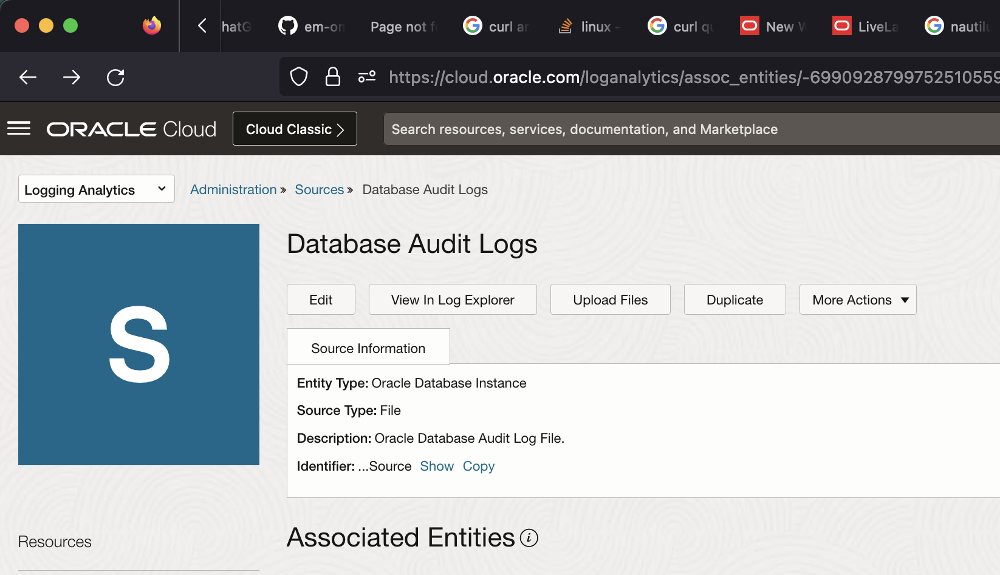
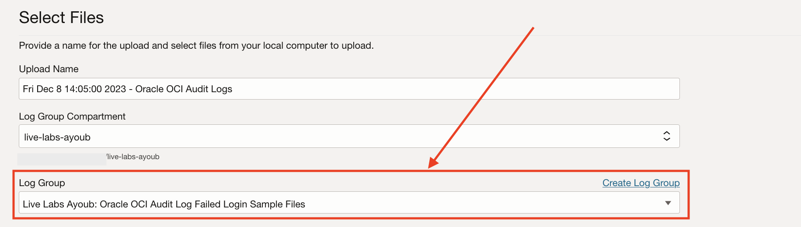
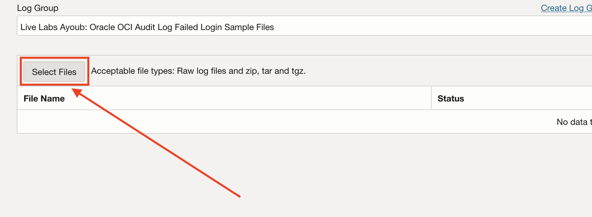
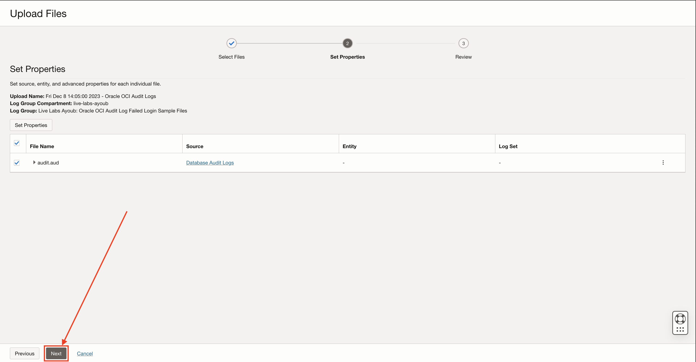
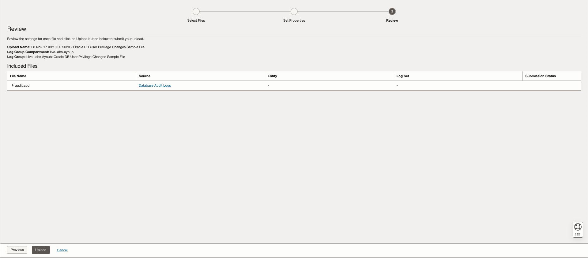
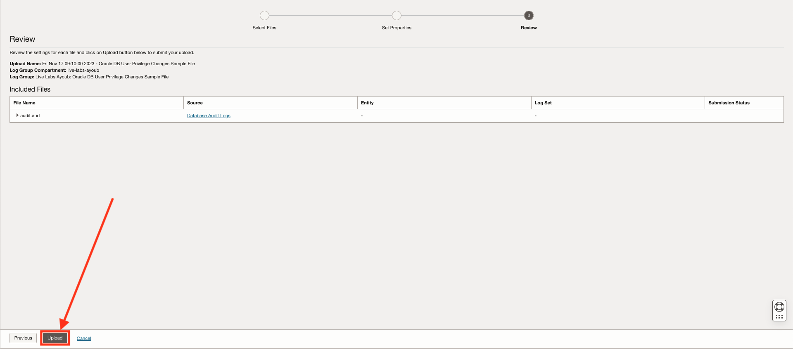
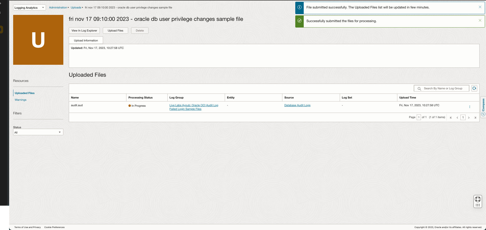
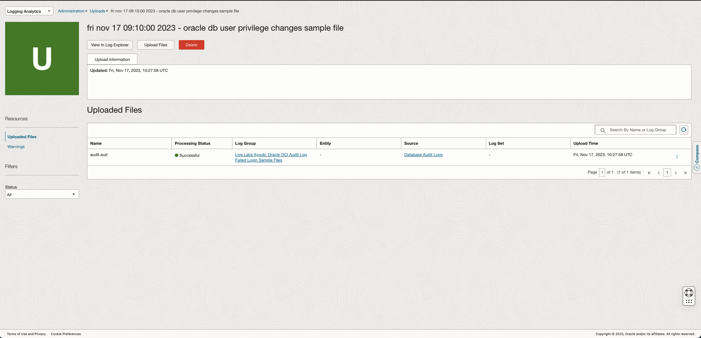
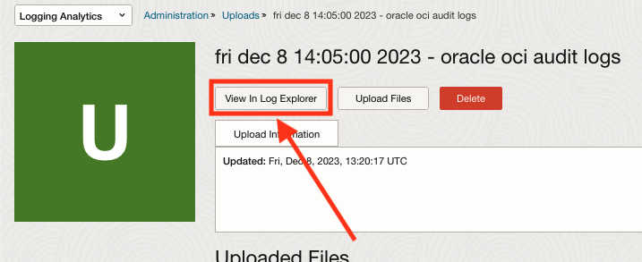
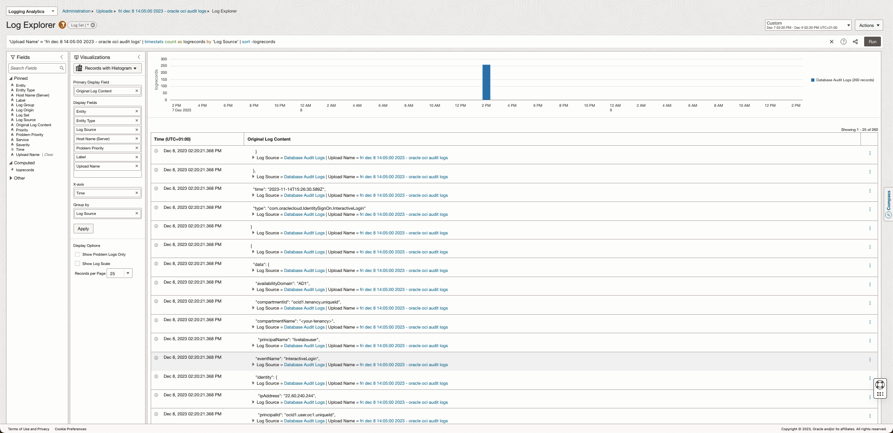

# How to upload Files into a Source from the OCI console?

Duration: 5 minutes

This lab will walk you through the steps to **"Upload a file into a Source"** from the OCI console interface.

1. Navigate to the Sources page > Select the Source you want to upload the logs for (We will use "Database Alert Logs" during this Live Lab):

2. Click on Upload Files:

3. Fill the name and the Log Group Compartment:

4. Fill the required Log Group (Create a new one if needed):

5. Select the files to upload from your computer:

6. Click on "Next":

7. Click on "Next":

8. Check the information on your screen & click "Upload" then click on "Close":

You should see a screen with the status of your uploaded files. Refresh the page to check when the file was successfully processed.

You can verify your uploads in the Log Explorer by clicking on "View in Log Explorer".

You should see a result similar to this if your log file is valid and contains logs:

## Learn More

* [Upload file(s) into OCI Logging Analytics](https://docs.oracle.com/en-us/iaas/logging-analytics/doc/upload-logs-demand.html)

## Acknowledgements

* **Author:** Ayoub BELMEHDI, OCI Logging Analytics

* **Contributors:** Ashish GOR, Kiran PALUKURI, Vikram REDDY, Kumar VARUN, Jolly KUNDU, OCI Logging Analytics

* **Last Updated By/Date:** Ayoub BELMEHDI, October 2023
