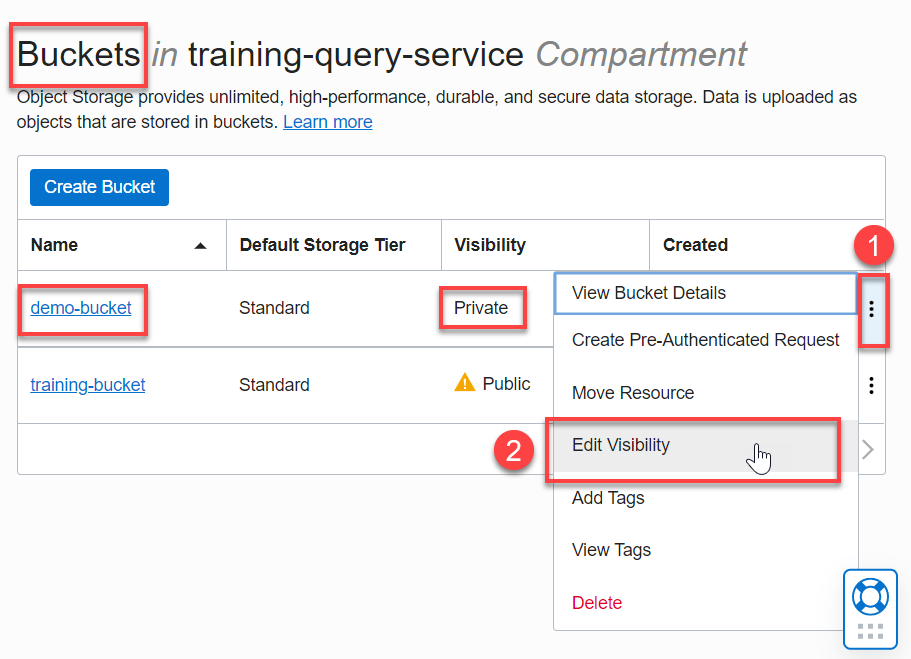
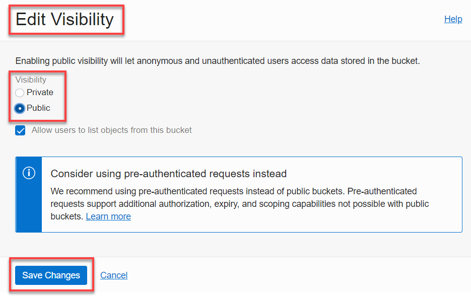
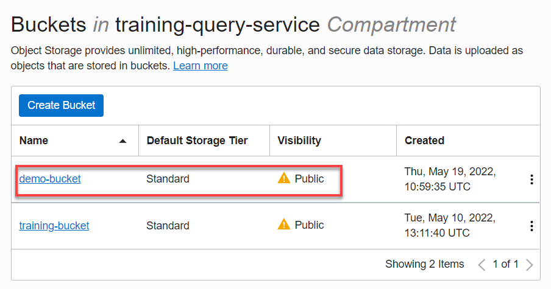

# How can I change bucket visibility settings?

Duration: 2 minutes

## Change a Bucket Visibility Settings

Make sure you are in the region where your bucket is and follow the steps below to change the visibility settings of a bucket:

1. Open the **Navigation** menu in the Oracle Cloud console and click **Storage**. Under **Object Storage & Archive Storage**, click **Buckets**.

2. On the **Buckets** page, select the compartment that contains your bucket from the **Compartment** drop-down list in the **List Scope** section.

3. On the **Buckets** page, note the current **Visibility** setting for your bucket, **Private** in this example. On the row for the bucket, click the **Actions** icon (three vertical dots), and then click **Edit Visibility** from the context menu. In the **Edit Visibility** dialog box, select the **Public** option (or Private if it was Public), and then click **Save Changes**.

  

    >**Note:** You can also edit the bucket's visibility setting by clicking the bucket's name link in the **Name** column to display the **Bucket Details** page.

4. In the **Edit Visibility** dialog box, select the desired visibility option, **Public** in this example, and then click **Save Changes**.

  

    >**Note:** If you are switching the bucket's visibility from Private to Public, the **Allow users to list objects from this bucket** check box is selected. This allows users to list the objects in the bucket.

5. The **Buckets** page is re-displayed. The updated visibility setting for your bucket is displayed in the **Visibility** column, **Public** in this example.

    

## Learn More

* [Explore more about Object Storage in Oracle Cloud.](https://docs.oracle.com/en-us/iaas/Content/Object/home.htm)
* [Using Pre-authenticated Requests](https://docs.oracle.com/en-us/iaas/Content/Object/Tasks/usingpreauthenticatedrequests.htm)
