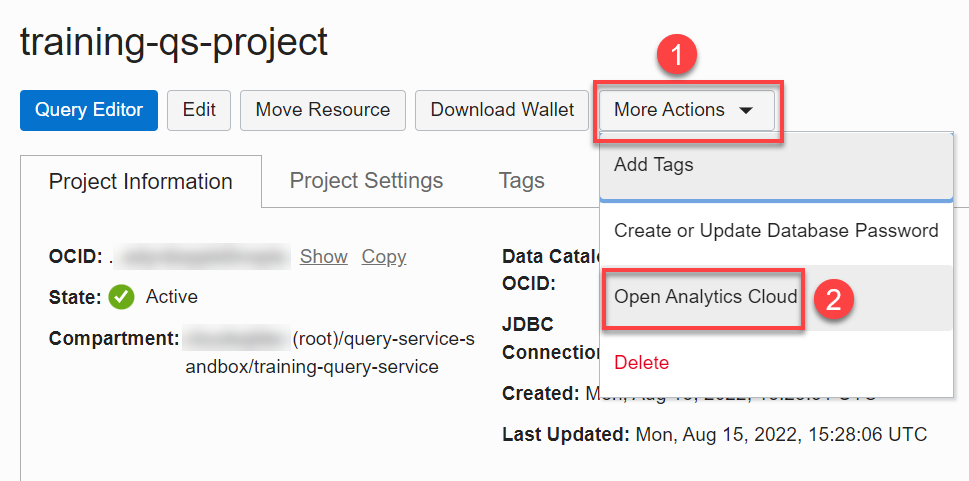
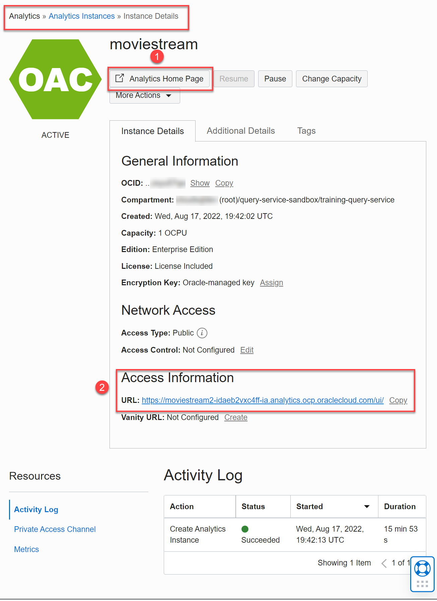
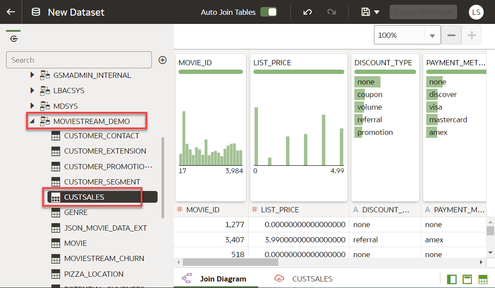

# How do I connect to Query Service from Oracle Analytics Cloud?
Duration: 10 minutes

Oracle Analytics Cloud (OAC) is a scalable and secure public cloud service that provides a full set of capabilities to explore and perform collaborative analytics for you, your workgroup, and your enterprise.

### Objectives

* Create an Oracle Analytics Cloud instance
* Create a connection to a Query Service data source
* Create a dataset from the Query Service connection
* Create a workbook and visualize the data

### Prerequisites
Successfully completed the following:
* **How do I create the required Query Service projects policies?** sprint
* **How do I create a Query Service project?** sprint
* The **Create Database Password** and **Download Database Wallet** _steps_ in the **How do I connect to Query Service from Oracle SQL Developer?** sprint

### **Create an Oracle Analytics Cloud Instance**

To connect to a Query Service project from Analytics Cloud, you need to create a database password and download a database wallet, which you should have already done in the **How do I connect to Query Service from Oracle SQL Developer?** sprint.   

1. Sign in to the Oracle Cloud Infrastructure Console using your tenancy, username, and password. On the **Console** Home page, open the **Navigation** menu and click **Analytics & AI**. Under **Data Lake**, click **Query Service**.

2. On the **Query Service Projects** page, click the desired project name link to display the project's detail page.

      

3. On the project's detail page, click the **More Actions** drop-down list, and then select **Open Analytics Cloud**.

      

4. On the **Analytics Instances** page, click **Create Instance**.

      

5. In the **Create Analytics Instance** panel, specify the following:

    * **Name:** Enter **moviestreamqs**.
    * **Description:** Enter an optional description.
    * **Create in Compartment:** Select your compartment from the drop-down list.
    * **Feature Set:** Accept the default **Enterprise Analytics**.
    * **Capacity:** Accept the default **OCPU**.
    * **License Type:** Accept the default **License Included**.

        

6. Click **Create**. The **Instance Details** page is displayed. The status of the instance creation is initially **CREATING**. When the instance is created successfully, the status changes to **Active**.

    

    >**Note:** Provisioning an Oracle Analytics Cloud instance can take anywhere from 10 to 20 minutes.

7. To access the OAC Home page, you can either click the **Analytics Home Page** button, or scroll-down to the **Access Information** section, and then click the URL.  

    The **Oracle Analytics Home Page** is displayed.

    

### **Create a Connection to a Query Service Data Source**

You can create a connection to enable you to analyze and visualize data in that data source. A dataset uses one or more connections to data sources such as Query Service to access and supply data for analysis and visualization. Create a connection to the `project` schema in Query Service.

1. From the Oracle Analytics banner, click **Create**, and then click **Connection**.  

    

2. From the **Create Connection** dialog box, in the **Select Connection Type** region, click **Oracle Autonomous Data Warehouse**.

    

3. In the **Create Connection** dialog box, specify the following:

    * **Name:** Enter **qs-connection**.
    * **Description:** Enter an optional description.
    * **Client Credentials:** Click **Select** and navigate to the location where you downloaded your `wallet.zip` file (contains the **`cwallet.sso`**) in the **How do I connect to Query Service from Oracle Analytics Cloud?** sprint, and select it. The **`cwallet.sso`** file is displayed in this field.
    * **Username:** Enter **project**. This is one of the schemas that is available with Query Service.
    * **Password:** Enter the database password that you created in the **How do I connect to Query Service from Oracle Analytics Cloud?** sprint.
    * **Service Name:** Accept the default value.

      

4. Click **Save**. A **Connection created successfully** message is displayed.

5. To view your available connections, on **Home** page, click the **Navigation** menu, and then click **Data**. On the **Data** page, click the **Connections** tab to view your connections list.

    

### **Create a Dataset from the Query Service Connection**

Datasets are self-service data models that you build specifically for your data visualization and analysis requirements. You use visualizations and analyses to find the answers that you need from key business data displayed in graphical formats. A dataset contains data source connection information, tables, the columns you specify, and the data enrichments and transformations that you apply. Create a dataset using your new Query Service connection.

1.  From the Oracle Analytics banner, click **Create**, and then click **Dataset**.  

    

2. In the **Create Dataset** dialog box, click the **qs-connection**.

    

    The **New Dataset** page is displayed. Drill-down on the **Schemas** node in the Navigation tree on the left to display the tables in the **project** schema.

    

3. Drill-down on the **MOVIESTREAM_DEMO** sample schema that is available with Query Service to display its tables. You can automatically create the best visualization on the canvas based on a set of data elements. Drag-and-drop (or double-click) the **custsales** table from the Data panel onto the canvas to add it to the dataset and to automatically create a visualization on the canvas.

    

    A quick analysis and visualization of **custsales** is displayed in graph and table formats in the data preview area.

    

    >**Note:** For detailed information on Oracle Analytics Cloud, see [Oracle Analytics Cloud Get Started](https://docs.oracle.com/en/cloud/paas/analytics-cloud/index.html).

4. Save your dataset. Click the **Save Dataset** icon in the **New Dataset** banner.  

    

5. In the **Save Dataset As** dialog box, enter **qs-custsales-dataset** as the name, enter an optional description, and then click **OK**.      

    

    The dataset name is displayed in the banner.

      

6. To view your available datasets, on **Home** page, click the **Navigation** menu, and then click **Data**. On the **Data** page, click the **Datasets** tab to view your datasets list.

### **Create a Workbook and visualize the data**

1. Click **Create Workbook** in the banner.

    

2. Display the **ACTUAL_PRICE** by **OS**. Drag and drop both tables onto the **Drop Visualizations or Data Here** canvas.

    

    The auto Visualizations bar graph for the selected actual price by OS is displayed. You can hover over any bar to display the details. You just ran analytics on top of Object Storage data!

    >**Note:** Bar graphs are one of the most commonly used visualization types. You can use them to compare data across categories, identify outliers, and uncover historical high and low data points. For other graph types, see [About Visualization Types](https://docs.oracle.com/en/cloud/paas/analytics-cloud/acubi/visualization-types.html).

    

3. Save the workbook. Click the drop-down list next to the **Save** icon in the **New Workbook** banner to view the available options. Click **Save**.

    

4. In the **Save Workbook** dialog box, enter a name and an optional description. By default, your workbook will be saved in the **My Folders** folder. To save the workbook in a new folder, click **New Folder** and follow the prompts.

    

5. Click **Save**. The workbook name is displayed in the banner.

6. On the Analytics Home page, you should see your new connection, dataset, and workbook.

    

## Learn More

* [Oracle Analytics Cloud Get Started](https://docs.oracle.com/en/cloud/paas/analytics-cloud/index.html)
* [Visualizing Data and Building Reports in Oracle Analytics Cloud](https://docs.oracle.com/en/cloud/paas/analytics-cloud/acubi/introduction-visualization-and-reporting.html)
* [SQL Developer Documentation](https://docs.oracle.com/cd/E12151_01/index.htm)
* [Data Catalog Documentation](https://docs.oracle.com/en-us/iaas/data-catalog/home.htm)
* [Data Catalog Policies](https://docs.oracle.com/en-us/iaas/data-catalog/using/policies.htm)
* [Oracle Cloud Infrastructure Documentation](https://docs.oracle.com/en-us/iaas/Content/GSG/Concepts/baremetalintro.htm)
* [Access the Data Lake using Autonomous Database and Data Catalog Workshop](https://apexapps.oracle.com/pls/apex/dbpm/r/livelabs/view-workshop?wid=877)
