# How do I connect to Query Service from Oracle SQL Developer?
Duration: 10 minutes

In this sprint you will perform the steps required to connect to Query Service as the user **`PROJECT`** from SQL Developer.   

### Prerequisites
* An Oracle Cloud Account.
* An optional compartment for your Query Service project and resources.
* An OCI Data Catalog instance that contains at least one Oracle Object Storage data asset that has been harvested to generate the logical data entities that will be used by Query Service.
* The required policies to allow access to the Data Catalog instance, Oracle Object Storage, and Query Service projects.
* A Query Service project.

## Work with Query Service from SQL Developer

In this sprint, you will use SQL Developer to connect to a Query Service project, create an external table in that project, and query the newly created external table. Finally, you will view and query the newly created external table in Query Service.

### **Connect to a Query Service Project from SQL Developer**

To connect to a Query Service project from SQL Developer, you need the following:
+ Create a database password from Query Service.
+ Copy your project's JDBC Connection string from Query Service.
+ Create a new database connection in SQL Developer.

1. Sign in to the Oracle Cloud Infrastructure Console using your tenancy, username, and password. On the **Console** Home page, open the **Navigation** menu and click **Analytics & AI**. Under **Data Lake**, click **Query Service**.

2. On the **Query Service Projects** page, click the desired project name link to display the project's detail page.

    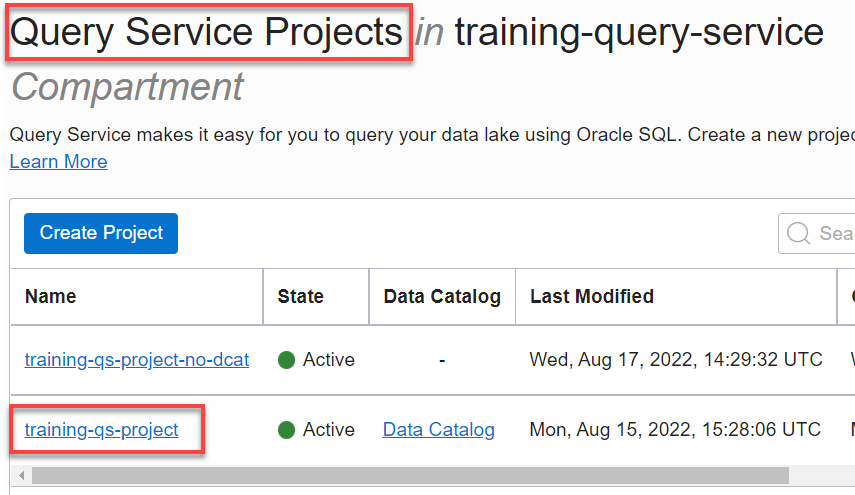  

3. On the project's detail page, click the **More Actions** drop-down list, and then select **Create or Update Database Password**.

    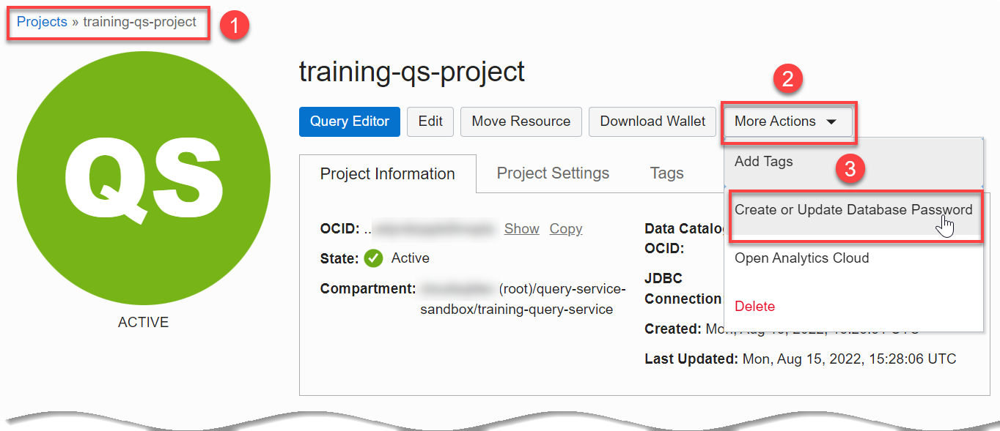  

4. In the **Create or Update Database Password** dialog box, enter and confirm the password of your choice for the **PROJECT** user (schema) that is automatically created for you when you create a Query Service project. **Important:** Make a note of this password as you will need it to perform later tasks. Next, click **Save Changes**.

    >**Note:** You can connect to the **PROJECT** schema using any Oracle Database client tool such as Oracle SQL Developer (you will do this in a later step), Oracle SQLcl, or SQL*Plus. You can then create Query service Project tables manually in this schema and run queries against those tables. It is also the Database User that the service uses to run queries submitted through the OCI Interface (UI/SDK/CLI).

  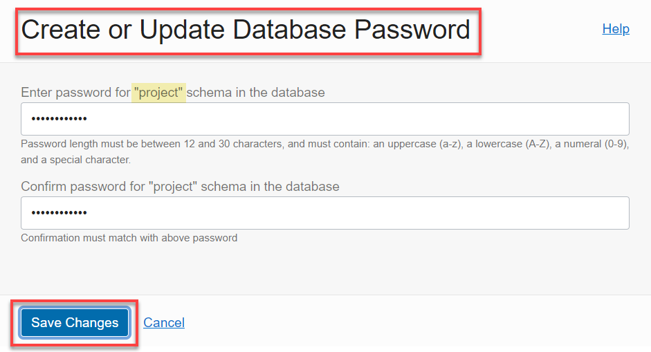  

  The project's detail page is re-displayed.

5. On the project's details page, in the **Project Information** tab, click the **Copy** link associated with the **JDBC Connection** field to copy the JDBC Connection string that is associated with your project. You will use this string when you create a new database connection to Query Service in SQL Developer in the next section.

      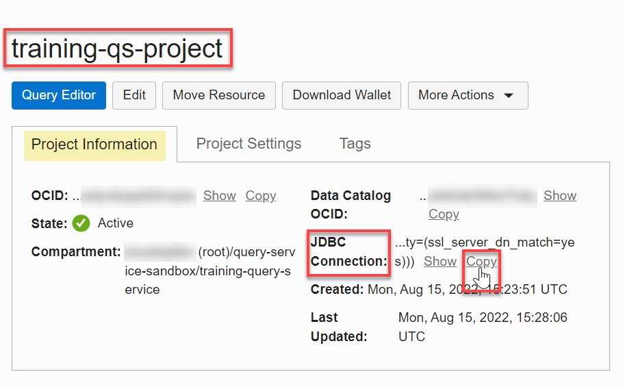

  <!-- Comments -->
  <!-- liveLabs section starts on line 466 -->

<!--
5. On the project's details page, click **Download Database Wallet**.

    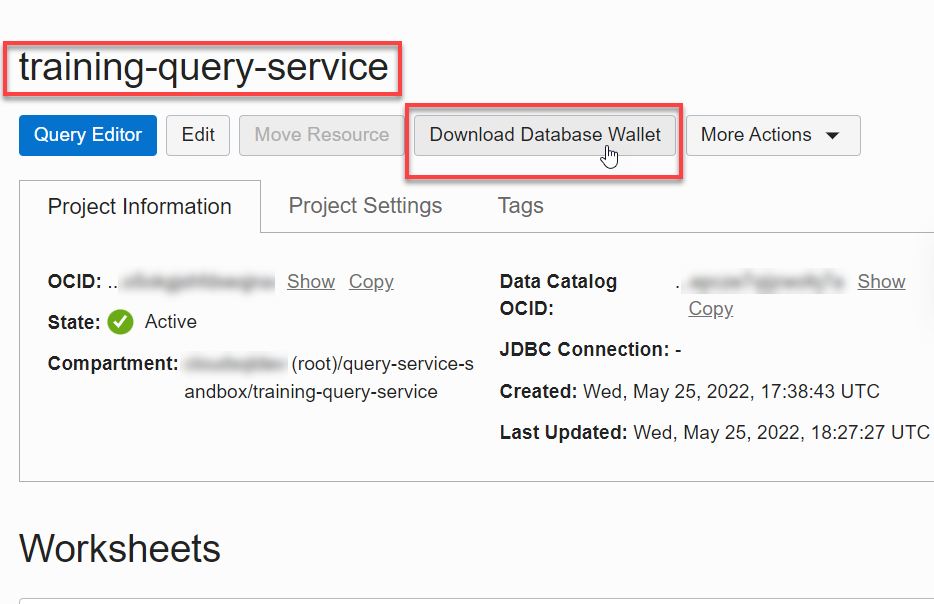

6. In the **Download Database Wallet** dialog box, enter and confirm the password of your choice that protects the Client Credentials **Wallet.zip** file that you will download, and then click **Download**.

    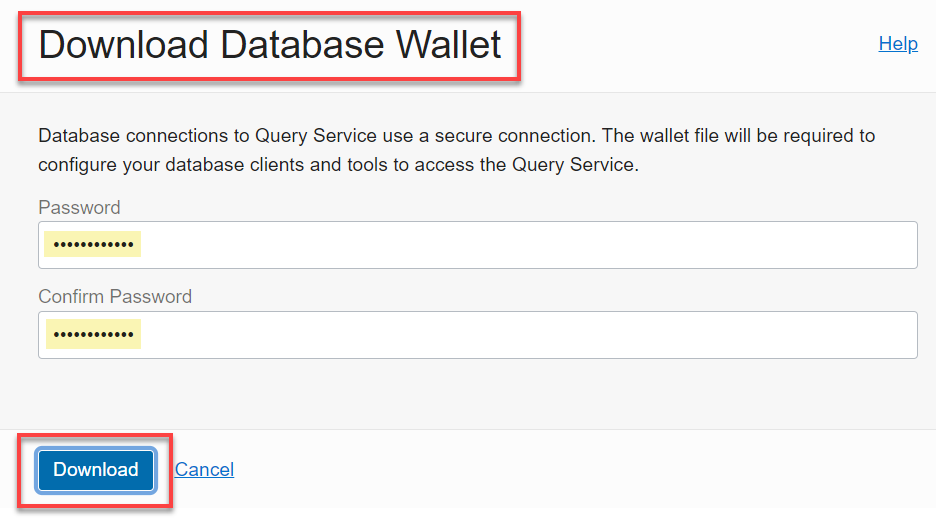

    The project's detail page is re-displayed. The **wallet.zip** file is downloaded to your web browser's default download directory. In this example, we are using **Chrome** on a MS-Windows computer. The downloaded **wallet.zip** file is in the **Downloads** folder.

    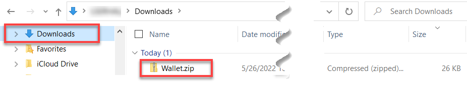
 -->

6. Start SQL Developer. The **Welcome Page** is displayed.

    >**Note:** If you don't have SQL Developer installed on your machine, refer to the **How do I install Oracle SQL Developer?** sprint from the **Contents** menu on the left.

  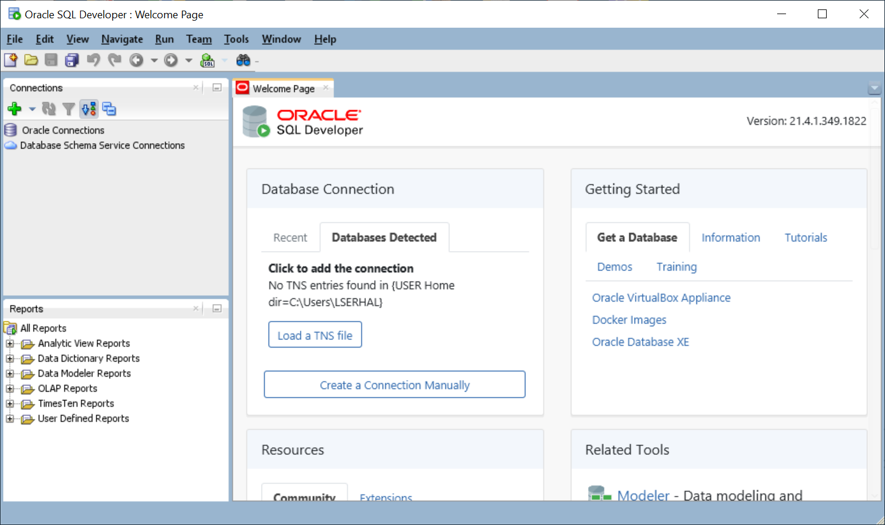

7. Create a new database connection. In the **Connections** pane, click the **New Connection** icon on the toolbar, and then click **New Database Connection**.

  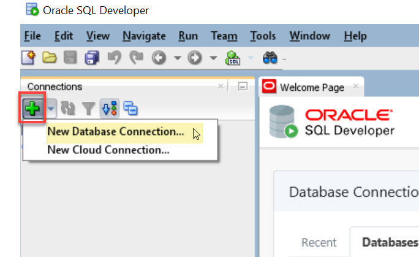

8. In the **New/Select Database Connection** dialog box, specify the following:

    * **Name:** Enter **qs-project-schema**.
    * **Database Type:** Accept the default, **Oracle**.
    * **Authentication Type:** Accept the **Default**.
    * **Username:** Enter **project**.
    * **Password:** Enter the password the you created in **Step 1** in this sprint.
    * **Save Password:** Select this checkbox.
    * **Connection Type:** Select **Custom JDBC** from this drop-down list.
    * **Custom JDBC URL:** Paste the **JDBC Connection** string that you copied from your project's Details page in the previous section in this text box.

    >**Note:** If you are connected to VPN, disconnect from it.

9. Click **Test** to test your connection. If the test is successful, the **Status: Success** message is displayed in the dialog box.

  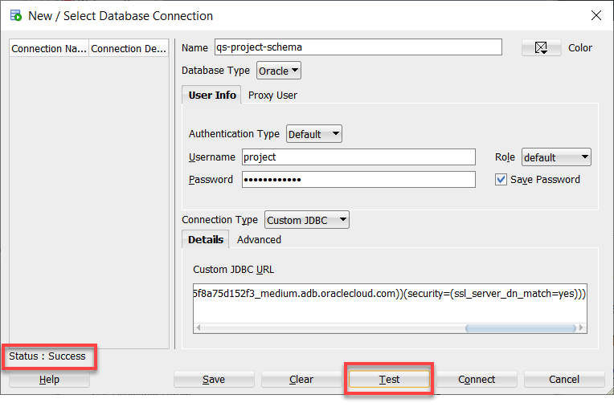

10. Click **Connect**. The **qs-project-schema** schema is displayed in the **Oracle Connections** tree.

    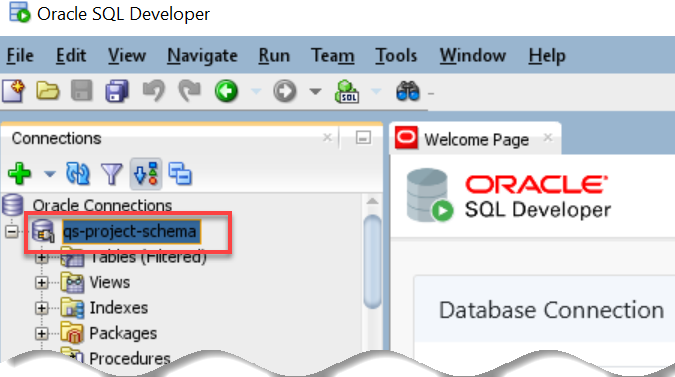

### **Query a Query Service Table from SQL Developer**

11. Right-mouse click the **qs-project-schema** schema, and then select **Schema Browser** from the context menu.

    

12. A **qs-project-schema** tab that contains an empty worksheet is displayed. From the list of available schemas drop-down list, select the **MOVIESTREAM_DEMO** schema that is available with Query Service. The **Tables** option is selected by default in the second drop-down list. The tables in this schema are displayed.

    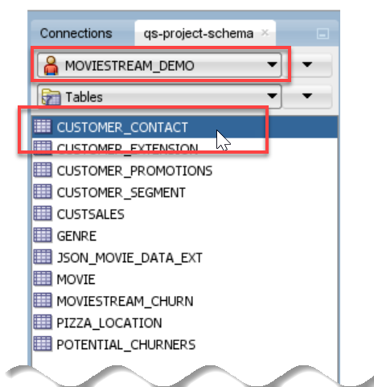

13. Drag and drop the **CUSTOMER_CONTACT** table onto the SQL Worksheet.

    

    A dialog box is displayed, click **Apply**. The query is displayed in the SQL Worksheet.

    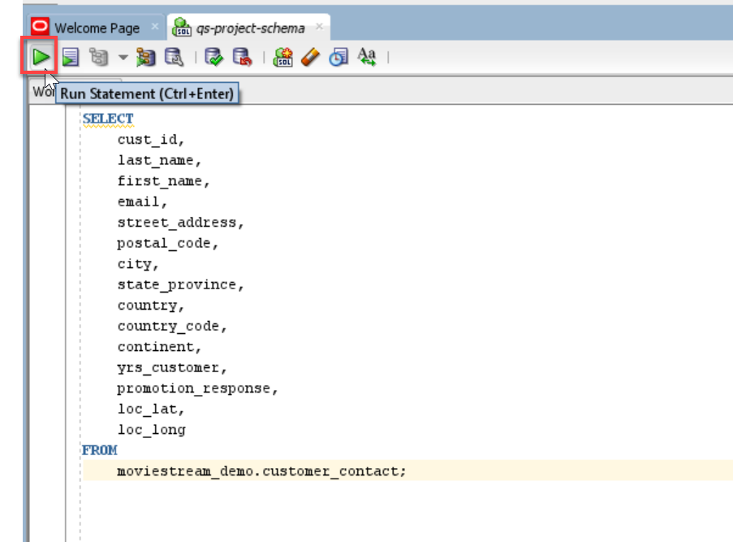

14. Click the **Run Statement** icon on the toolbar. The query output is displayed in the **Query Result** tab.

    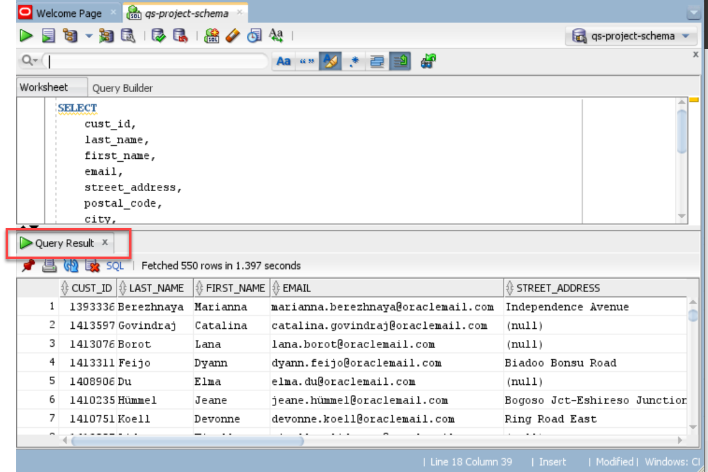

### **Create an External Table in Query Service from SQL Developer**

>**Note:** Although you can create a regular database table in the **PROJECT** schema in Query Service, you cannot populate it with data since the **PROJECT** user has no tablespace quota.  

15. Click the **SQL Worksheet** icon in the toolbar to add a new empty worksheet.

    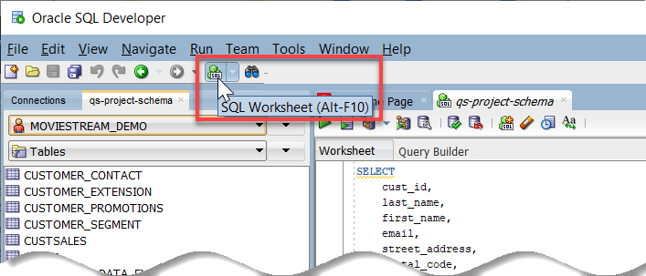

    A **Select Connection** dialog box is displayed. Select the **qs-project-schema** from the **Connection** drop-down list if you have more than one connection, and then click **OK**. A new empty worksheet is added.

    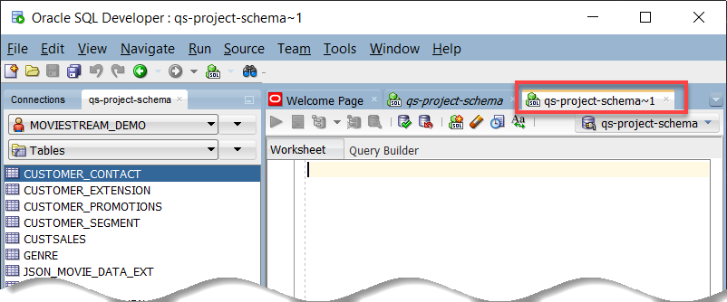

16. In the **qs-project-schema** tab, select the **PROJECT** schema that is available with Query Service from the schemas drop-down list. The **Tables** option is selected by default in the second drop-down list. Currently, there are no tables in this schema.

    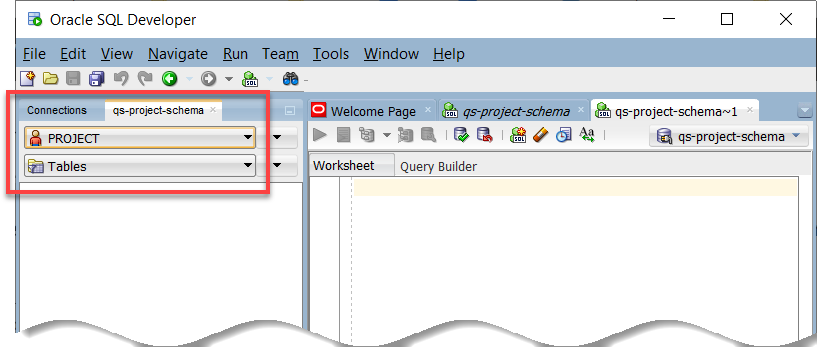

16. Create a new _external table_ named **custsales_jdbc** in the **PROJECT** schema. You will also populate this table with data from a public Object Storage bucket named **`moviestream_gold`** in the **c4u04** public tenancy (namespace) using the URL in the script. Copy and paste the following script into your newly added SQL Worksheet, and then click the **Run Script (F5)** icon in the Worksheet toolbar.

    ```
    <copy>declare
    uri varchar2(1000) := 'https://objectstorage.us-ashburn-1.oraclecloud.com/n/c4u04/b/moviestream_gold/o';
    parquet_format  varchar2(1000) := '{"type":"parquet",  "schema": "all"}';

      begin
        dbms_cloud.create_external_table(
        table_name => 'custsales_jdbc',
        file_uri_list => uri || '/custsales/*.parquet',
        format => parquet_format,
        column_list => 'MOVIE_ID NUMBER(20,0),
        LIST_PRICE BINARY_DOUBLE,
        DISCOUNT_TYPE VARCHAR2(4000 BYTE),
        PAYMENT_METHOD VARCHAR2(4000 BYTE),
        GENRE_ID NUMBER(20,0),
        DISCOUNT_PERCENT BINARY_DOUBLE,
        ACTUAL_PRICE BINARY_DOUBLE,
        DEVICE VARCHAR2(4000 BYTE),
        CUST_ID NUMBER(20,0),
        OS VARCHAR2(4000 BYTE),
        DAY_ID date,
        APP VARCHAR2(4000 BYTE)'
        );
      end;
      </copy>
      ```

      A **PL/SQL procedure successfully completed** message is displayed in the **Script Output** tab.

      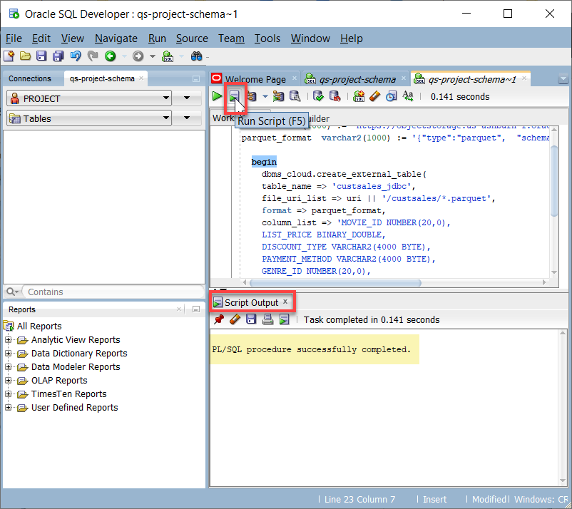

18. To view the newly created external table in the list of tables in the **PROJECT** schema, click the drop-down list next to the **Tables** drop-down list, and then select **Refresh** from the context menu.

    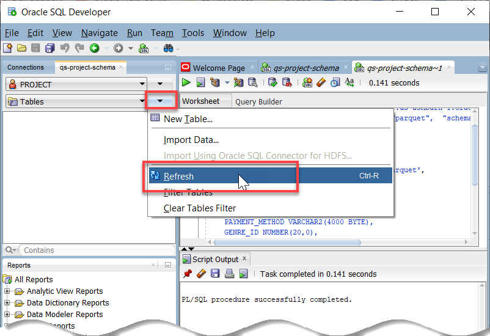

    The newly created external table is displayed.

    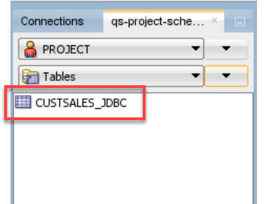

19. Add a new SQL worksheet. Click the **SQL Worksheet** drop-down list on the toolbar, and then select **qs-project-schema**.
    A new worksheet is displayed.

20. Copy and paste the following script into your SQL Worksheet to query the newly created external table, and then click the **Run Statement** icon in the Worksheet toolbar.      

    ```
    <copy>select *
    from custsales_jdbc;</copy>
    ```

    The query result is displayed in the **Query Result** tab.

    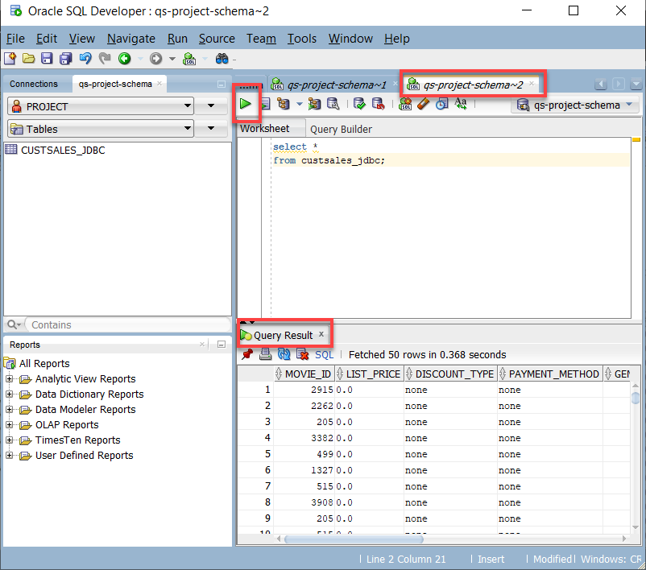

### **View and Query the New External Table in Query Service**

21. To view the newly created table in your Query Service project, sign in to the Oracle Cloud Infrastructure Console using your tenancy, username, and password. On the **Console** Home page, open the **Navigation** menu and click **Analytics & AI**. Under **Data Lake**, click **Query Service**.

22. On the **Query Service Projects** page, in the row for your Query Service project, click **Query Editor**. The **Query Editor** page is displayed.

23. On the **Scratchpad** worksheet, click the **Select a Schema** drop-down list and select the **`PROJECT`** schema.

  The **custsales_jdbc** external table that you created in SQL Developer is displayed.

  

    > **Note:** It could take up to an hour after you create the external table in SQL Developer before it is displayed in Query Service.

24. Query the **custsales\_jdbc** external table. Click the **Clear Editor** icon in the toolbar to delete any queries that you might have in your Scratchpad worksheet. Click the **Actions** icon next the **custsales\_jdbc** table, and then select **Query** from the Context menu. The auto generated SQL query is displayed in the Editor area. Click **Run Query** to run the query. A **Running Query** information box is displayed briefly.   

  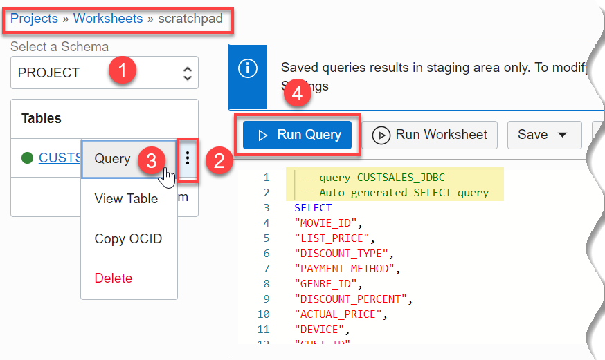

  In the **Last Query Result** tab, the status of running the query is displayed, initially **In Progress**. When the query is completed successfully, the results are displayed in the **Last Query Result** tab and the status changes to **Succeeded**.

  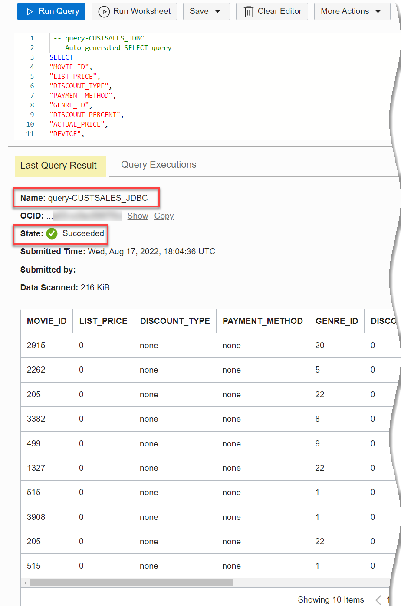

## Learn More

* [SQL Developer Documentation](https://docs.oracle.com/cd/E12151_01/index.htm)
* [Data Catalog Documentation](https://docs.oracle.com/en-us/iaas/data-catalog/home.htm)
* [Data Catalog Policies](https://docs.oracle.com/en-us/iaas/data-catalog/using/policies.htm)
* [Oracle Cloud Infrastructure Documentation](https://docs.oracle.com/en-us/iaas/Content/GSG/Concepts/baremetalintro.htm)
* [Access the Data Lake using Autonomous Database and Data Catalog Workshop](https://apexapps.oracle.com/pls/apex/dbpm/r/livelabs/view-workshop?wid=877)

## Acknowledgements
* **Author:** Lauran Serhal, Consulting User Assistance Developer
* **Contributors:**
    + Alexey Filanovskiy, Senior Principal Product Manager
    + Ravi Ramkissoon, Software Development Director
* **Last Updated By/Date:** Lauran Serhal, August 2022
