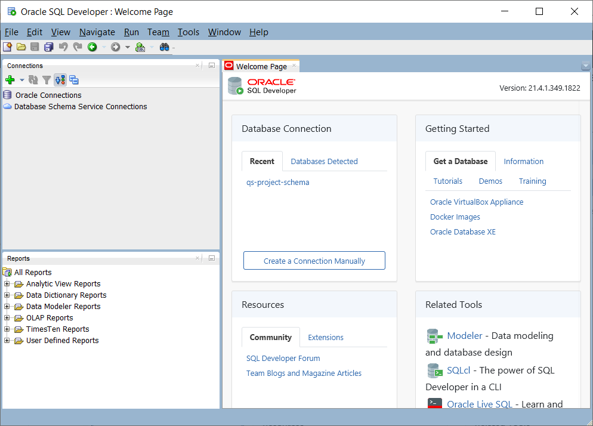
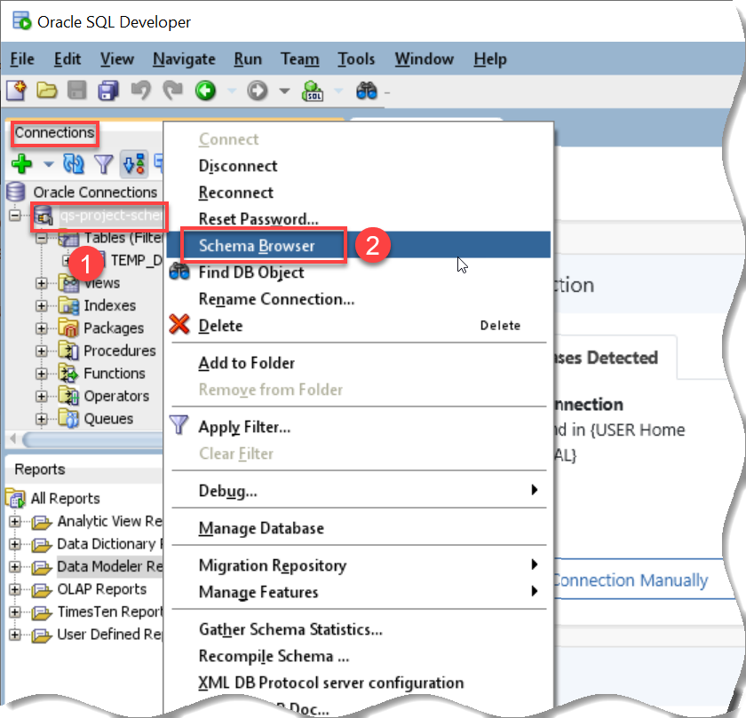
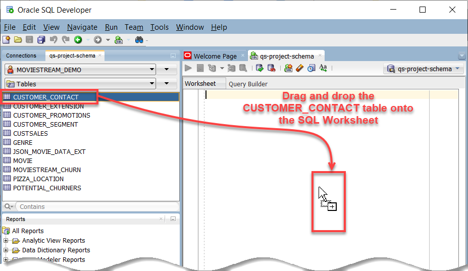
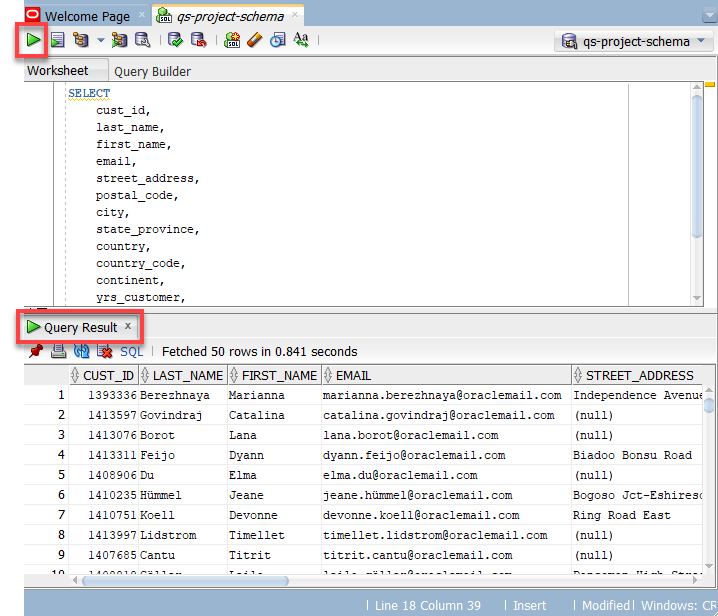
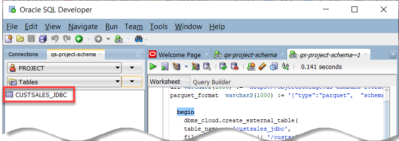
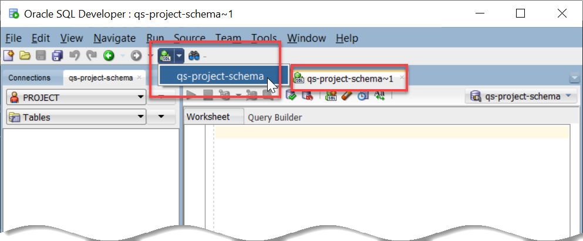
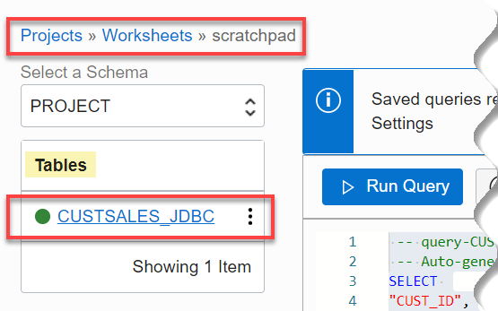

# How do I connect to Query Service from Oracle SQL Developer?
Duration: 10 minutes

In this sprint you will perform the steps required to connect to Query Service as the user **`PROJECT`** from SQL Developer.   

### Prerequisites
* An Oracle Cloud Account.
* An optional compartment for your Query Service project and resources.
* An OCI Data Catalog instance that contains at least one Oracle Object Storage data asset that has been harvested to generate the logical data entities that will be used by Query Service. For detailed instructions on creating a Data Catalog data asset and harvesting it, see **Lab 2: Harvest Technical Metadata from Oracle Object Storage** in the [Access the Data Lake using Autonomous Database and Data Catalog](https://apexapps.oracle.com/pls/apex/dbpm/r/livelabs/view-workshop?wid=877&clear=180&session=103071880685237) LiveLabs workshop. Alternatively, you can create a new Data Catalog instance when you create your Query Service project.
* The required policies to allow access to the Data Catalog instance, Oracle Object Storage, and Query Service projects.
* A Query Service project.

## Connect to Query Service from SQL Developer

### **Step 1: Create a Database Password**

1. Sign in to the Oracle Cloud Infrastructure Console using your tenancy, username, and password. For the **Query Service Limited Availability (LA) release**, navigate to your assigned **Query Service Console** provided to you by your Oracle Product Manager.

2. On the **Query Service Projects** page, click the desired project name link to display the project's detail page.

      

3. On the project's detail page, click the **More Actions** drop-down list and select **Create Database Password**.

      

4. In the **Create Database Password** dialog box, enter and confirm the password for the user **PROJECT** user (schema) that is automatically created for you when you create a Query Service project. Make sure you remember the password. Next, click **Save Changes**.

    >**Note:** You can connect to the **PROJECT** schema using any Oracle Database client tool such as Oracle SQL Developer, Oracle SQLcl, or SQL*Plus. You can then create Query service Project tables manually in this schema and run queries against those tables. It is also the Database User that the service uses to run queries submitted through the OCI Interface (UI/SDK/CLI).

    

  The project's detail page is re-displayed.

### **Step 2: Download Database Wallet**

5. On the project's details page, click **Download Database Wallet**.

    

6. In the **Download Database Wallet** dialog box, enter and confirm the password for the user **PROJECT** user (schema) that your created in **Step 1** in this sprint, and then click **Download**.

    

    The project's detail page is re-displayed. The **wallet.zip** file is downloaded to your web browser's default download directory. In this example, we are using **Chrome** on a MS-Windows computer. The downloaded **wallet.zip** file is in the **Downloads** folder.

    

### **Step 3: Use SQL Developer to Query Tables in Query Service**

7. Start SQL Developer. If you don't have SQL Developer installed on your machine, refer to the **How do I install Oracle SQL Developer?** sprint from the **Contents** menu on the left.

  

8. In the **Connections** pane, click the **New Connection** icon on the toolbar, and then click **New Database Connection**.

  

9. In the **New/Select Database Connection** dialog box, specify the following:

    * **Name:** Enter **qs-project-schema**.
    * **Database Type:** Accept the default, **Oracle**.
    * **Authentication Type:** Accept the **Default**.
    * **Username:** Enter **project**.
    * **Password:** Enter the password the you created in **Step 1** in this sprint.
    * **Save Password:** Select this checkbox.
    * **Connection Type:** Select **Cloud Wallet** from this drop-down list.
    * **Configuration File:** Click **Browse** and navigate to the folder where you saved your **Wallet.zip** file in **Step 2** in this sprint, **Downloads** in our example.

10. Click **Test** to test your connection. If the test is successful, the **Status: Success** is displayed in the dialog box.

  

11.    Click **Connect**. The **qs-project-schema** schema is displayed in the **Oracle Connections** tree.

    

12. Right-mouse click the **qs-project-schema** schema, and then select **Schema Browser** from the context menu.

    

13. A **qs-project-schema** tab is displayed. From the list of available schemas drop-down list, select the **MOVIESTREAM_DEMO** schema that is available with Query Service. The **Tables** option is selected by default in the second drop-down list. The list of tables in this schema are displayed.

    

14. Drag and drop the **CUSTOMER_CONTACT** table onto the SQL Worksheet.

    

    A dialog box is displayed, click **Apply**. The query is displayed.

    

15. Click the **Run Statement** icon on the toolbar. The query output is displayed in the **Query Result** tab.

    

### **Step 4: Create External Tables in Query Service from SQL Developer**

>**Note:** Although you can create a regular database table in the **PROJECT** schema, you cannot populate it with data since the **PROJECT** user has no tablespace quota.  

16. In the **qs-project-schema**, select the **PROJECT** schema that is available with Query Service from the schemas drop-down list. The **Tables** option is selected by default in the second drop-down list. Currently, there are no tables in this schema.

    

17. Copy and paste the following script into your SQL Worksheet to create a new external table named **custsales_jdbc** in the **PROJECT** schema. Click the **Run Script (F5)** icon in the Worksheet toolbar.

    ```
    <copy>declare
    uri varchar2(1000) := 'https://objectstorage.us-ashburn-1.oraclecloud.com/n/c4u04/b/moviestream_gold/o';
    parquet_format  varchar2(1000) := '{"type":"parquet",  "schema": "all"}';

      begin
        dbms_cloud.create_external_table(
        table_name => 'custsales_jdbc',
        file_uri_list => uri || '/custsales/*.parquet',
        format => parquet_format,
        column_list => 'MOVIE_ID NUMBER(20,0),
        LIST_PRICE BINARY_DOUBLE,
        DISCOUNT_TYPE VARCHAR2(4000 BYTE),
        PAYMENT_METHOD VARCHAR2(4000 BYTE),
        GENRE_ID NUMBER(20,0),
        DISCOUNT_PERCENT BINARY_DOUBLE,
        ACTUAL_PRICE BINARY_DOUBLE,
        DEVICE VARCHAR2(4000 BYTE),
        CUST_ID NUMBER(20,0),
        OS VARCHAR2(4000 BYTE),
        DAY_ID date,
        APP VARCHAR2(4000 BYTE)'
        );
      end;
      </copy>
      ```

      The **PL/SQL procedure successfully completed** message is displayed in the **Script Output** tab.

      

18. To view the newly created external table in the list of tables in the **PROJECT** schema, click the drop-down list next to the **Tables** drop-down list, and then select **Refresh** from the context menu.

    

    The newly created external table is displayed.

    

19. Click the **SQL Worksheet** drop-down list on the toolbar, and then select **qs-project-schema**.

  A new worksheet is displayed.

  

20. Copy and paste the following script into your SQL Worksheet to query the newly created external table, and then click the **Run Statement** icon in the Worksheet toolbar.      

    ```
    <copy>select * from custsales_jdbc;</copy>
    ```

    The query result is displayed in the **Query Result** tab.

    

21. To view the newly created table in your Query Service project, sign in to the Oracle Cloud Infrastructure Console using your tenancy, username, and password. For the **Query Service Limited Availability (LA) release**, navigate to your assigned **Query Service Console** provided to you by your Oracle Product Manager.

22. On the **Query Service Projects** page, in the row for your Query Service project, click **Query Editor**. The **Query Editor** page is displayed.

23. On the **Scratchpad** worksheet, click the **Select a Schema** drop-down list and select the **`PROJECT`** schema.

  The **custsales_jdbc** external table that you created in SQL Developer is displayed.

  


## Learn More

* [SQL Developer Documentation](https://docs.oracle.com/cd/E12151_01/index.htm)
* [Data Catalog Documentation](https://docs.oracle.com/en-us/iaas/data-catalog/home.htm)
* [Data Catalog Policies](https://docs.oracle.com/en-us/iaas/data-catalog/using/policies.htm)
* [Oracle Cloud Infrastructure Documentation](https://docs.oracle.com/en-us/iaas/Content/GSG/Concepts/baremetalintro.htm)
* [Access the Data Lake using Autonomous Database and Data Catalog Workshop](https://apexapps.oracle.com/pls/apex/dbpm/r/livelabs/view-workshop?wid=877)
