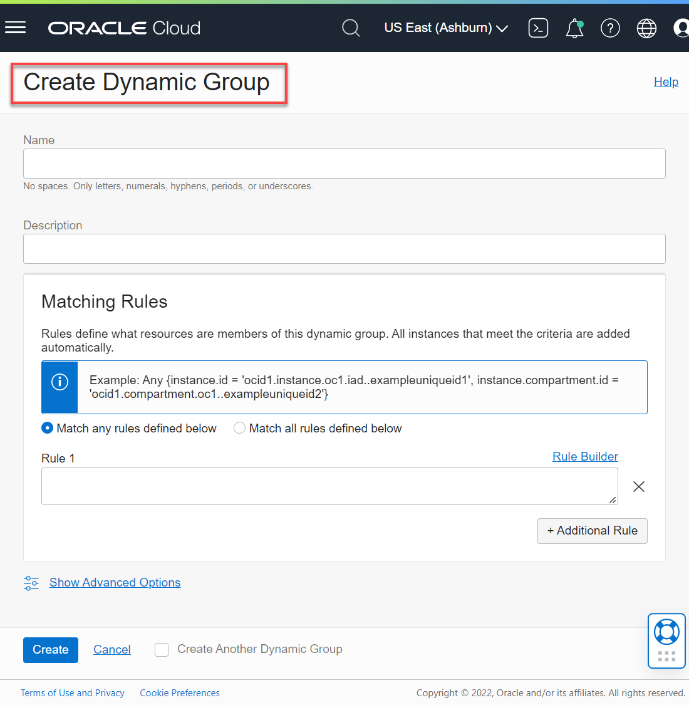

# How do I create a dynamic group?
Duration: 5 minutes

Dynamic groups allow you to group Oracle Cloud Infrastructure compute instances as "principal" actors (similar to user groups).

### Prerequisites
* An Oracle Cloud Account.

## Create a Dynamic Group Policy

You can create a dynamic group policy that includes the specific compartment OCID as a resource in the group as follows:

1. Sign in to the Oracle Cloud Infrastructure Console.

2. Open the **Navigation** menu and click **Identity & Security**. Under **Identity**, click **Dynamic Groups**.

3. On the **Dynamic Groups** page, click **Create Dynamic Group**. The **Create Dynamic Group** dialog box is displayed.

    

4. Specify the following:

    + **Name:** Enter a unique name.
    + **Description:** Enter an optional description.
    + In the **Matching Group** section, accept the default **Match any rules defined below** option.
    + Click the **Copy** button in the following code box to copy the dynamic rule, and then paste it in the **Rule 1** text box. This rule specifies that any _resource defined in this compartment is a member of this dynamic group_. You will substitute the _your-compartment-ocid_ with your own compartment OCID.

        ```
        <copy>resource.compartment.id='your-compartment-ocid'</copy>
        ```
        >**Note:** Don't delete the single quotation marks around the OCID value.

5. To find your _Compartment OCID_, view the **How do I find the compartment OCID?** in the **Contents** menu. Paste the OCID value in the above code example.

6. Click **Create**.

    

7. The **Dynamic Group Details** page is displayed. Click **Dynamic Groups** in the breadcrumbs to re-display the **Dynamic Groups** page.

    The newly created dynamic group is displayed.

    

## Learn More

* [Signing In to the Console](https://docs.cloud.oracle.com/en-us/iaas/Content/GSG/Tasks/signingin.htm).
* [Oracle Cloud Infrastructure Documentation](https://docs.oracle.com/en-us/iaas/Content/GSG/Concepts/baremetalintro.htm)
* [Managing Dynamic Groups](https://docs.oracle.com/en-us/iaas/Content/Identity/Tasks/managingdynamicgroups.htm)
* [Data Catalog Policies](https://docs.oracle.com/en-us/iaas/data-catalog/using/policies.htm)
