# How do I create an Oracle Object Storage Table in Query Service?
Duration: 5 minutes

In this workshop sprint, you will create a table in Query Service using a Parquet file stored in a public Object Storage bucket. You will also download the Parquet file to your local computer, create an Oracle Object Storage bucket, change its visibility from Private to Public, and then upload the Parquet file to this bucket. Finally, you will create a table in Query Service using the Parquet file in your bucket.

### Prerequisites
* An Oracle Cloud Account.
* A Data Catalog instance.
* A Query Service project.
* The required policies to allow access to the Data Catalog instance, Oracle Object Storage, and Query Service projects.

## **Create a Table Using a Data File in a Public Object Storage Bucket**  

The **PROJECT$** schema contains the tables that you create and manage using the Query Service interfaces such as the UI Console, SDKs, or the REST API. You can create your own tables in this schema. In this exercise, you will create a table over a Parquet file that is stored in a public Object Storage bucket that you will access using a URL.

### **Method 1: Create a Table Using an Object Storage File's URL**

1. Sign in to the Oracle Cloud Infrastructure Console using your tenancy, username, and password. For the **Query Service Limited Availability (LA) release**, navigate to your assigned **Query Service Console** provided to you by your Oracle Product Manager.

2. On the **Query Service Projects** page, in the row for your Query Service project, click **Query Editor**.

  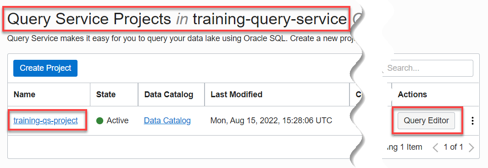  

3. On the **Scratchpad** worksheet, click the **Select a Schema** drop-down list and select the **`PROJECT$`** schema.

  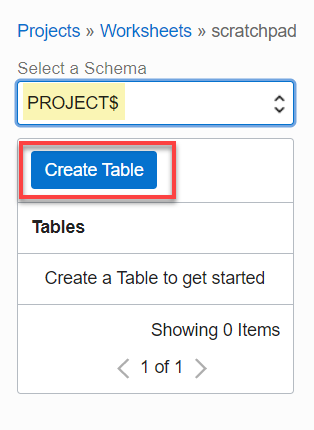  

4. Click **Create Table**. The **Create Table** page is displayed. Specify the following:

    + **Table Name:** Enter **training\_object\_storage\_table**.

        >**Note:** Special characters such as **`&`**, **`-`** (hyphen), and **`/`** are not allowed in table names.

    + **Target Object File Glob:** Click **Copy** to copy the following URL, and then paste it in this field. This is the URL to access a Parquet file named **`custsales-2019-01.parquet`** which is stored in a public Oracle Object Storage bucket in a tenancy named **c4u04** in the **us-ashburn-1** region.

        ```
        <copy>https://objectstorage.us-ashburn-1.oraclecloud.com/n/c4u04/b/moviestream_gold/o/custsales/month=2019-01/custsales-2019-01.parquet</copy>
        ```

        The Column Selection section is displayed. Click the unchecked checkbox to the left of the **Source Column** label to select all the columns.

        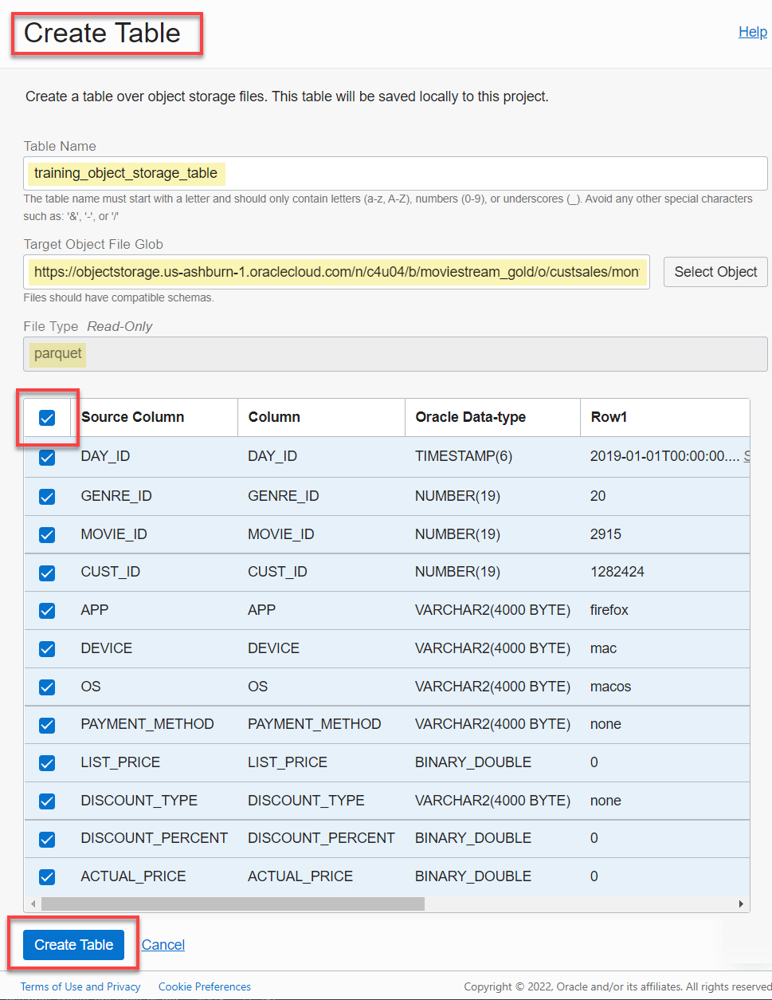    

5. Click **Create Table**. The table status shows as **Creating** (orange color) in the **Tables** section.

  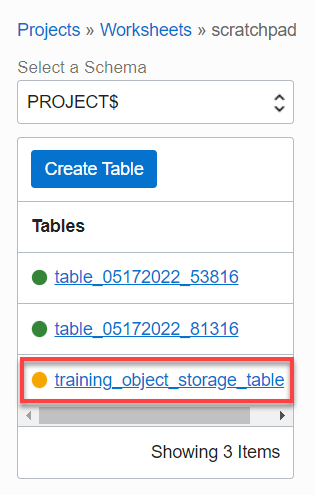

6. Click the table's name link to view its details such as the columns names, columns Oracle data types, and state. Click **Close**.

  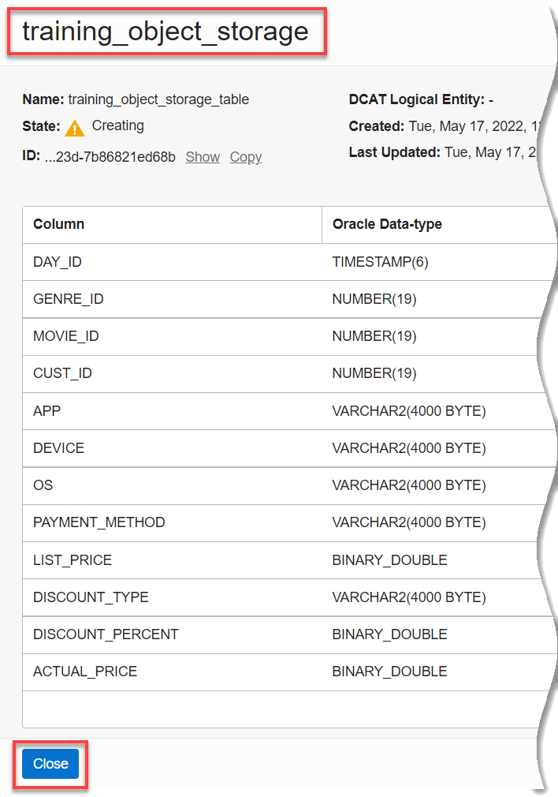   

  If the table creation is successful, it is displayed in the **Tables** section.

  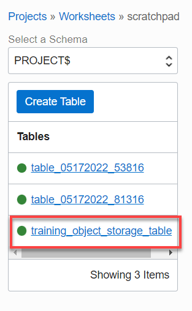   

7. Use the horizontal scroll bar at the bottom of the **Tables** section to scroll to the right and view the **Actions** icon that is associated with the **training\_object\_storage\_table** table.

  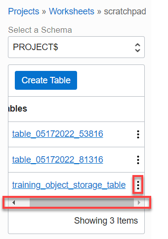  

  The Actions Context menu is displayed. You can use this menu to query and view the table, copy the table's OCID, edit the table name, and delete the table.

  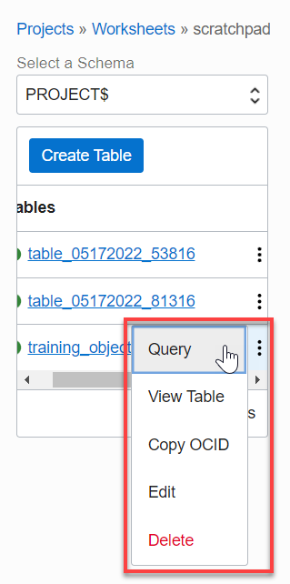  

8. Click **Query**. The auto select query for this table is displayed in the **Scratchpad** query area.

  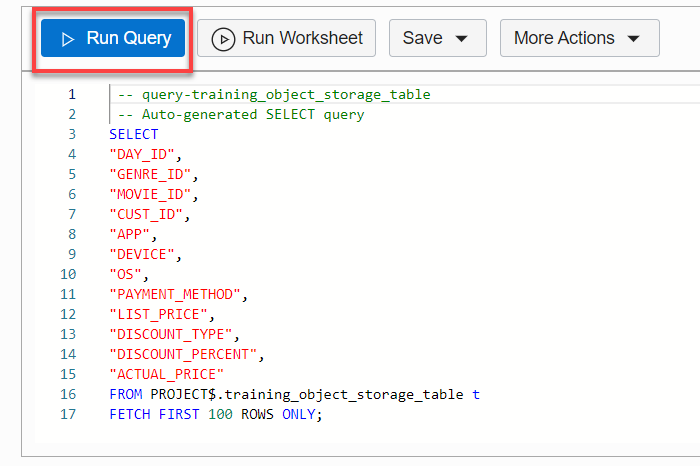  

9. Click **Run Query**. The query output is displayed in the **Last Query Result** tab.

  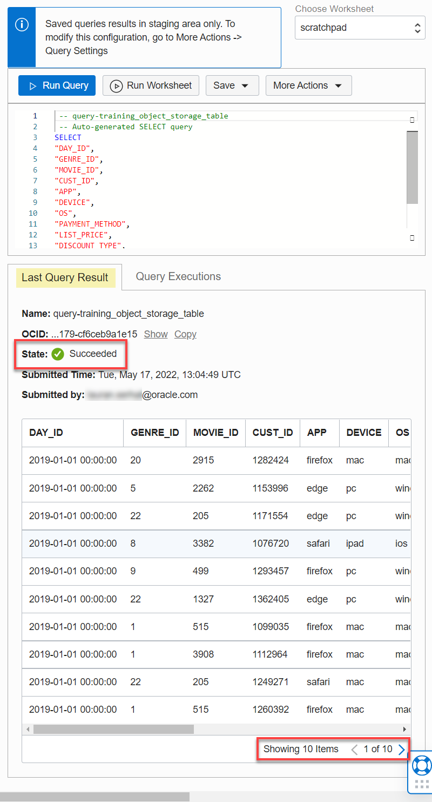  

10. Save the query to a worksheet. Click **Save**, and then select **Save Worksheet as** from the drop-down list.

  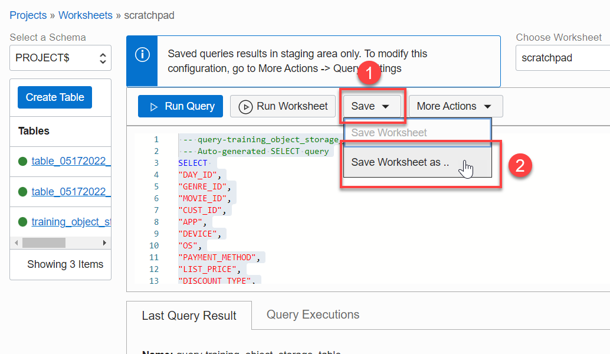  

11. Enter a meaningful name for the worksheet in the **Save Worksheet as** dialog box, and then click **Save As**.

    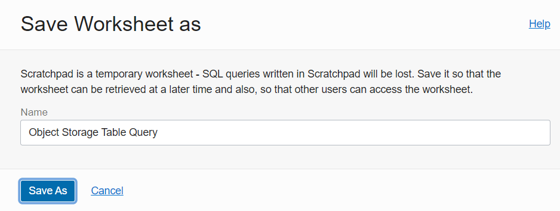

    The new worksheet is displayed.

    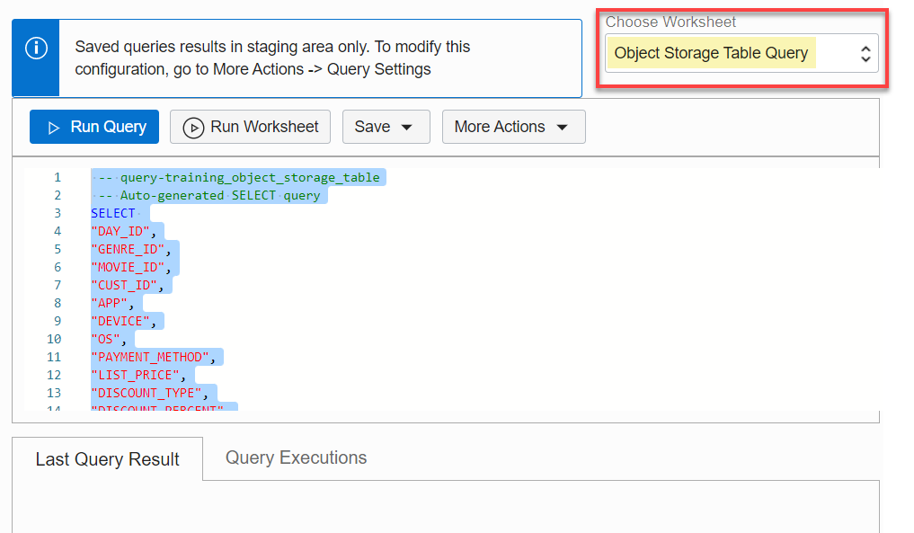  

### **Method 2: Create a Table by Choosing an Object Storage File**

You will first create an Object Storage bucket (unless you already have one) in your own tenancy, change its visibility from Private to Public, and then upload a local Parquet file to that bucket. Next, you will create a table by selecting the Parquet file from your Public Object Storage bucket.

1. Sign in to the Oracle Cloud Infrastructure Console using your tenancy, username, and password. For the **Query Service Limited Availability (LA) release**, navigate to your assigned **Query Service Console** provided to you by your Oracle Product Manager.

2. Copy your web browser URL where you are running Query Service and paste it into a new browser tab.

3. In the new browser tab, create a new Oracle Object Storage bucket (unless you already have one). For detailed instructions, click the **How can I create a bucket in Oracle Cloud?** sprint from the **Contents** menu on the left.

4. Change the bucket's visibility setting from Private to Public. For detailed instructions, click the **How can I change bucket visibility settings?** sprint from the **Contents** menu on the left.

5. Download the Parquet file that you will use to create a new table in Query Service to Your Local Machine. Click the following link to download the [custsales-2019-01.parquet](files/custsales-2019-01.parquet?download=1) file.

6. Upload the **`custsales-2019-01.parquet`** file to your Object Storage public bucket. For detailed instructions, click the **How do I upload my files to Object Storage?** sprint from the **Contents** menu on the left.

7. Close the new web browser tab.

8. In the original web browser tab, navigate to the **Query Service Projects** page. In the row for your Query Service project, click **Query Editor**.

    

9. On the **Scratchpad**, click the **Select a Schema** drop-down list and select the **`PROJECT$`** schema.

  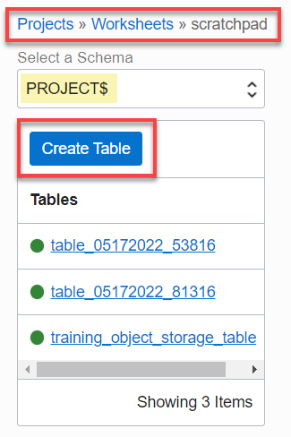  

10. Click **Create Table**. The **Create Table** page is displayed. Specify the following:

    + **Table Name:** Enter **training\_object\_storage\_table_2**.

          >**Note:** Special characters such as **`&`**, **`-`** (hyphen), and **`/`** are not allowed in table names.

      + **Target Object File Glob:** Click **Select Object** to select **`custsales-2019-01.parquet`** file from your Object Storage bucket. The **Select Object** panel is displayed. Click the filename link in the **Name** column.

      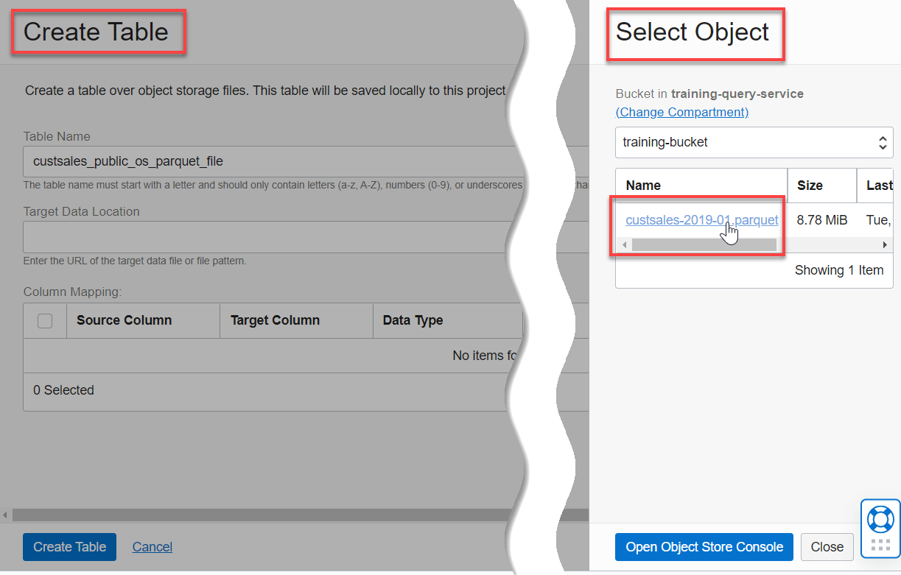    

      The **Object Details** panel is displayed. Click **Pick Object**.

      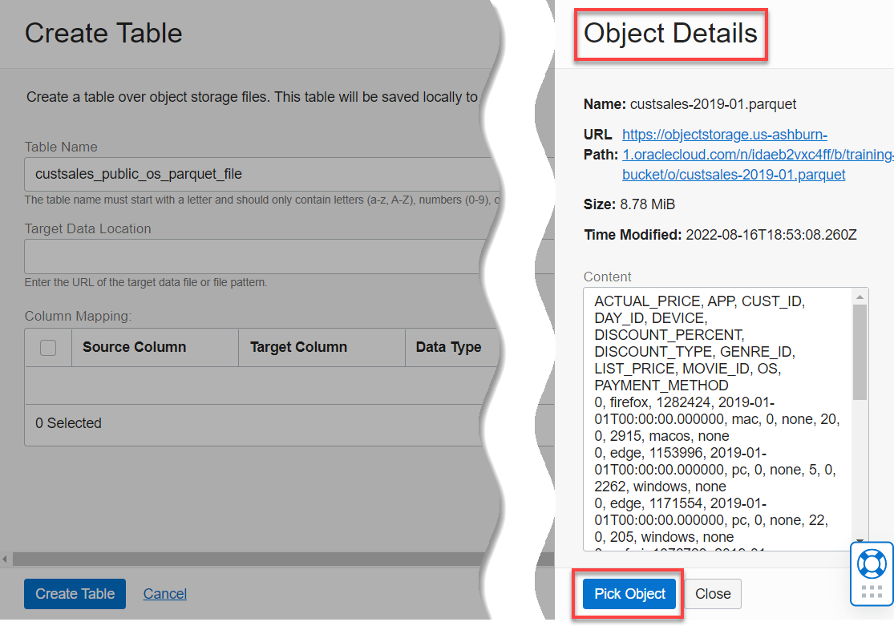      

      The Column Selection section is displayed. Click the unchecked checkbox to the left of the **Source Column** label to select all the columns.

      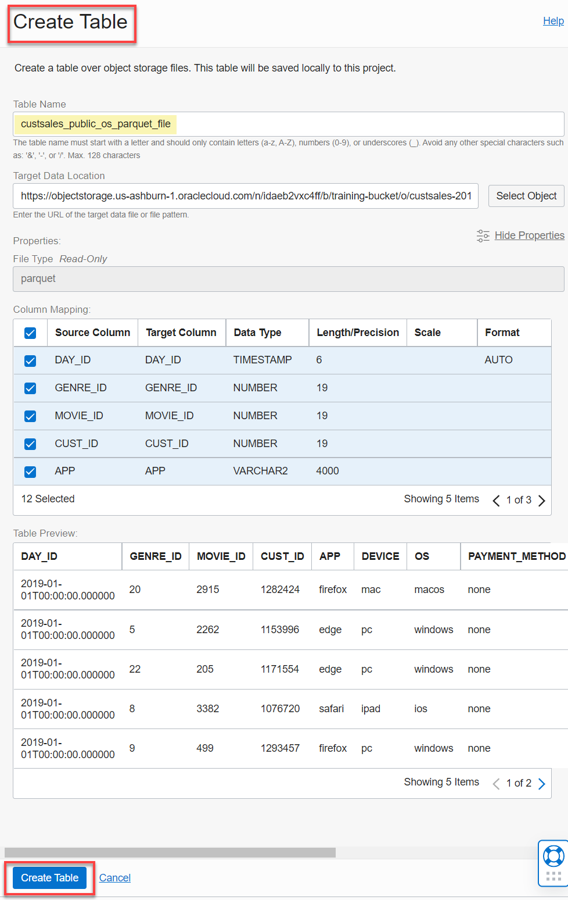    

11. Click **Create Table**. The table status shows as **Creating** (orange color) in the **Tables** section.

  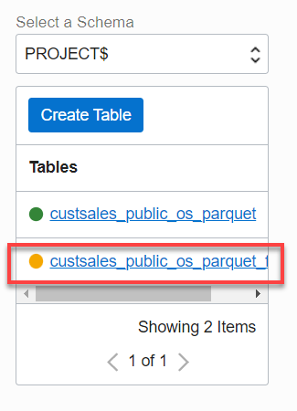

  If the table creation is successful, it is displayed in the **Tables** section.

  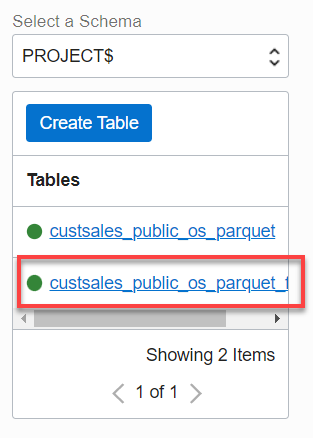   

**This concludes the Get Started with Query Service workshop sprints.**

## Learn More

* [Signing In to the Console](https://docs.cloud.oracle.com/en-us/iaas/Content/GSG/Tasks/signingin.htm).
* [Creating a Bucket and Uploading Files to a Bucket](https://docs.oracle.com/en-us/iaas/Content/GSG/Tasks/addingbuckets.htm#Putting_Data_into_Object_Storage)
* [Data Catalog Documentation](https://docs.oracle.com/en-us/iaas/data-catalog/home.htm)
* [Data Catalog Policies](https://docs.oracle.com/en-us/iaas/data-catalog/using/policies.htm)
* [Oracle Cloud Infrastructure Documentation](https://docs.oracle.com/en-us/iaas/Content/GSG/Concepts/baremetalintro.htm)
* [Access the Data Lake using Autonomous Database and Data Catalog Workshop](https://apexapps.oracle.com/pls/apex/dbpm/r/livelabs/view-workshop?wid=877)
* [DBMS_DCAT Package](https://docs-uat.us.oracle.com/en/cloud/paas/exadata-express-cloud/adbst/ref-dbms_dcat-package.html#GUID-4D927F21-E856-437B-B42F-727A2C02BE8D)
* [RUN_SYNC Procedure](https://docs.oracle.com/en/cloud/paas/autonomous-database/adbsa/ref-running-synchronizations.html#GUID-C94171B4-6C57-4707-B2D4-51BE0100F967)
* [Using Oracle Autonomous Database on Shared Exadata Infrastructure](https://docs.oracle.com/en/cloud/paas/autonomous-database/adbsa/index.html)
* [Connect with Built-in Oracle Database Actions](https://docs.oracle.com/en/cloud/paas/autonomous-database/adbsa/sql-developer-web.html#GUID-102845D9-6855-4944-8937-5C688939610F)
