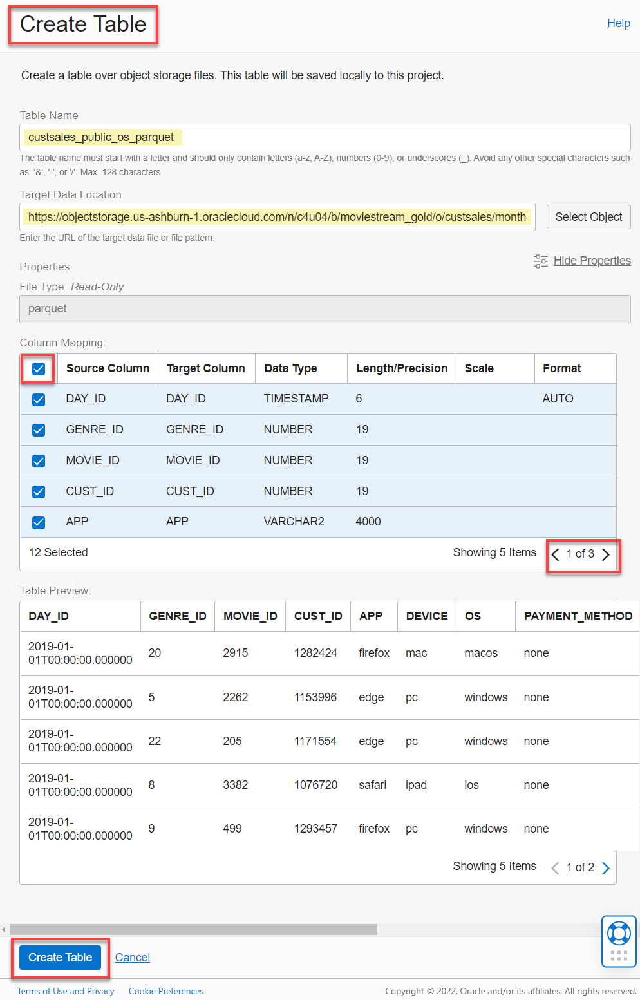
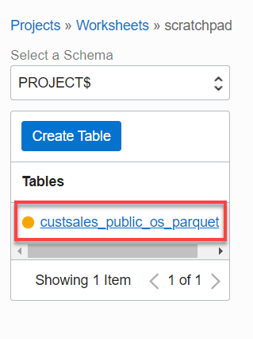
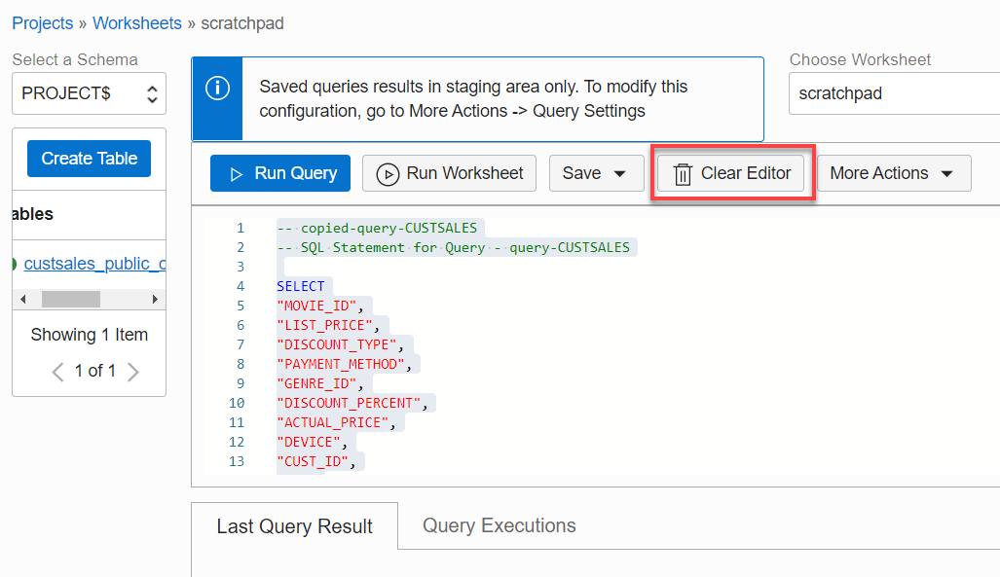
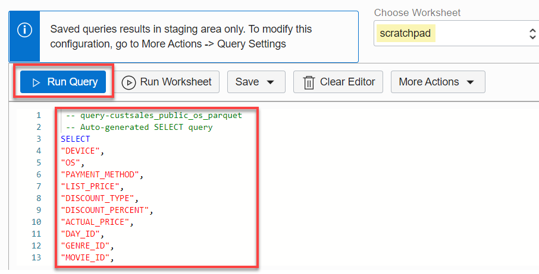
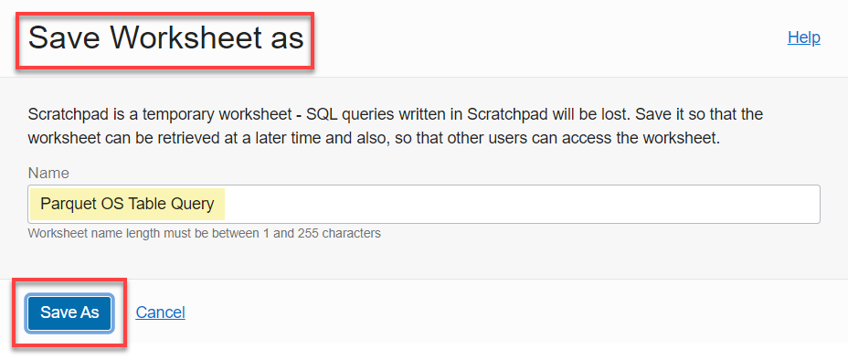
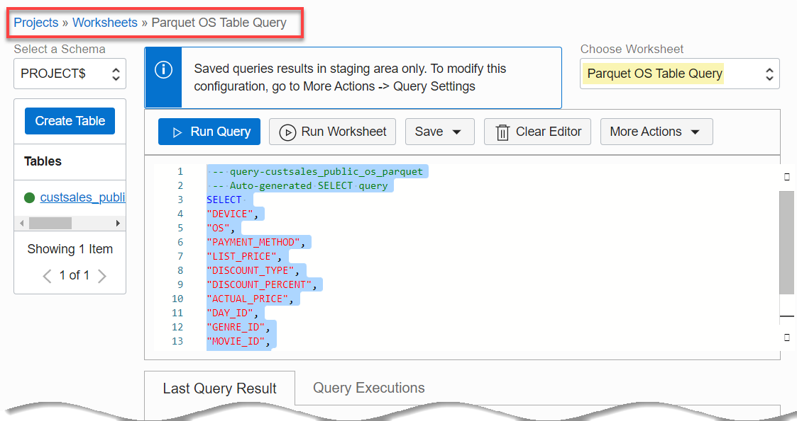

# How do I create an Oracle Object Storage Table in Query Service?
Duration: 15 minutes

In this sprint, you will create a table using a **Parquet** file that is stored in a public Object Storage bucket. You also create a table using a **.csv** file that is stored in a private Object Storage bucket. You will also create a table using a public Object Storage folder that contains two **.csv** files. Finally, you will create two tables in Query Service using the **.Parquet** and **.csv** files from public and private Object Storage buckets.

### Prerequisites

* An Oracle Cloud Account.
* A Query Service project.
* The required policies to allow access to the Data Catalog instance, Oracle Object Storage, and Query Service projects.

## **Create a Table Using a Parquet Data File in a Public Object Storage Bucket**

The **PROJECT$** schema contains the tables that you create and manage using the Query Service interfaces such as the UI Console, SDKs, or the REST API. You can create your own tables in this schema. In this exercise, you will create a table over a Parquet file that is stored in a public Object Storage bucket that you will access using a URL.

### **Method 1: Create a Table Using an Object Storage File's URL**

### **Create the Table**

1. Sign in to the Oracle Cloud Infrastructure Console using your tenancy, username, and password. On the **Console** Home page, open the **Navigation** menu and click **Analytics & AI**. Under **Data Lake**, click **Query Service**.

2. On the **Query Service Projects** page, in the row for your Query Service project, click **Query Editor**.

  

3. On the **Scratchpad** worksheet, click the **Select a Schema** drop-down list and select the **`PROJECT$`** schema, if not already selected.

  

4. Click **Create Table**. The **Create Table** page is displayed. Specify the following:

    + **Table Name:** Initially, accept the default name.

    + **Source Data URI from: Oracle Object-Storage:** Click **Copy** to copy the following URL, and then paste it in this field. This is the URL to access a **Parquet** file named **`custsales-2019-01.parquet`** which is stored in a public Oracle Object Storage bucket in a namespace named **c4u04** in the **us-ashburn-1** region.

        ```
        <copy>https://objectstorage.us-ashburn-1.oraclecloud.com/n/c4u04/b/moviestream_gold/o/custsales/month=2019-01/custsales-2019-01.parquet</copy>
        ```

        The **Properties**, **Column Mapping**, and **Table Preview** sections are displayed. All the columns are selected by default. This is controlled by the checkbox to the left of **Source Column** in the first table row. The **Table Preview** section previews the data from the selected file.

    + **Table Name:** Replace the default table name with **custsales\_public\_os\_parquet**.

      

5. Click **Create Table**. A **1 operation in progress** link (orange color) is displayed in the **Tables** section. If you hover over the link, a **Creating custsales\_public\_os\_parquet** tooltip is displayed.

  

  If the table creation is successful, it is displayed in the **Tables** section.

  

### **View, Edit, and Query the Table**

6. Click the table's name link to view its details such as the columns names, columns Oracle data types, and state.

    

7. To query the table, you can click **Preview Table**. The **Scratchpad** is re-displayed, and the automatically generated query for this table is displayed in the Editor.

    

8. To run the query, you click **Run Query** in the toolbar; however, you will run the query using another method.

9. Click the **Clear Editor** icon to delete the query in the editor.

      

10. You can the drag the vertical divider line to re-size the **Tables** section so that you can see the **Actions** icon that is associated with the **custsales\_public\_os\_parquet** table, if it's not visible.

  

11. Click the **Actions** icon to display the context menu. You can use this menu to query and view the table, copy the table's OCID, edit the table, and delete the table. Click **Query**.

  

  The auto generated select query for this table is displayed in the editor.

  

12. Click **Run Query** in the toolbar. The query output is displayed in the **Last Query Results** tab.

  

  You can click **Download results** to download the query results as a **.csv** file.

  

11. Save the query to a worksheet. Click the **Save Worksheet as** icon in the toolbar.

  

12. Enter a meaningful name for the worksheet in the **Save Worksheet as** dialog box, and then click **Save As**.

    

    The new worksheet is displayed.

    

### **Method 2: Create a Table by Choosing an Object Storage File**

You will first create an Object Storage bucket (unless you already have one) in your own tenancy, change its visibility from Private to Public, and then upload a local Parquet file to that bucket. Next, you will create a table by selecting the Parquet file from your Public Object Storage bucket.

### **Create an Object Storage Bucket and Change its Visibility to Public**

1. Sign in to the Oracle Cloud Infrastructure Console using your tenancy, username, and password. On the **Console** Home page, open the **Navigation** menu and click **Analytics & AI**. Under **Data Lake**, click **Query Service**.

2. Copy your web browser URL where you are running Query Service and paste it into a new browser tab.

3. In the new browser tab, open the **Navigation** menu in the Oracle Cloud console and click **Storage**. Under **Object Storage & Archive Storage**, click **Buckets**.

4. On the **Buckets** page, select the compartment where you want to create the bucket from the **Compartment** drop-down list in the **List Scope** section. Make sure you are in the region where you want to create your bucket.

5. Click **Create Bucket**.

6. In the **Create Bucket** panel, specify the following:
    - **Bucket Name:** Enter a meaningful name for the bucket.
    - **Default Storage Tier:** Accept the default **Standard** storage tier.
    - **Encryption:** Accept the default **Encrypt using Oracle managed keys**.

    

7. Click **Create** to create the bucket.

    

8. Change the bucket's visibility setting from Private to Public. In the row for your newly created bucket, click the **Actions** icon. Select **Edit visibility** from the context menu.

    

9. In the **Edit visibility** dialog box, select the **Public** button, and then click **Save Changes**.

    

10. The **Buckets** page is re-displayed. The **Visibility** of the bucket is now **Public**.

    

### **Upload a Parquet File to Your Public Object Storage Bucket**

11. Download the **Parquet** file that you will use to create a new table in Query Service to Your local machine. Click the following link to download the [custsales-2019-01.parquet](files/custsales-2019-01.parquet?download=1) file.

12. On the **Buckets** page, click the bucket's name link to which you want to upload the files. The **Bucket Details** page is displayed.

13. Scroll-down the page to the **Objects** section, and then click **Upload**.

14. In the **Upload Objects** panel, in the **Choose Files from your Computer** field, click **select files**. Navigate to the location where you downloaded the `custsales-2019-01.parquet` file and select it.

  

15. Click **Upload** to upload the selected file to the bucket.

16. When the file is uploaded, click **Close** to close the **Upload Objects** panel. The **Bucket Details** page is re-displayed. The newly uploaded file is displayed in the **Objects** section.

  

17. To return to the **Buckets** page, click **Object Storage** in the breadcrumbs.

18. Close the new web browser tab.

### **Create a Table Using the Parquet File in Your Public Bucket**

19. In the original web browser tab, navigate to the **Query Service Projects** page. In the row for your Query Service project, click **Query Editor**.

  

20. On the **Scratchpad**, click the **Select a Schema** drop-down list and select the **`PROJECT$`** schema, if not already selected.

  

21. Click **Create Table**. The **Create Table** page is displayed. Specify the following:

    + **Table Name:** Initially, accept the default name.

    + **Target Data Location:** Click **Select Object** to select **`custsales-2019-01.parquet`** file from your Object Storage bucket. The **Select Object** panel is displayed. Click the filename link in the **Name** column.

      

      The **Object Details** panel is displayed. Click **Pick Object**.

      

      The Column Selection section is displayed.

      + **Table Name:** Replace the table name with **custsales\_public\_os\_parquet_file**.

      

22. Click **Create Table**. The table status shows as **Creating** (orange color) in the **Tables** section.

  

  If the table creation is successful, it is displayed in the **Tables** section.

     

## **Create a Table Using a .csv Data File in a Private Object Storage Bucket**  

You will first create a private Object Storage bucket (unless you already have one) in your own tenancy and then upload a local .csv file to that bucket. Next, you will create a table in the **PROJECT$** schema using the **.csv** file in your private Object Storage bucket.

>**Note:** In order to create an Object Storage table in Query Service based on a
file that is stored in a private Object Storage bucket, you will need read access to that bucket.
For information on how to create the required policy, see the **How do I create the required Query Service projects policies?** sprint in the **Contents** menu on the left. 

### **Create a Private Object Storage Bucket and Upload a .csv File to the Bucket**

1. Sign in to the Oracle Cloud Infrastructure Console using your tenancy, username, and password. On the **Console** Home page, open the **Navigation** menu and click **Analytics & AI**. Under **Data Lake**, click **Query Service**.

2. Copy your web browser URL where you are running Query Service and paste it into a new browser tab.

3. In the new browser tab, open the **Navigation** menu in the Oracle Cloud console and click **Storage**. Under **Object Storage & Archive Storage**, click **Buckets**.

4. On the **Buckets** page, select the compartment where you want to create the bucket from the **Compartment** drop-down list in the **List Scope** section. Make sure you are in the region where you want to create your bucket.

5. Click **Create Bucket**.

6. In the **Create Bucket** panel, enter a meaningful name for the bucket name in the **Bucket Name** field. Accept the defaults for the rest of the fields, and then click **Create** to create the bucket. The new private bucket is displayed on the **Buckets** page.

  

7. Download the **.csv** file that you will use to create a new table in Query Service to your local machine. Click the following link to download the [weather_weather-newark-airport.csv](files/weather_weather-newark-airport.csv?download=1) file into a location of your choice.

8. On the **Buckets** page, click the private bucket's name link. The **Bucket Details** page is displayed.

9. Upload the **`weather_weather-newark-airport.csv`** file to your private Object Storage bucket. Scroll-down the page to the **Objects** section, and then click **Upload**.

10. In the **Upload Objects** panel, click the **select files** link. In the **Open** dialog box, navigate to the location where you downloaded the **`weather_weather-newark-airport.csv`**, select it, and then click **Open**. The file is displayed in the **Upload Objects** panel.

  

11. Click **Upload** to upload the selected file to the bucket. When the file is uploaded, click **Close** to close the **Upload Objects** panel. The **Bucket Details** page is re-displayed. The newly uploaded file is displayed in the **Objects** section.

  

12. To return to the **Buckets** page, click **Object Storage** in the breadcrumbs.

13. Close the new web browser tab.

### **Create a Table in the PROJECT$ Schema Using the .csv File in Your Private Bucket**

14. In the original web browser tab, navigate to the **Query Service Projects** page, if not already there. In the row for your Query Service project, click **Query Editor**.

  

15. On the **Scratchpad**, click the **Select a Schema** drop-down list and select the **`PROJECT$`** schema, if not already selected. Click **Create Table**.

  

16. In the **Create Table** page, specify the following:

    + **Table Name:** Initially, accept the default name. Once you select the target data location, you will change the table name.

    + **Target Data Location:** Click **Select Object** in the **Target Data Location** row. The **Select Object** panel is displayed. Click the **Bucket** drop-down list to select your private Object Storage bucket that contains the .csv file. In the **Name** section, click the **`weather_weather-newark-airport.csv`** filename link.

      

    + The **Object Details** panel is displayed. Click **Pick Object**.

      

      The **Create Table** page is re-displayed. In the **Table Name** field, enter **weather\_private\_os\_csv**. The **Properties**, **Column Mapping**, and **Table Preview** sections are displayed.

      

17. In the **Source column name** section, select the **Get from file header** check box. In the **Formatted Column** section, select the **Convert invalid data to null** check box.

      

      The columns' names are derived from the .csv file header row. Cells that contain zeros will be replaced with a null.

      

18. Click **Create Table**. The table status shows as **Creating** (orange color) in the **Tables** section.

  

  If the table creation is successful, it is displayed in the **Tables** section.

  

## **Create a Table Using Files in an Object Storage Folder**

You will first create a new folder in your Object Storage bucket, and then upload two **.csv** files into that folder. You will then create a table by selecting folder from your Public Object Storage bucket. This creates the table using both **.csv** files in that folder.

>**Note:** The files' types in the folder must match.

1. Download the first **.csv** file that you will use to create the new table in Query Service to Your local machine. Click the following link to download the [custsales-2019-01.csv](files/custsales-2019-01.parquet?download=1) file.

2. Download the second **.csv** file that you will use to create the new table in Query Service to Your local machine. Click the following link to download the [custsales-2019-02.csv](files/custsales-2019-02.csv?download=1) file.

3. Sign in to the Oracle Cloud Infrastructure Console using your tenancy, username, and password, if not already signed in. On the **Console** Home page, open the **Navigation** menu and click **Analytics & AI**. Under **Data Lake**, click **Query Service**.

4. On the **Query Service Projects** page, in the row for your Query Service project, click **Query Editor**.

5. Make sure that the **Scratchpad** worksheet is selected from the **Worksheet** drop-down list. Click the **Select a Schema** drop-down list and select the **`PROJECT$`** schema, if not already selected.

6. Click **Create Table**. In the **Create Table** page, accept the default name name.

7. In the **Source Data URI from: Oracle Object-Storage** field, click **Select Object or Folder** to display the **Select Object or Folder** panel. In this example, we will select the **training-bucket** from the list of available buckets. This is the bucket where you will upload the two downloaded **.csv** files that you will use to create the new table.

    

    If you have access to multiple Object Storage buckets, click **(list of buckets)** from the **Location** drop-down list to list your buckets and select the one that you would like to use.

    

8. Click **Open Object Store Console**. The **Buckets Details** page is displayed in a _new web browser tab_. Scroll-down to the **Objects** section, click the **More Actions** drop-down list, and then select **Create New Folder**.

    

9. In the **Create New Folder** panel, enter **custsales** as the name of the new folder that will contain the two **.csv** files, and then click **Create**. The **Buckets Details** page is re-displayed with the new folder displayed in the **Objects** section.

    

10. Click the **custsales** folder in the **Name** column, and then click **Upload**.

    

11. In the **Upload Objects** panel, click the **select files** link in the **Choose Files from your Computer** region. In the **Open** dialog box, navigate to the location where you downloaded the two **.csv** files, select both of them (**Ctrl+click**), and then click **Open**. The two files are displayed in the **Upload Objects** panel.

    

12. Click **Upload**. When the upload process is complete the status of the upload process for each file is **Finished**. Click **Close**. The two files are displayed in the **Objects** section.

    

13. Return to your first web browser tab where the **Select Object or Folder** panel is displayed. In the **Name** column section, click the back arrow icon to return to the list of buckets. Click the bucket that contains the uploaded **.csv** files, **training-bucket** in our example.

    

14. Select the **custsales** folder, and then click **Pick Folder**.

    

15. The **Create Table** page is re-displayed. The selected Object Storage folder is displayed in the **Source Data URI from: Oracle Object-Storage** field. The **Properties**, **Column Mapping**, and **Table Preview** sections are displayed. All the columns are selected by default. This is controlled by the checkbox to the left of **Source Column** in the first table row. The **Table Preview** section previews the data from one of the selected two **.csv** files.

      

16. Click **Create Table**. A **1 operation in progress** link (orange color) is displayed in the **Tables** section. If you hover over the link, a **Creating table-name table** tooltip is displayed. 

  

  If the table creation is successful, it is displayed in the **Tables** section.

  

17. Query the newly created table. In the **Tables** section, click the **Actions** icon that is associated with the table, and then click **Query** from the context menu. The auto-generated Select query is displayed in the editor. Click the **Run Query** icon in the toolbar. The query output is displayed in the Last **Query Results** tab.

## Learn More

* [Signing In to the Console](https://docs.cloud.oracle.com/en-us/iaas/Content/GSG/Tasks/signingin.htm).
* [Creating a Bucket and Uploading Files to a Bucket](https://docs.oracle.com/en-us/iaas/Content/GSG/Tasks/addingbuckets.htm#Putting_Data_into_Object_Storage)
* [Oracle Cloud Infrastructure Documentation](https://docs.oracle.com/en-us/iaas/Content/GSG/Concepts/baremetalintro.htm)

## Acknowledgements
* **Author:** Lauran Serhal, Consulting User Assistance Developer
* **Contributors:**
    + Alexey Filanovskiy, Senior Principal Product Manager
    + Ravi Ramkissoon, Software Development Director
* **Last Updated By/Date:** Lauran Serhal, November 2022
