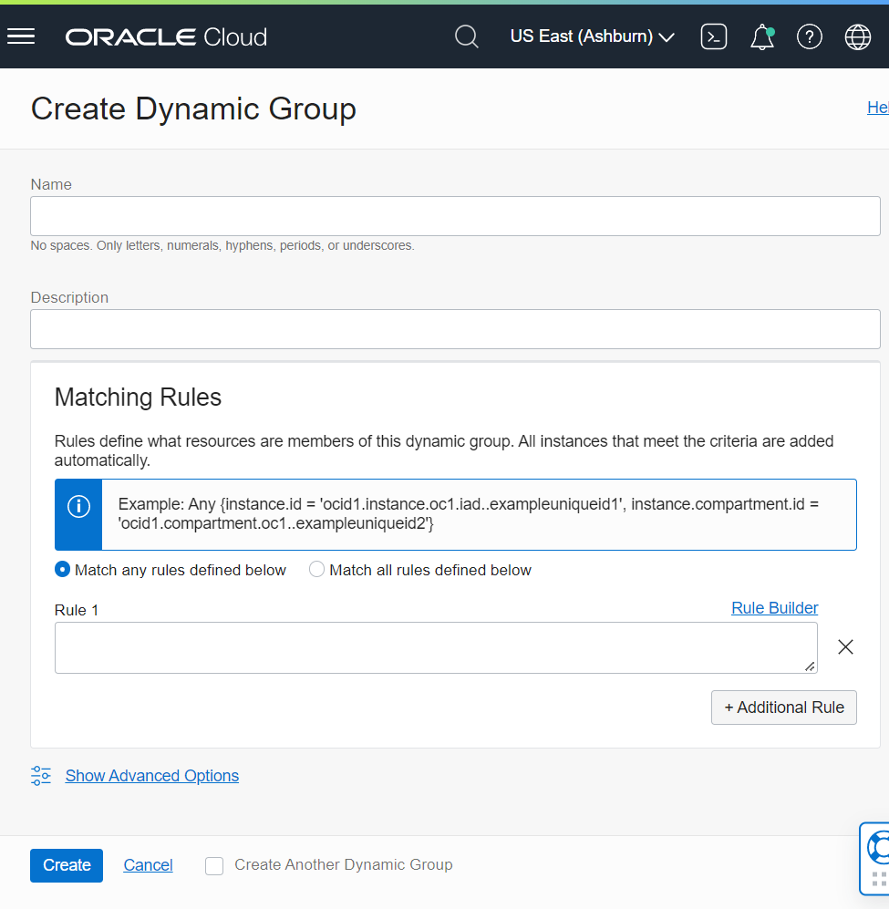
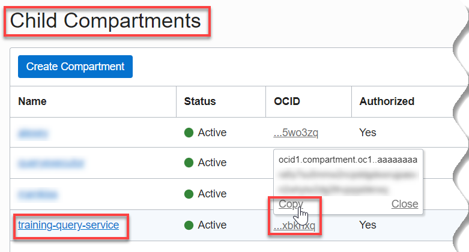
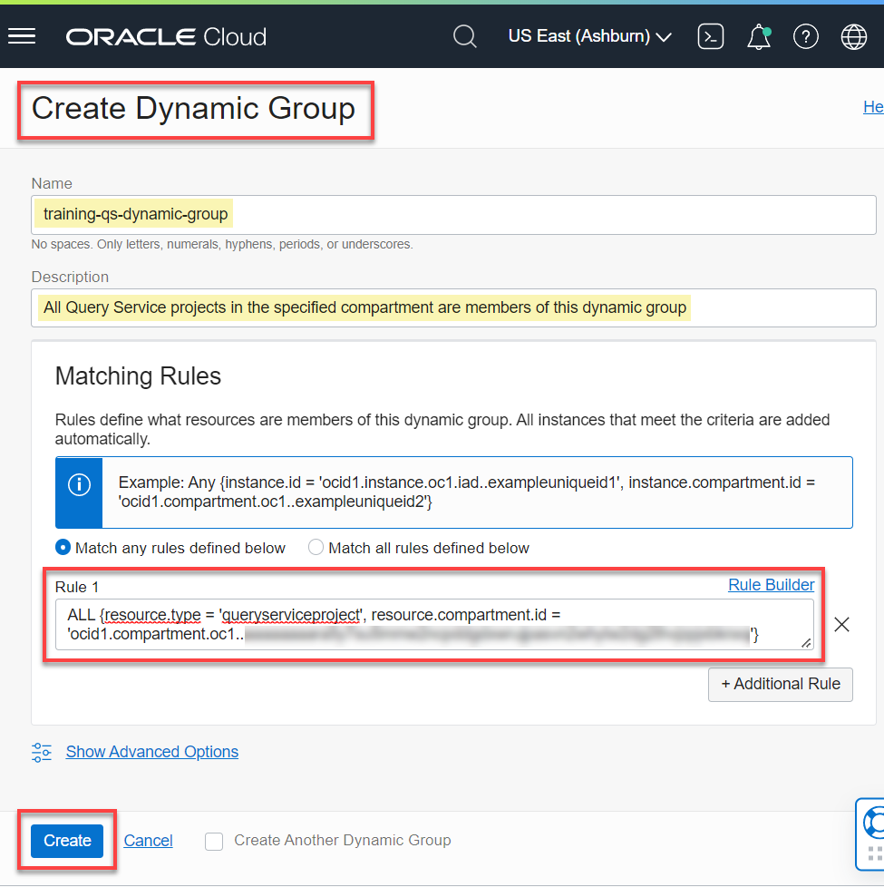
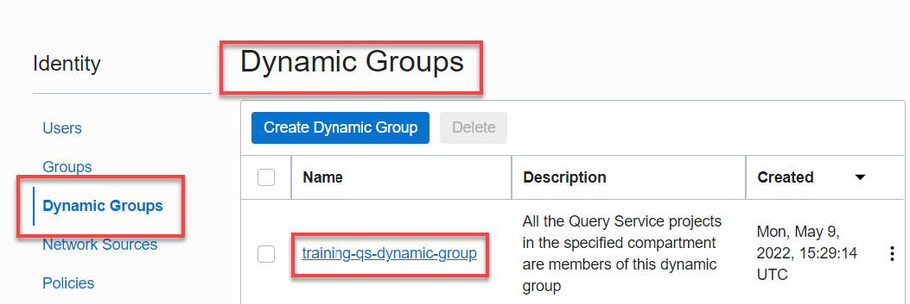
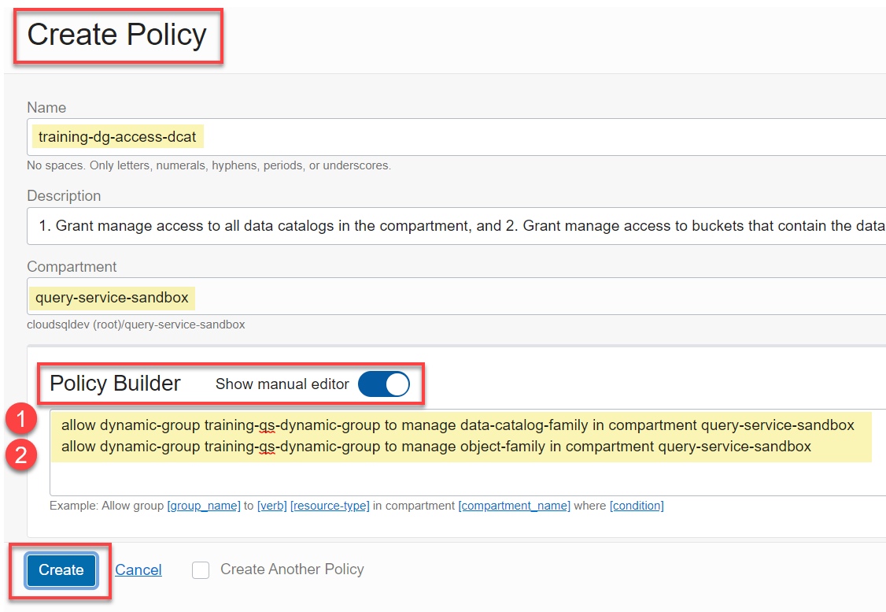
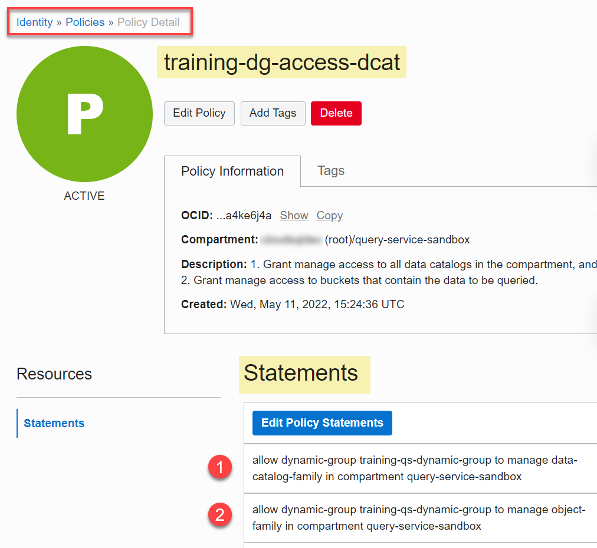
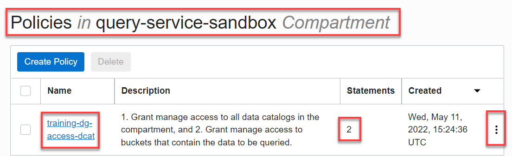

# How do I create the required Query Service projects policies?
Duration: 10 minutes

### Prerequisites
* An Oracle Cloud Account.

## Create a dynamic group and a Dynamic Group Access Policy for your Query Service Project

Before you can create and use a Query Service project, your tenancy must have a dynamic group that contains the project you will create and the policies granting the project access to resources it needs. The dynamic group containing the project must have manage access on the Data Catalog instance that it will reference. In addition, the dynamic group containing the project must have manage access to the buckets that contain the data to be queried using the Query Builder in the Query Service project.

>**Note:** Optionally, if you want to store your query results in Object Storage buckets, the dynamic group that contains the project must have read and write access to those buckets.


### **Requirement 1: Create a Dynamic Group**

1. Sign in to the Oracle Cloud Infrastructure Console using your tenancy, username, and password. For the **Query Service Limited Availability (LA) release**, navigate to your assigned **Query Service Console** provided to you by your Oracle Product Manager.

2. Open the **Navigation** menu and click **Identity & Security**. Under **Identity**, click **Dynamic Groups**.

3. On the **Dynamic Groups** page, click **Create Dynamic Group**. The **Create Dynamic Group** dialog box is displayed.

    

4. Specify the following:

    + **Name:** Enter a meaningful and unique name.
    + **Description:** Enter a useful description (required).
    + In the **Matching Group** section, accept the default **Match any rules defined below** option. Resources that meet the rule criteria that you will specify in the **Rule 1** text box are members of the group.
    + Click the **Copy** button in the following code box to copy the dynamic rule, and then paste it in the **Rule 1** text box. This rule specifies that this group contains all of the projects that currently exists or are later created in the specified compartment (identified by the compartment's OCID) are members of this group. You will substitute the _your-qs-project-compartment-ocid_ with your own Query Service project's compartment OCID. This is the compartment where you will create your **Query Service** project.

        ```
        <copy>ALL {resource.type = 'queryserviceproject', resource.compartment.id = 'your-qs-project-compartment-ocid'}</copy>
        ```
        >**Note:** Don't delete the single quotation marks around the compartment OCID value. For detailed information on Dynamic Groups, see the [Managing Dynamic Groups](https://docs.oracle.com/en-us/iaas/Content/Identity/Tasks/managingdynamicgroups.htm) Oracle Cloud Infrastructure (OCI) Documentation.

5. Find your _Compartment OCID value_. This is the compartment where you will create your Query Service project. Open the **Navigation** menu and click **Identity & Security**. Under **Identity**, click **Compartments**. On the **Compartments** page, in the row for _the Query Service compartment_ (where you will create your Query Service project), hover over the **OCID** link in the **OCID** column, and then click the **Copy** link to copy the OCID value for the compartment to your clipboard.

    

    >**Note:** If your compartment is a child compartment of another compartment, click the parent compartment name link on the **Compartments** page. On the **Compartment Details** page, scroll-down to the **Child Compartments** section. In the row for the compartment where you will create your Query Service project, hover over the **OCID** link in the **OCID** column, and then click the **Copy** link to copy the compartment's OCID value to your clipboard.

    

6. Replace the _`your-qs-project-compartment-ocid`_ place holder (inside the single quotes) in the above code that you copied with _your own compartment OCID value_.

7. Click **Create**.

    

8. The **Dynamic Group Details** page is displayed. Click the **Dynamic Groups** link in the breadcrumbs to re-display the **Dynamic Groups** page.

    The newly created dynamic group is displayed.

    


### **Requirement 2: Create a Dynamic Group Access Policy**     

After you create a dynamic group, you need to create a policy to grant the dynamic group read access on the Data Catalog instance that you will use when you create your Query Service project. Create a policy to allow any project (resource) in your _your dynamic group_ to manage _your Data Catalog instance_ in the compartment that contains this Data Catalog instance.

9. If you are still on the **Dynamic Groups** page, click **Policies** in the **Identity** section on the left; otherwise, open the **Navigation** menu and click **Identity & Security**. Under **Identity**, select **Policies**.

10. On the **Policies** page, make sure that the compartment that contains the Data Catalog instance that you will use to create the Query Server project is selected in the **List Scope** section. Next, click **Create Policy**.  

11. In the **Create Policy** dialog box, provide the following information:
    + **Name:** Enter a meaningful and unique name.
    + **Description:** Enter a useful description (required).
    + **Compartment:** Select _your compartment_ from the drop-down list, if it's not already selected.
    + In the **Policy Builder** section, click and slide the **Show manual editor** slider to enable it. An empty text box is displayed in this section.
    + Allow any resource in the dynamic group that you created to manage _your Data Catalog_ in _your selected compartment_. Click the **Copy** button in the following code box, and then paste it in the **Policy Builder** text box. This policy statement allows any resource in the dynamic group listed to manage the Data Catalog in the selected compartment.

        ```
        <copy>allow dynamic-group training-qs-dynamic-group to manage data-catalog-family in compartment query-service-sandbox</copy>
        ```

        >**Note:** Data Catalog offers both aggregate and individual resource-types for writing policies. You can use aggregate resource-types to write fewer policies. For example, instead of using two policy statements to allow a group to manage `data-catalogs` and `data-catalog-data-assets` which we need in this workshop, you can have one policy statement that allows the group to manage the aggregate resource-type, `data-catalog-family` as we used in the preceding code example. See [Data Catalog Policies](https://docs.oracle.com/en-us/iaas/data-catalog/using/policies.htm).

12. Add a second policy statement to allow any Query Service project in the dynamic group to manage Object Storage buckets that contain the data that you will query. Click the **Copy** button in the following code box, and then paste it on the second line in the **Policy Builder** text box.

    ```
    <copy>allow dynamic-group training-qs-dynamic-group to manage object-family in compartment query-service-sandbox</copy>
    ```

    

13. Click **Create**. The policy is created and the **Policy Detail** page is displayed. Click the **Policies** link in the breadcrumbs to re-display the **Policies** page.

    

14. The newly created policy is displayed.

    

### **Optional Requirement**

As mentioned earlier, if you want to store your query results in Object Storage buckets, the dynamic group that contains the project must have read and write access to those buckets.

The following is an example of a policy granting read and write access to all buckets in the tenancy:

```
allow dynamic-group training-qs-dynamic-group to manage object-family in tenancy
```

The following is an example of a policy granting read and write access to a specific bucket in the tenancy named
`training-bucket`:

```
allow dynamic-group training-qs-dynamic-group to manage object-family in tenancy where target.bucket.name='training-bucket'
```

## Learn More

* [Signing In to the Console](https://docs.cloud.oracle.com/en-us/iaas/Content/GSG/Tasks/signingin.htm).
* [Oracle Cloud Infrastructure Documentation](https://docs.oracle.com/en-us/iaas/Content/GSG/Concepts/baremetalintro.htm)
* [Managing Dynamic Groups](https://docs.oracle.com/en-us/iaas/Content/Identity/Tasks/managingdynamicgroups.htm)
* [Data Catalog Policies](https://docs.oracle.com/en-us/iaas/data-catalog/using/policies.htm)
