# How do I create a Query Service project?

Duration: 15 minutes

In this sprint, you will learn how to create a Query Service project.

### Prerequisites
* An Oracle Cloud Administrator Account
* An optional compartment for your Query Service project and resources
* The required policies to allow access to the Data Catalog instance (if using one), Oracle Object Storage, and Query Service projects
* The required permissions to create dynamic groups
* The required permissions to create policies in the root compartment

<!-- Comment: Update video with new create policy and then expose it again.
Watch the following short video on how to create Query Service projects.

 -->

## Create a Query Service Project

A Query Service project is a collection of tables, worksheets, and queries related to a common theme or task. Every project can provide access to schemas and external table definitions that are derived (synchronized) from logical entities in the Data Catalog instance that can associate with your new the project. Alternatively, you can create a Query Service project without associating it  with any existing Data Catalog instance. You can create and query external Object Storage tables using files in public and private Object Storage buckets. A schema in a Query Service project is a collection of related tables. When you query a table in a schema you need to reference the schema and table in the schema using the syntax **`schema_name.table_name`**.

>**Note:** To learn how to create an OCI Data Catalog instance and how to harvest a data asset from Oracle Object Storage buckets, see the [Access the Data Lake using Autonomous Database and Data Catalog](https://apexapps.oracle.com/pls/apex/dbpm/r/livelabs/view-workshop?wid=877) LiveLabs workshop.

1. Sign in to the Oracle Cloud Infrastructure Console using your tenancy, username, and password. The **Console** Home page is displayed. Open the **Navigation** menu and click **Analytics & AI**. Under **Data Lake**, click **Query Service**. The **Query Service Overview** page is displayed.

    

2. Click **Create Project**. The **Create Query Service project** panel is displayed.

3. In the **Name** field, accept the default name or enter a meaningful and unique name such as **training-qs-project** in the example.

4. Click the **Create in compartment** drop-down list and start typing the compartment's name in the **Search compartments** text field. This is the compartment where you'd like to create this project. Once you see your compartment, click it. In this example, we selected the **`training-query-service`** compartment.

      

5. In the **Project Description** field, enter an optional description.

6. In the **Connect Data Catalog** section, you have two options:

    * **Option 1:** The **Associate Data Catalog Instance** checkbox is de-selected by default. You can select this checkbox to select a Data Catalog instance in your compartment that you want to associate with your new Query Service project.

          

          In the above screen capture example, the **`query-service-sandbox`** compartment that contains the **DataLake** Data Catalog instance to which we want to connect is selected from the drop-down list. Click the **Change Compartment** link to search for the Data Catalog instance if it's in a different compartment. This instance contains a data asset that was harvested from three Oracle Object Storage buckets. Logical data entities were harvested from each of the three buckets: **moviestream\_sandbox**, **moviestream\_landing**, and **moviestream_gold**.

          If a Data Catalog instance is selected, Query Service is automatically synchronized with the Data Catalog instance. It synchronizes (links) the metadata in your Data Catalog instance and creates schemas that correspond to buckets in your harvested data assets. Query Service also creates the external tables in those schemas that correspond to the logical data entities that were harvested in the Data Catalog instance.

    * **Option 2:** If you don't want to associate an existing Data Catalog instance with this new project, keep the **Associate Data Catalog Instance** checkbox unchecked. For this project, we will keep it unchecked.

        

7. Before you can create a project, your tenancy must have a dynamic group that contains your new project in addition to other policies that grants the project access to all of the resources it needs. _If you don't have the required dynamic group and the access policies_, you can use the **Create Dynamic Group and Access Policies** section to create them. The two available options are described in detail in the next section in this sprint.

    >**Note:** In order to create the required policies using the **Create Dynamic Group and Access Policies** section, you must have the required permissions to create a dynamic group and to create a policy in the root compartment.

    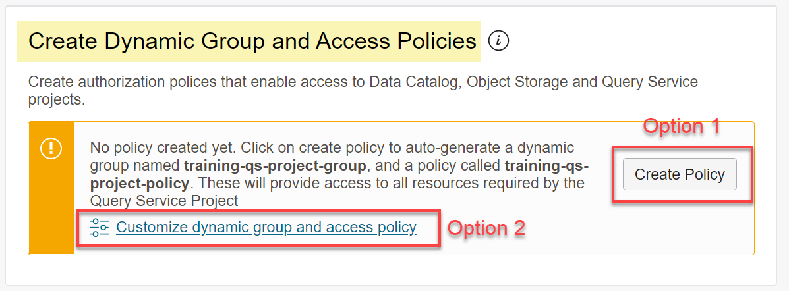

    The dynamic group and the access policy are automatically created. You can click the link that is associated with each resource to display its details. This is shown in the next section.

    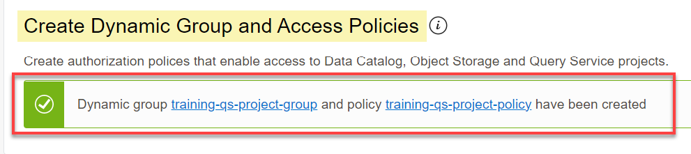

    > **Note:** To create the required dynamic group and the access policies that you need to use Query Service _manually_, view the **How do I create the required policies for Query Service projects?** sprint which you can select from the **Contents** menu on the left.

8. Click **Create Policy** to create the dynamic group and your access policy. _The access policy is created in your **root compartment**_.

9. You can click the **Show Advanced Options** link to configure and limit the project level settings using the **Configure Project-level Settings** section.

    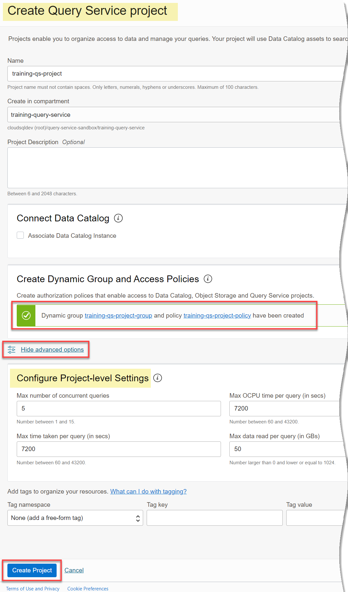

10. Click **Create Project**. The **Query Service Projects** page is re-displayed. The initial state of the project is **Creating**. When the project is created successfully, its state changes to **Active**.

    

## Create a Customized Dynamic Group and an Access Policy

As mentioned earlier, when you use the **Create a Dynamic Group and an Access Policy** section, you have two options.

### **Option 1: Click the Create Policy Button**

Click **Create Policy** to automatically generate the required dynamic group and the the access policy that enables access to Query Service projects, Data Catalog, and Object Storage. _**The access policy is created in your root compartment**_.

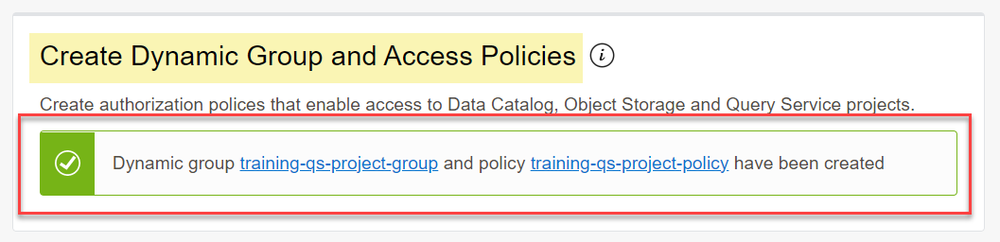

To view the created dynamic group, from the **Console**, open the **Navigation** menu and click **Identity & Security**. Under **Identity**, click **Dynamic Groups**. On the **Dynamic Groups** page, the automatically created dynamic group is displayed.

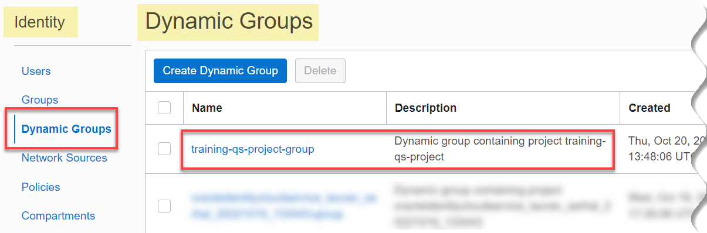

To view the created access policy, from the **Dynamic Groups** page from the previous step, click **Policies** in the **Identity** section on the left. Select the compartment from the **Compartment** drop-down list. The automatically created access policy is displayed.

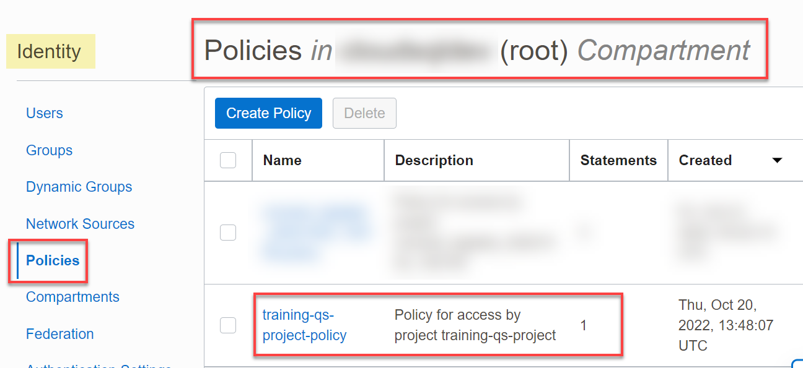

If you decide not to proceed with creating your project and click **Cancel** instead, the following message box is displayed. You can either keep the automatically created dynamic group and access policy or delete them.

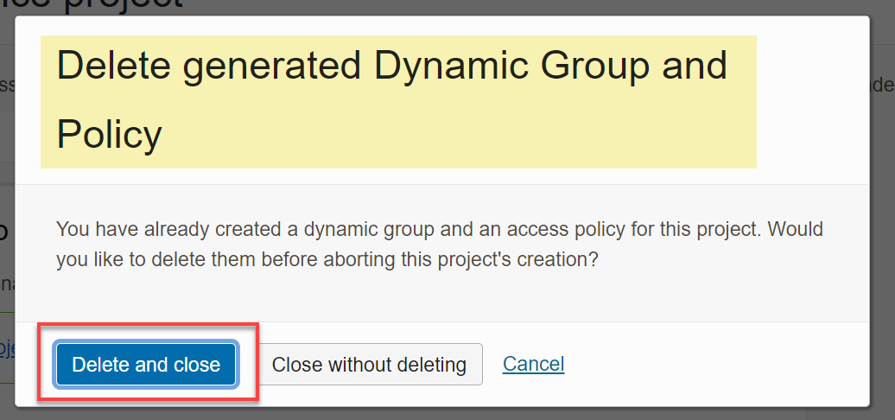

### **Option 2: Click the Customize group and access policy link**

If you want more control over the how the dynamic group and the access policy will be created, click the **Customize group and access policy** link to display the **Customize Project Group and Access Policy** wizard. The four wizard's steps are described next.

* **Step 1: Set up a dynamic group**: Use this step to customize the dynamic group policy's name, description, the matching rule, and then click **Next**.

    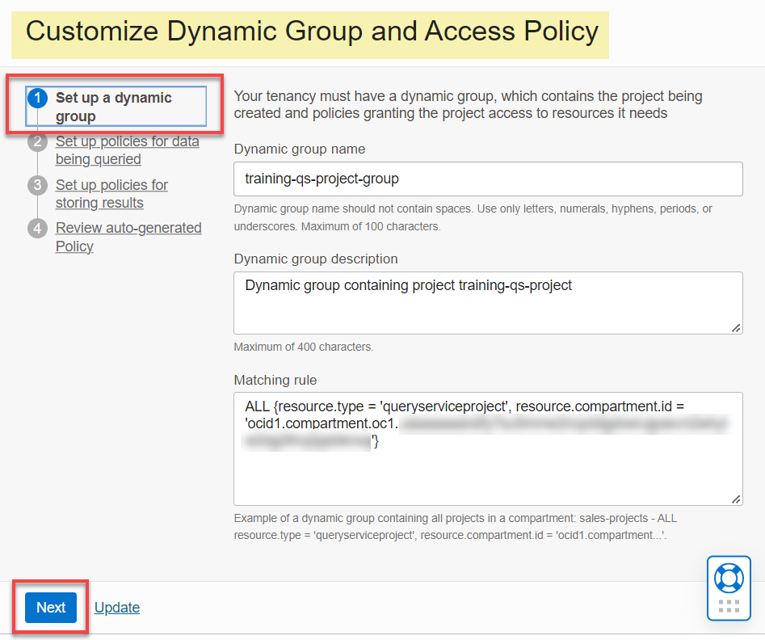

* **Step 2: Set up policies for data being queried**: _This is an optional step if you are only accessing data in public buckets_. Select the compartments and buckets that contain the data that you want to query, and then click **Next**.
    * In the **Compartments** tab, select the parent compartment from the drop-down list to display its sub-compartments that contain the buckets where you would like to store your query results. To select a compartment, click **Select** next the compartment's name. The selected compartment is displayed in the **Selected compartments** section.

        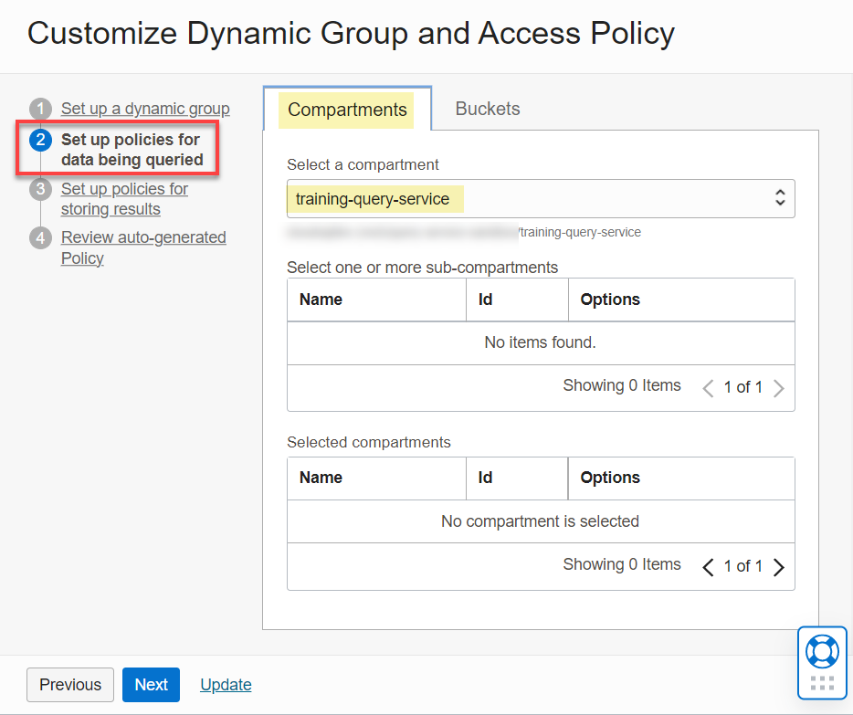

    * Click the **Buckets** tab to select the bucket(s) in the compartments that you selected in the **Compartments** tab. These are the buckets where you'd like to save the results of your queries. To select a bucket, click **Select** next the bucket's name. The selected bucket is displayed in the **Selected buckets** section. Click **Next**.

        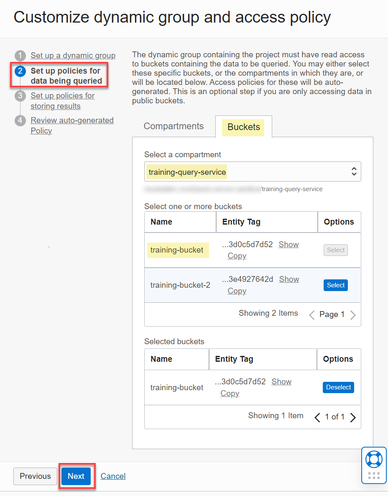

* **Step 3: Set up policies for storing results**: _This is an optional step if you don't want to save the results of your queries_. Select the compartments and buckets where you want to store your queries' results, and then click **Next**.

    * In the **Compartments** tab, select the parent compartment from the drop-down list to display its sub-compartments that contain the buckets where you would like to store your query results. To select a compartment, click **Select** next the compartment's name. The selected compartment is displayed in the **Selected compartments** section.

        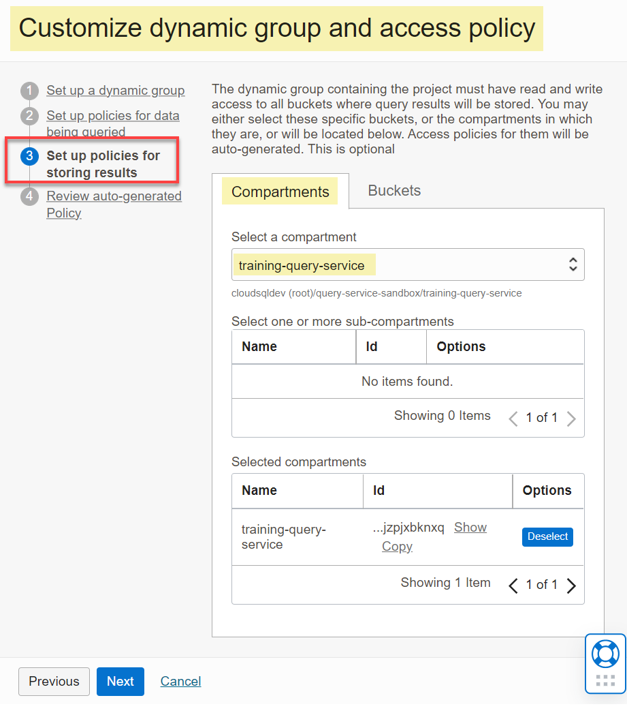

    * Click the **Buckets** tab to select the bucket(s) in the compartments that you selected in the **Compartments** tab. These are the buckets where you'd like to save the results of your queries. To select a bucket, click **Select** next the bucket's name. The selected bucket is displayed in the **Selected buckets** section.

        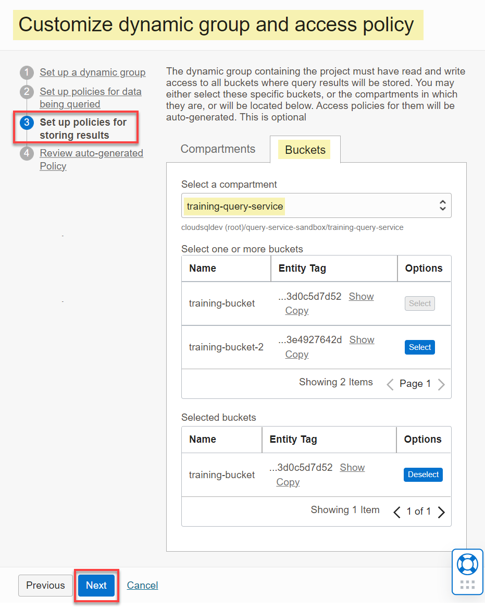

* **Step 4: Review auto-generated Policy**: Review the details of the auto-generated policy statements along with any changes that you might have made. Click **Previous** to return to the previous pages in the wizard to make any changes. When done, click **Save Changes**. To exit the wizard without saving your changes, click **Cancel**.

    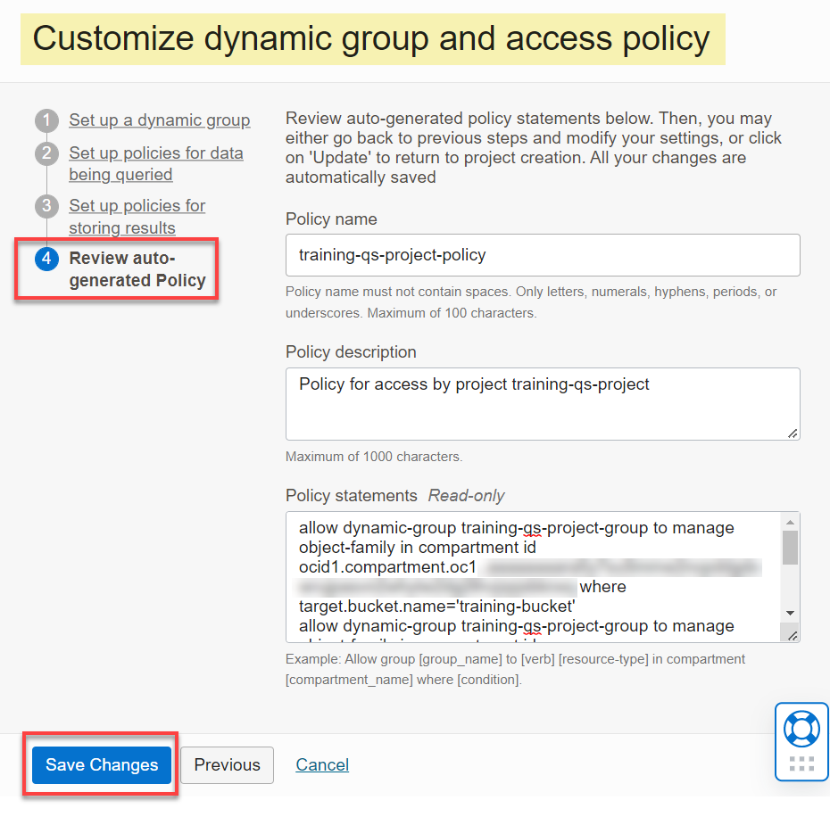

    A message is displayed in the **Create Dynamic Group and Access Policies** section indicating that the dynamic group and the policy are successfully created. You can click the links associated with the dynamic group or the policy to display their details. The **Create Query Service project** panel is re-displayed.

    Based on our selections in the wizard in the above example, the following policy statements were added to the new access policy:

    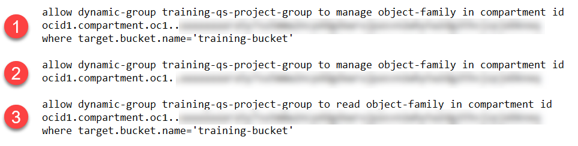

    Usually, the next step would be to create the project; however, in this sprint, you already did that in the earlier section.

## Work with Query Service Projects

1. To view the project's details page, click the project's name link in the **Name** column.

    

    >**Note:** You can use the **State** filter in the **Filters** section on the left side of the page to display projects with only a specific state such as **Active**

    

    You can use this page to do the following:

    * On the top of the page, you can access the **Query Editor**, edit the project, move resource, download database wallet, and use the **More Actions** drop-down list to add tags, create or update database password, open the Analytics Cloud, and delete the project.
    * In the middle of the page, you can click the appropriate tabs to display the project's information, project settings, and tags.
    * The **Resources** section provides information about tables in selected schemas, past query executions in the Query Editor, and work requests such as the CREATE PROJECT when you create a project.
    * The **worksheets** section displays any worksheets that you have saved previously.

    >**Note:** To return to the **Query Service Projects** page, click the **Projects** link in the breadcrumbs.

2. From the **Query Service Projects** page, you can also click **Query Editor** to display an empty **Scratchpad**. This is where you run one or more Oracle SQL queries against tables in your available schemas. The **Scratchpad** is only stored for the duration of your web browser session; therefore, to share or persist the queries across web browsers or web browser sessions, you must save the content of the **Scratchpad** as a worksheet. To learn how to query data in Query Service, click the **How do I query data in Query Service?** workshop sprint in the **Contents** menu on the left.

3. You can click the **Actions** button (three vertical dots) in the row for your Query Service project to display the Context menu and perform a variety of tasks.

    

## Learn More

* [Signing In to the Console](https://docs.cloud.oracle.com/en-us/iaas/Content/GSG/Tasks/signingin.htm).
* [Data Catalog Documentation](https://docs.oracle.com/en-us/iaas/data-catalog/home.htm)
* [Oracle Cloud Infrastructure Documentation](https://docs.oracle.com/en-us/iaas/Content/GSG/Concepts/baremetalintro.htm)

## Acknowledgements
* **Author:** Lauran Serhal, Consulting User Assistance Developer
* **Contributors:**
    + Alexey Filanovskiy, Senior Principal Product Manager
    + Ravi Ramkissoon, Software Development Director
* **Last Updated By/Date:** Lauran Serhal, November 2022
