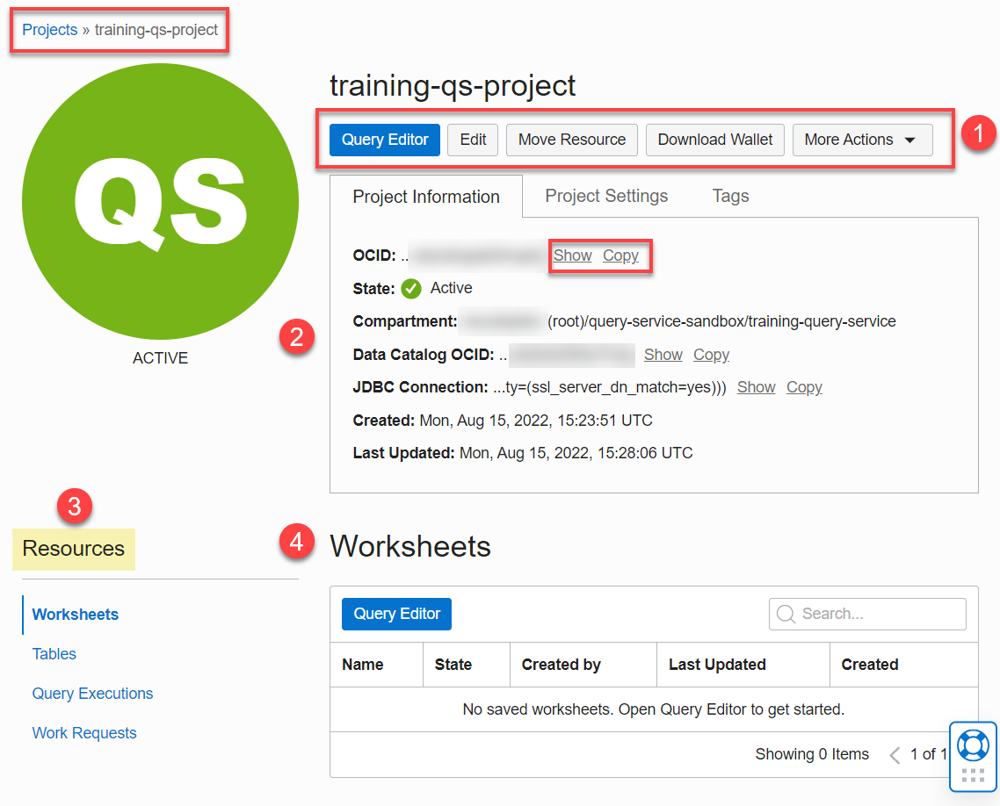

# How do I create a Query Service project?

Duration: 5 minutes

In this sprint, you will learn how to create a Query Service project.

### Prerequisites
* An Oracle Cloud Account.
* An optional compartment for your Query Service project and resources.
* The required policies to allow access to the Data Catalog instance, Oracle Object Storage, and Query Service projects.

Watch the following short video on how to create Query Service projects.

## Create a Query Service Project

A Query Service project is a collection of tables, worksheets, and queries related to a common theme or task. Every project can provide access to schemas and external table definitions that are derived (synchronized) from logical entities in the Data Catalog instance that can associate with your new the project. Alternatively, you can create a Query Service project without associating it  with any existing Data Catalog instance. You can create and query external Object Storage tables using files in public and private Object Storage buckets. A schema in a Query Service project is a collection of related tables. When you query a table in a schema you need to reference the schema and table in the schema using the syntax **`schema_name.table_name`**.

>**Note:** To learn how to create an OCI Data Catalog instance and how to harvest a data asset from Oracle Object Storage buckets, see the [Access the Data Lake using Autonomous Database and Data Catalog](https://apexapps.oracle.com/pls/apex/dbpm/r/livelabs/view-workshop?wid=877) LiveLabs workshop.

1. Sign in to the Oracle Cloud Infrastructure Console using your tenancy, username, and password. The **Console** Home page is displayed. Open the **Navigation** menu and click **Analytics & AI**. Under **Data Lake**, click **Query Service**.

2. On the **Query Service Projects** page, click **Create Project**.

3. In the **Create Query Service project** panel, specify the following:
    * **Name:** Accept the default name or enter a meaningful and unique name such as **training-qs-project**.
    * **Create in compartment:** Select the compartment where you'd like to create this project. Click the **Create In Compartment** drop-down list and start typing the compartment's name in the **Search compartments** text field. Once you see your compartment, click it. In this example, we selected the **`training-query-service`** compartment.

      

    * **Project Description:** Enter an optional description.
    * **Connect Data Catalog:** You have two choices in this section:

        + By default, the **Associate Data Catalog Instance** checkbox is selected. You can select the Data Catalog instance in your compartment that you want to associate with your new Query Service project.

          

          In this example, we selected the **`query-service-sandbox`** compartment that contains the **DataLake** Data Catalog instance to which we want to connect from the drop-down list. Click the **Change Compartment** link to search for the Data Catalog instance if it's in a different compartment. This instance contains a data asset that was harvested from three Oracle Object Storage buckets. Logical data entities were harvested from each of the three buckets.

             + **moviestream\_sandbox**
             + **moviestream\_landing**
             + **moviestream_gold**

          When you select a Data Catalog instance, Query Service is automatically synchronized with the Data Catalog instance. It synchronizes (links) the metadata in your Data Catalog instance and creates schemas that correspond to buckets in your harvested data assets. Query Service also creates the external tables in those schemas that correspond to the logical data entities that were harvested in the Data Catalog instance.

        + If you don't want to associate an existing Data Catalog instance with this new project, uncheck the **Associate Data Catalog Instance** checkbox.

          

    >**Note:** If you don't have a Data Catalog instance and for detailed information on how to create and harvest a data asset from Oracle Object Storage buckets, see **Lab 2: Harvest Technical Metadata from Oracle Object Storage** in the [Access the Data Lake using Autonomous Database and Data Catalog](https://apexapps.oracle.com/pls/apex/dbpm/r/livelabs/view-workshop?wid=877) Livelabs workshop.

    * **Create Policy:** The **Query Service LA** release doesn't support creating the required policies using this section. You must create the policies manually; however, you can click **Create Policy** to view the required policies that you need to create. This is covered in the **How do I create the required policies for Query Service projects?** sprint which you can select from the **Contents** menu on the left.  

      

      You can click the **Show Advanced Options** to configure and limit the project level settings using the **Configure Project-level Settings** section.

      

4. Click **Create Project**. The initial state of the project is **Creating**. When the project is created successfully, its state changes to **ACTIVE** and it is displayed in the **Query Service Projects** page.   

    

    >**Note:** You can use the **State** filter in the **Filters** section on the left side of the page to display projects with only a specific state such as **Active**

    

5. To view the project's details page, click the project's name link in the **Name** column.

    

    You can use this page to do the following:

    * On the top of the page, you can access the **Query Editor**, edit the project, move resource, download database wallet, and use the **More Actions** drop-down list to add tags, create or update database password, open the Analytics Cloud, and delete the project.
    * In the middle of the page, you can click the appropriate tabs to display the project's information, project settings, and tags.
    * The **Resources** section provides information about tables in selected schemas, past query executions in the Query Editor, and work requests such as the CREATE PROJECT when you create a project.
    * The **worksheets** section displays any worksheets that you have saved previously.

    >**Note:** To return to the **Query Service Projects** page, click the **Projects** link in the breadcrumbs.

6. From the **Query Service Projects** page, you can also click the **Data Catalog** name link to display the details of the Data Catalog instance that you used with the project.

      

    >**Note:** To return to the **Query Service Projects** page, click your browser's Back button.

7. From the **Query Service Projects** page, you can also click **Query Editor** to display an empty **Scratchpad**. This is where you run one or more Oracle SQL queries against tables in your available schemas. The **Scratchpad** is only stored for the duration of your web browser session; therefore, to share or persist the queries across web browsers or web browser sessions, you must save the content of the **Scratchpad** as a worksheet. To learn how to query data in Query Service, click the **How do I query data in Query Service?** workshop sprint in the **Contents** menu on the left.  

8. Finally, you can click the **Actions** button (three vertical dots) in the row for your Query Service project to display the Context menu and perform a variety of tasks.

      

## Learn More

* [Signing In to the Console](https://docs.cloud.oracle.com/en-us/iaas/Content/GSG/Tasks/signingin.htm).
* [Data Catalog Documentation](https://docs.oracle.com/en-us/iaas/data-catalog/home.htm)
* [Oracle Cloud Infrastructure Documentation](https://docs.oracle.com/en-us/iaas/Content/GSG/Concepts/baremetalintro.htm)

## Acknowledgements
* **Author:** Lauran Serhal, Consulting User Assistance Developer
* **Contributors:**
    + Alexey Filanovskiy, Senior Principal Product Manager
    + Ravi Ramkissoon, Software Development Director
* **Last Updated By/Date:** Lauran Serhal, August 2022
