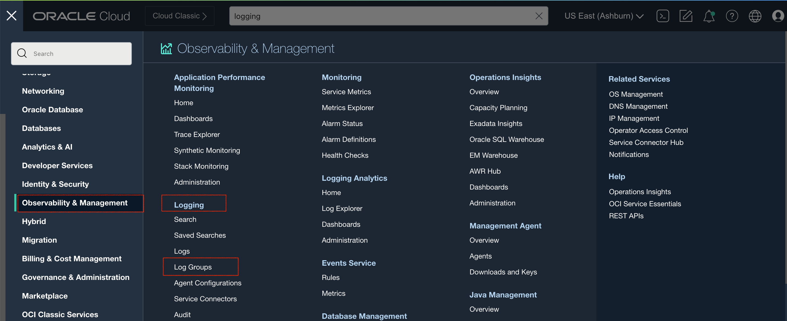

# How do I create a VCN flow logs for resources in VCN?
Duration: 5 minutes

You can use flows logs for troubleshooting and monitoring. Through the Logging service, you can enable, view, and manage your flow log configuration.

## Enable flow logs

In the navigation menu in the Console, go to Logging and click Log Management.

1. Open the navigation menu and click <b>Observability & Management</b>. Under <b>Logging</b>, click <b>Log Groups</b>

2. Click <b>Create Log Groups</b>.

3. Enter a name and description for the Log Groups.

4. Enable VCN flow logs on your subnet. On the Logs tab, click <b>Enable Service Log</b>. Select the <b>Virtual Cloud Network - subnets</b> service, and select your subnet as the resource. Enter a name for the log, and click Enable Log

## Learn More

* [VCN Flow Logs](https://docs.oracle.com/en-us/iaas/Content/Network/Concepts/vcn_flow_logs.htm)
