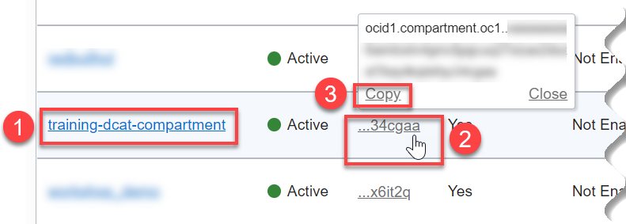
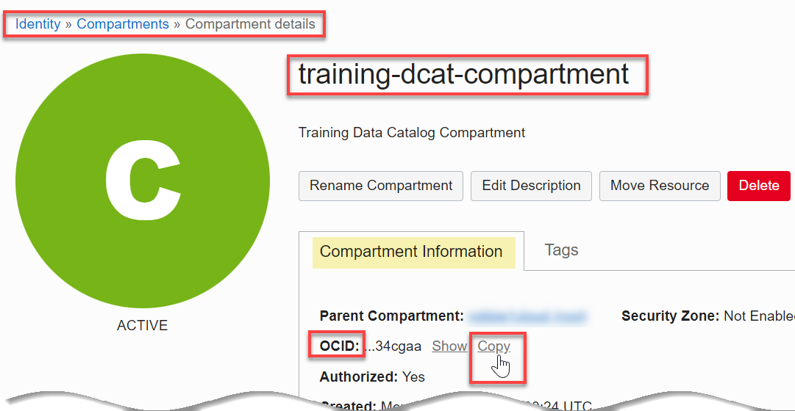

# How do I find the compartment OCID?
Duration: 2 minutes

### Prerequisites
* An Oracle Cloud Account.

## Find the Compartment OCID

1. Sign in to the Oracle Cloud Infrastructure Console.

2. Open the **Navigation** menu and click **Identity & Security**. Under **Identity**, click **Compartments**.

3. On the **Compartments** page, in the row for _the compartment_ (**training-dcat-compartment** in this example), hover over the **OCID** link in the **OCID** column, and then click the **Copy** link to copy the OCID for the compartment to your clipboard.

    

You can now paste your copied compartment OCID anywhere you need it.

> **Note:** Alternatively, you can copy the compartment OCID as follows: On the **Compartments** page, click the compartment name link in the **Name** column to display the **Compartment details** page. On the **Compartment Information** tab, in the **OCID** row, click the **Copy** link. The OCID for the compartment is copied to your clipboard.

## Learn More

* [Signing In to the Console](https://docs.cloud.oracle.com/en-us/iaas/Content/GSG/Tasks/signingin.htm).
* [Oracle Cloud Infrastructure Documentation](https://docs.oracle.com/en-us/iaas/Content/GSG/Concepts/baremetalintro.htm)
