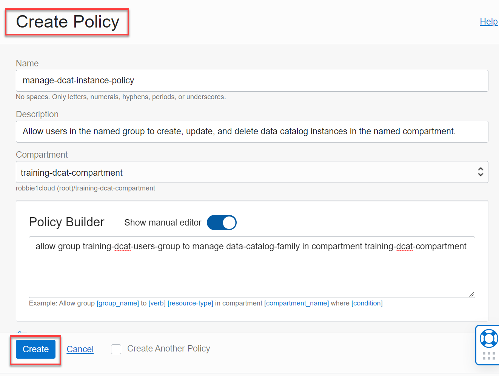

# How do I allow users to manage a Data Catalog instance?
Duration: 5 minutes

You can create policies to define how you want your users to access Data Catalog instances.

### Prerequisites
* An Oracle Cloud Account.
* A compartment.
* A Data Catalog instance.

## Create a Policy to Allow Users to Manage a Data Catalog Instance         
Create a policy to allow users to create, update, and delete Data Catalog instances in your tenancy or a specific compartment as follows:

1. Sign in to the Oracle Cloud Infrastructure Console.

2. Open the **Navigation** menu and click **Identity & Security**. Under **Identity**, select **Policies**.

3. On the **Policies** page, make sure that _your compartment_ is selected in the **List Scope** section, and then click **Create Policy**.  

4. In the **Create Policy** dialog box, provide the following information:
    + Enter a unique name for the policy in the **Name** field.
    + Enter a description in the **Description** field.
    + Select _your compartment_ from the **Compartment** drop-down list, if it's not already selected.
    + In the **Policy Builder** section, click and slide the **Show manual editor** slider to enable it. An empty text box is displayed in this section.

      Select one of the following statements to add to your policy:

    + To allow users to create, update, and delete data catalog instances in a tenancy, click the **Copy** button in the following code box, and then paste it on in the **Policy Builder** text box.

        ```
        <copy>Allow group <group-name> to manage data-catalog-family in tenancy</copy>
        ```

        > **Note:** Substitute `<group-name>` with your actual group name.

    + To allow users to create, update, and delete data catalog instances in a specific compartment,
    click the **Copy** button in the following code box, and then paste it in the **Policy Builder** text box.

        ```
        <copy>Allow group <group-name> to manage data-catalog-family in compartment <compartment-name>
        </copy>
        ```

        > **Note:** Substitute `<group-name>` with your actual group name and `<compartment-name>` with your compartment's name.

        In the following policy example, users in a group named `training-dcat-users-group` can manage Data Catalogs in a compartment named `training-dcat-compartment` using the aggregate resource-type, `data-catalog-family`.

        

5. Click **Create**. The **Policy Detail** page is displayed. Click the **Policies** link in the breadcrumbs to return to the **Policies** page. The newly created policy is displayed.

    


## Learn More

* [Signing In to the Console](https://docs.cloud.oracle.com/en-us/iaas/Content/GSG/Tasks/signingin.htm).
* [Oracle Cloud Infrastructure Documentation](https://docs.oracle.com/en-us/iaas/Content/GSG/Concepts/baremetalintro.htm)
* [Data Catalog Documentation](https://docs.oracle.com/en-us/iaas/data-catalog/home.htm)
* [Data Catalog Policies](https://docs.oracle.com/en-us/iaas/data-catalog/using/policies.htm)
