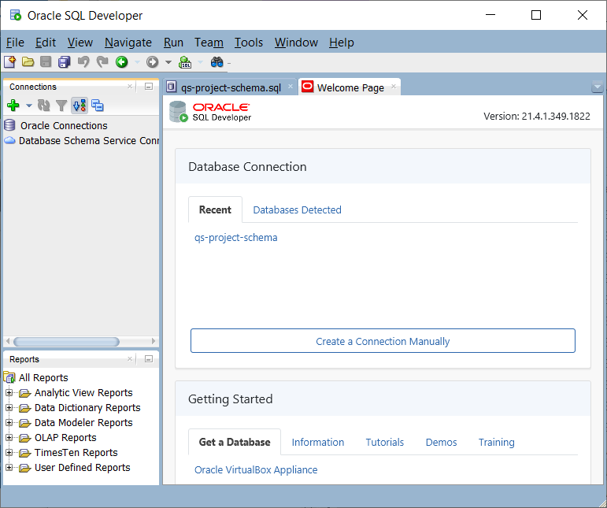

# How do I install Oracle SQL Developer?
Duration: 5 minutes

Oracle SQL Developer is a graphical version of SQL*Plus that gives database developers a convenient way to perform basic tasks. You can browse, create, edit, and delete (drop) database objects; run SQL statements and scripts; edit and debug PL/SQL code; manipulate and export data; and view and create reports.

You can connect to any target Oracle database schema using standard Oracle database authentication. Once connected, you can perform operations on objects in the database.

### Prerequisites
* An unzip tool.

## Download, Extract, and Start SQL Developer

1. Download the latest version of Oracle SQL Developer for your own platform from the [SQL Developer 21.4.1 Downloads](https://www.oracle.com/tools/downloads/sqldev-downloads-2141.html) page to a directory of your choice. In our example, we are using the MS-Windows platform; therefore, we clicked the **Download** link in the row for the **Windows 64-bit with JDK 8 included** `.zip` file.

  

    >**Note:** Make sure you click and read the **Installation Notes** for your own platform. The downloaded archive (`.zip`) file includes both SQL Developer and an embedded copy of the Java 8 Development Kit (JDK). You can also review the [Database SQL Developer Installation Guide](https://docs.oracle.com/cd/E12151_01/doc.150/e12153/toc.htm).

2. The **Oracle License Agreement** dialog box is displayed. Click the "I reviewed and accept the Oracle License Agreement" checkbox, and then click **Download sqldeveloper.zip**.

    The `.zip` file is downloaded to the **Downloads** directory by default.

    

3. Extract the `.zip` file to a directory of your choice. In our example, we will extract the file to the **Program Files** folder. Unzipping the SQL Developer kit creates a folder named **sqldeveloper** under our selected **Program Files** folder such as `C:\Program Files\sqldeveloper`. Many files and folders will be added under the **sqldeveloper** folder. In MS-Windows, navigate to the location where you downloaded the `.zip` file, and then click the `.zip` file name. The **Extract** tab is displayed. Click the **Extract all** icon on the toolbar.   

    

4. In the **Extract Compressed (Zipped) Folders** dialog box, browse to the folder where you'd like to extract the `.zip` file. Click **Browse** and then navigate to and click the desired folder such as **Program Files**. Next, click **Select Folder**. The **Extract Compressed (Zipped) Folders** dialog box is re-displayed. The **Files to be extracted to this folder** field displays your selected folder. Click **Extract**.

      

    > **Note:** If a **Destination Folder Access Denied** message box is displayed in MS-Windows, click **Continue**.

    The extracted file contents are displayed in the folder that you chose. In the top **sqldeveloper** folder, you can double-click the **`sqldeveloper.exe`** file to start SQL Developer.

      

5.  Create a shortcut for the **`sqldeveloper.exe`** file on your Desktop. In MS-Windows, navigate to the top **sqldeveloper** folder, right-click the **`sqldeveloper.exe`** file, and then select **Send to > Desktop (create shortcut)** from the context menus.

    

  A **sqldeveloper** shortcut is created on your Desktop.

    

6. Double-click the **sqldeveloper** shortcut on your Desktop to start it. For information about using SQL Developer, see the [SQL Developer User's Guide](https://docs.oracle.com/cd/E12151_01/doc.150/e12152/toc.htm)

  

## Learn More

* [SQL Developer Documentation](https://docs.oracle.com/cd/E12151_01/index.htm)
