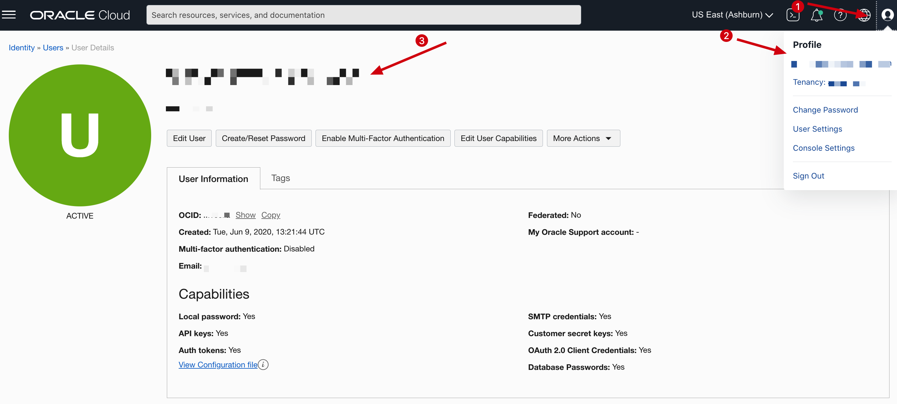

# How can I know my OCI username?

Duration: 1 minute

## Know your OCI username

1. In the OCI Console, click on the person icon at the far upper right. View your OCI username right below Profile from the drop-down menu or click on your user’s name. Remember, this user name could also be an email address.

  	> **Note**: If you do not see your user name in the drop-down menu, you might be a “federated” user. In that case, in the OCI Console, click on the navigation menu, select **Identity & Security**, and click **Users**. Click your user’s name to view the details. Federated users are "federated" from another user service.

  	