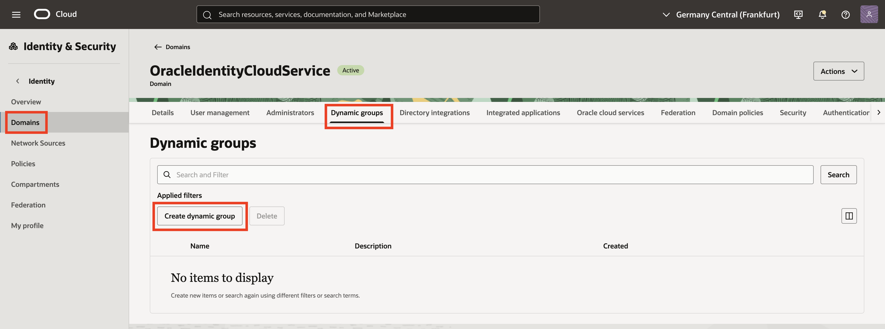
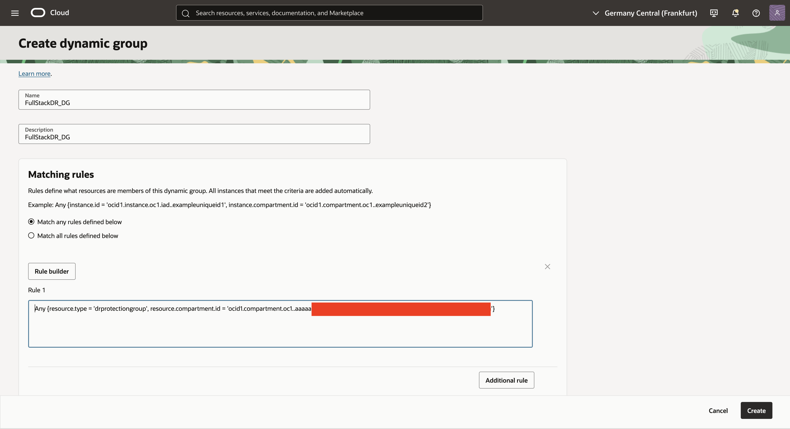
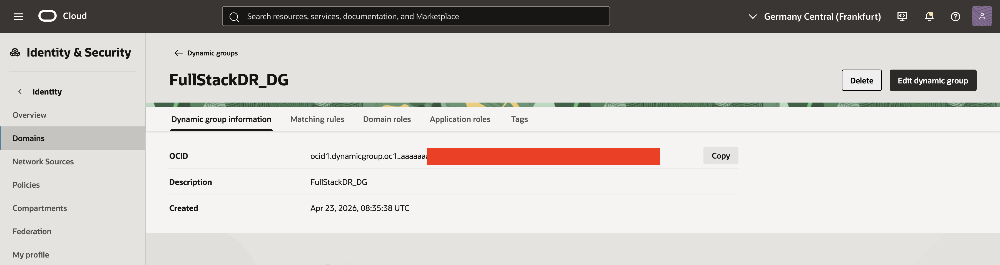
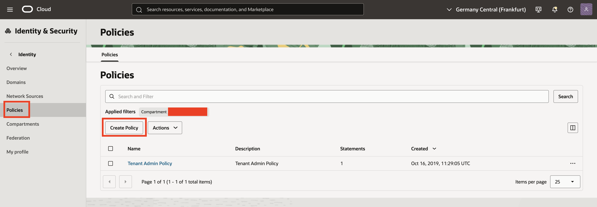
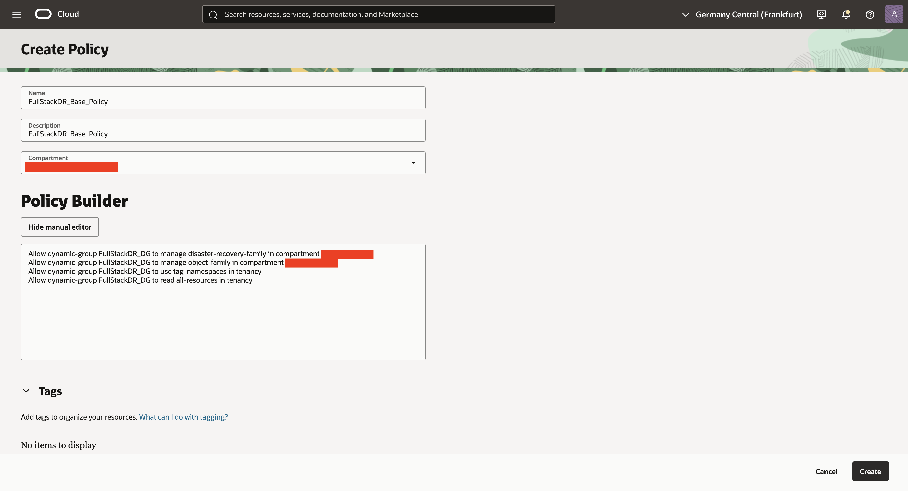
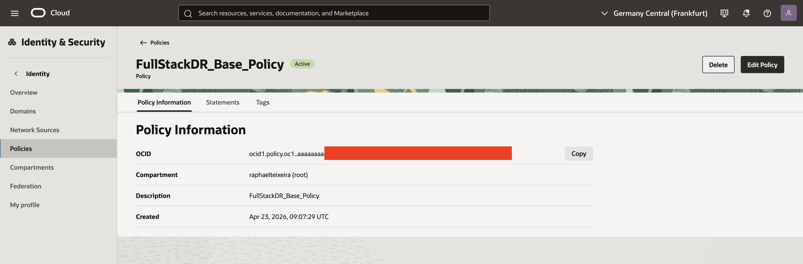
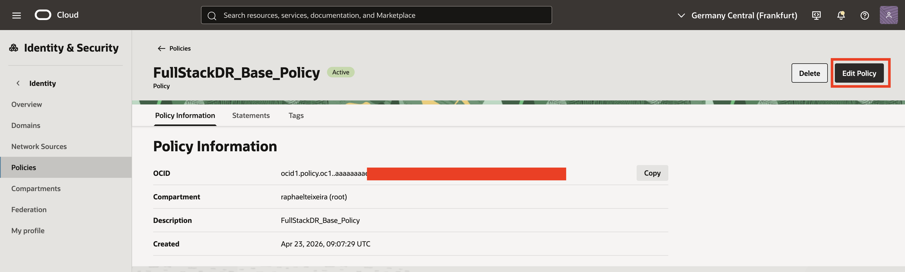

# How do I set up dynamic group and IAM policies for OCI Full Stack Disaster Recovery members?

Estimated Time: 15 minutes.

## Introduction

OCI Full Stack Disaster Recovery uses resource principals.

Those principals run DRPG prechecks, plan steps, member actions, and log writes. Grant access before you add members or run plans.

Use this sprint to create one dynamic group and add the IAM policies for your stack.

> **Note:** Oracle documentation checked on **May 14, 2026**.

### Objectives

Complete these goals.

* Create a dynamic group for Full Stack DR.
* Add baseline IAM policies.
* Add policies for each DRPG member type.
* Validate IAM access before plan runs.

### Prerequisites

* Access to an OCI tenancy.
* Rights to create dynamic groups and IAM policies.
* DRPG, resource, network, vault, and Object Storage scope names.
* OCIDs for DRPGs, compute instances, OKE clusters, and MySQL scopes.

## Task 1: Identify Names and Scope

1. Record the dynamic group name.

    Example: `FullStackDR_DG`.

2. Record these compartment names and OCIDs.

    * `<dr_protection_group_compartment_name>`
    * `<dr_protection_group_compartment_ocid>`
    * `<object_storage_bucket_compartment_name>`
    * `<network_compartment_name>`
    * `<vault_compartment_name>`

3. Record the member resource scopes that apply to your DRPG.

    * `<instance_compartment_name>`
    * `<instance_compartment_ocid>`
    * `<volume_group_compartment_name>`
    * `<file_system_compartment_name>`
    * `<database_compartment_name>`
    * `<autonomous_database_compartment_name>`
    * `<autonomous_container_database_compartment_name>`
    * `<mysql_compartment_name>`
    * `<mysql_compartment_ocid>`
    * `<load_balancer_compartment_name>`
    * `<network_load_balancer_compartment_name>`
    * `<oke_cluster_compartment_name>`
    * `<oke_cluster_compartment_ocid>`
    * `<integration_instance_compartment_name>`
    * `<function_compartment_name>`

4. Record the OKE cluster OCID if you use OKE virtual node pools.

    * `<cluster_ocid>`

## Task 2: Create the Dynamic Group

1. Sign in to OCI Console.

2. Open the navigation menu and click **Identity & Security**.

3. Click **Domains**, open your identity domain, click **Groups**, and then click **Dynamic Groups**.

4. Click **Create Dynamic Group**.

    
    **Figure:** OCI Console path to Dynamic Groups and Create Dynamic Group action.

5. Enter the dynamic group name.

6. Select **Match any rules defined below**.

7. Add the required DRPG rule.

    ```text
    All {resource.type='drprotectiongroup', resource.compartment.id='<dr_protection_group_compartment_ocid>'}
    ```

8. Add the compute instance rule when your DRPG includes moving or non-moving compute members.

    ```text
    Any {instance.compartment.id = '<instance_compartment_ocid>'}
    ```

9. Add compute container instance rules when your DRPG includes OKE or MySQL members.

    ```text
    All {resource.type='computecontainerinstance', resource.compartment.id='<oke_cluster_compartment_ocid>'}
    All {resource.type='computecontainerinstance', resource.compartment.id='<mysql_compartment_ocid>'}
    ```

10. Use broader rules only when your governance model allows all compartments.

    ```text
    All {resource.type='drprotectiongroup'}
    All {resource.type='computecontainerinstance'}
    ```

11. Click **Create Dynamic Group**.

    
    **Figure:** Dynamic Group matching rules for `drprotectiongroup`, `instance`, and `computecontainerinstance`.

    
    **Figure:** Dynamic Group creation completed page.

## Task 3: Create Baseline Policies

1. Open the navigation menu and click **Identity & Security**.

2. Click **Policies**.

3. Select the target scope for the policy.

4. Click **Create Policy**.

    
    **Figure:** OCI Console path to Policies and Create Policy action.

5. Enter a policy name.

    Example: `FullStackDR_Base_Policy`.

6. Add the baseline dynamic group statements.

    ```text
    Allow dynamic-group <dynamic_group_name> to manage disaster-recovery-family in compartment <dr_protection_group_compartment_name>
    Allow dynamic-group <dynamic_group_name> to manage object-family in compartment <object_storage_bucket_compartment_name>
    Allow dynamic-group <dynamic_group_name> to use tag-namespaces in tenancy
    Allow dynamic-group <dynamic_group_name> to read all-resources in tenancy
    ```

7. Add the user group statement if administrators need DRPG management rights.

    ```text
    Allow group <group_name> to manage disaster-recovery-family in compartment <dr_protection_group_compartment_name>
    ```

8. Review the policy editor.

    
    **Figure:** Baseline Full Stack DR policy statements in policy editor.

9. Click **Create**.

    
    **Figure:** Baseline policy created successfully.

## Task 4: Add Member-Specific Policies

1. Open the baseline policy and click **Edit Statements**.

    
    **Figure:** Edit policy flow used for each Full Stack DR member type.

2. Add these statements for compute instances and user-defined command steps.

    ```text
    Allow dynamic-group <dynamic_group_name> to manage instance-family in compartment <instance_compartment_name>
    Allow dynamic-group <dynamic_group_name> to manage volume-family in compartment <volume_group_compartment_name>
    Allow dynamic-group <dynamic_group_name> to manage virtual-network-family in compartment <network_compartment_name>
    Allow dynamic-group <dynamic_group_name> to manage instance-agent-command-execution-family in compartment <instance_compartment_name>
    Allow dynamic-group <dynamic_group_name> to manage instance-agent-command-family in compartment <instance_compartment_name>
    Allow dynamic-group <dynamic_group_name> to manage instance-agent-plugins in compartment <instance_compartment_name>
    Allow dynamic-group <dynamic_group_name> to manage objects in compartment <object_storage_bucket_compartment_name>
    ```

3. Add these statements when a member uses vaults or secrets.

    ```text
    Allow dynamic-group <dynamic_group_name> to read vaults in compartment <vault_compartment_name>
    Allow dynamic-group <dynamic_group_name> to read secret-family in compartment <vault_compartment_name>
    ```

4. Add this statement for volume groups.

    ```text
    Allow dynamic-group <dynamic_group_name> to manage volume-family in compartment <volume_group_compartment_name>
    ```

5. Add these statements for file systems.

    ```text
    Allow dynamic-group <dynamic_group_name> to manage file-family in compartment <file_system_compartment_name>
    Allow dynamic-group <dynamic_group_name> to read vaults in compartment <vault_compartment_name>
    Allow dynamic-group <dynamic_group_name> to read secret-family in compartment <vault_compartment_name>
    ```

6. Add this statement for Object Storage bucket members.

    ```text
    Allow dynamic-group <dynamic_group_name> to manage object-family in compartment <object_storage_bucket_compartment_name>
    ```

7. Add these statements for Oracle Database members.

    ```text
    Allow dynamic-group <dynamic_group_name> to manage database-family in compartment <database_compartment_name>
    Allow dynamic-group <dynamic_group_name> to read vaults in compartment <vault_compartment_name>
    Allow dynamic-group <dynamic_group_name> to read secret-family in compartment <vault_compartment_name>
    ```

8. Add these statements for Autonomous Database Serverless members.

    ```text
    Allow dynamic-group <dynamic_group_name> to manage autonomous-database-family in compartment <autonomous_database_compartment_name>
    Allow dynamic-group <dynamic_group_name> to read vaults in compartment <vault_compartment_name>
    Allow dynamic-group <dynamic_group_name> to read secret-family in compartment <vault_compartment_name>
    ```

9. Add these statements for Autonomous Container Database members.

    ```text
    Allow dynamic-group <dynamic_group_name> to manage autonomous-database-family in compartment <autonomous_container_database_compartment_name>
    Allow dynamic-group <dynamic_group_name> to update cloud-autonomous-vmclusters in compartment <autonomous_container_database_compartment_name>
    Allow dynamic-group <dynamic_group_name> to update autonomous-vmclusters in compartment <autonomous_container_database_compartment_name>
    Allow dynamic-group <dynamic_group_name> to update autonomousContainerDatabaseDataguardAssociations in compartment <autonomous_container_database_compartment_name>
    Allow dynamic-group <dynamic_group_name> to read vaults in compartment <vault_compartment_name>
    Allow dynamic-group <dynamic_group_name> to read secret-family in compartment <vault_compartment_name>
    ```

10. Add these statements for MySQL DB system members.

    ```text
    Allow dynamic-group <dynamic_group_name> to manage mysql-family in compartment <mysql_compartment_name>
    Allow dynamic-group <dynamic_group_name> to manage object-family in compartment <object_storage_bucket_compartment_name>
    Allow dynamic-group <dynamic_group_name> to read secret-family in compartment <vault_compartment_name>
    ```

11. Add this statement for load balancers.

    ```text
    Allow dynamic-group <dynamic_group_name> to manage load-balancers in compartment <load_balancer_compartment_name>
    ```

12. Add this statement for network load balancers.

    ```text
    Allow dynamic-group <dynamic_group_name> to manage network-load-balancers in compartment <network_load_balancer_compartment_name>
    ```

13. Add these statements for OKE cluster members.

    ```text
    Allow dynamic-group <dynamic_group_name> to manage cluster-family in compartment <oke_cluster_compartment_name>
    Allow dynamic-group <dynamic_group_name> to manage cluster-virtualnode-pools in compartment <oke_cluster_compartment_name>
    Allow dynamic-group <dynamic_group_name> to manage compute-container-family in compartment <oke_cluster_compartment_name>
    Allow dynamic-group <dynamic_group_name> to manage object-family in compartment <object_storage_bucket_compartment_name>
    ```

14. Add these statements when OKE virtual node pools need Object Storage access.

    ```text
    Allow any-user to manage objects in compartment <object_storage_bucket_compartment_name> where all {request.principal.type = 'workload', request.principal.namespace = 'brie', request.principal.service_account = 'brie-reader', request.principal.cluster_id = '<cluster_ocid>'}
    Allow any-user to manage objects in compartment <object_storage_bucket_compartment_name> where all {request.principal.type = 'workload', request.principal.namespace = 'brie', request.principal.service_account = 'brie-creator', request.principal.cluster_id = '<cluster_ocid>'}
    ```

15. Add this statement for integration instance members.

    ```text
    Allow dynamic-group <dynamic_group_name> to manage integration-instance in compartment <integration_instance_compartment_name>
    ```

16. Add these statements when a DR plan uses Functions steps.

    ```text
    Allow dynamic-group <dynamic_group_name> to read fn-app in compartment <function_compartment_name>
    Allow dynamic-group <dynamic_group_name> to read fn-function in compartment <function_compartment_name>
    Allow dynamic-group <dynamic_group_name> to use fn-invocation in compartment <function_compartment_name>
    ```

17. Save the policy changes.

18. Wait a few minutes for IAM propagation.

## Task 5: Validate IAM Configuration

1. Open **Migration & Disaster Recovery** and click **DR Protection Groups**.

2. Open the target DRPG.

3. Add each intended member type.

4. Confirm that each resource appears without authorization errors.

5. Refresh each affected DR plan.

6. Run **Prechecks** before switchover, failover, or drill runs.

7. Check dynamic group rules, policy scope, and IAM propagation time if prechecks report authorization errors.

8. Remove duplicate statements after validation.

## Summary

You created a dynamic group and added the required IAM policy set.

## Learn More

* [Policies for OCI Full Stack DR](https://docs.oracle.com/en-us/iaas/disaster-recovery/doc/disaster-recovery-policies.html).
* [Resource Principals for OCI Full Stack DR](https://docs.oracle.com/en-us/iaas/disaster-recovery/doc/resource-principal.html).
* [Policies for Other Services Managed by Full Stack DR](https://docs.oracle.com/en-us/iaas/disaster-recovery/doc/dr-managed-services-policies.html).
* [Policies for Kubernetes Engine (OKE)](https://docs.oracle.com/en-us/iaas/disaster-recovery/doc/oke-policies.html).
* [Policies for Integration Instance](https://docs.oracle.com/en-us/iaas/disaster-recovery/doc/integrationinstance-policies.html).
* [Built-In Plan Groups and Supported Member Types](https://docs.oracle.com/en-us/iaas/disaster-recovery/doc/built-in-plan-groups.html).

## Acknowledgements

* **Author:** Raphael Teixeira, Principal Product Manager for OCI Full Stack DR.
