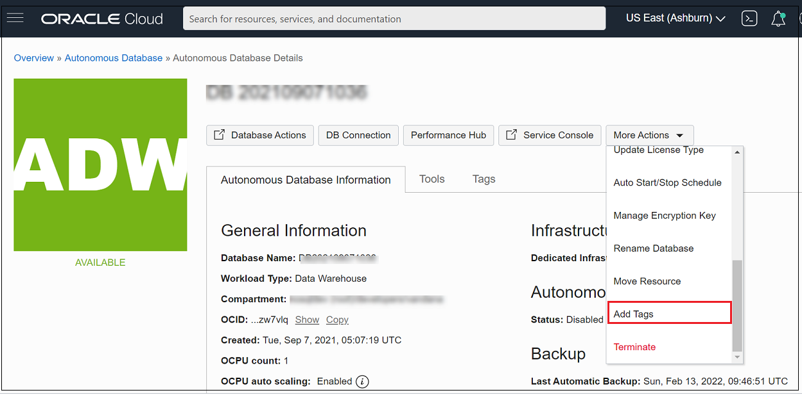

# How can I tag my ADB instance in OCI?
Duration: 5 minutes

Tagging is a metadata system that allows you to organize and track resources within your tenancy. Tags are composed of keys and values that can be attached to resources.

## Create a tag for your ADB instance

1. Open the navigation menu. Click **Oracle Database**. Under Autonomous Database, click Autonomous Data Warehouse, Autonomous JSON Database, or Autonomous Transaction Processing.
2. Choose your **Compartment**.
3. In the list of Autonomous Databases, click the display name of the database you want to administer.
4. Go to **More Actions**, and then click **Add Tags**. To apply a defined tag to a resource, you first select the tag namespace, then the tag key within the namespace, and then you can assign a value.

**Note**:
If the tag key contains a blank value, you can type in a value or leave it blank. If the tag key contains a list, you must select a value from the list.
5. Click **Add Tags**.

You have added a tag to your ADB instance in OCI.

## Learn More
(Managing Tags in OCI)[https://docs.oracle.com/en-us/iaas/Content/Tagging/Tasks/managingtagsandtagnamespaces.htm]
