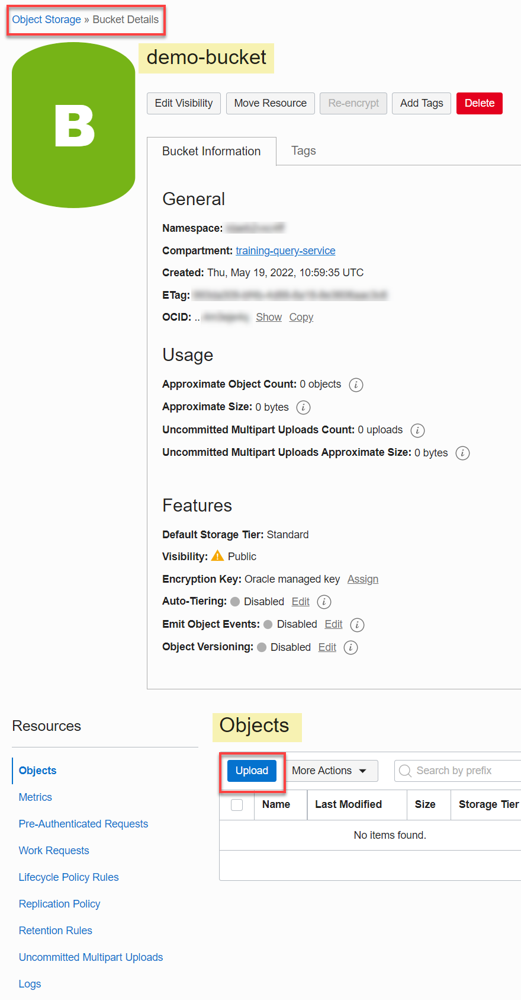
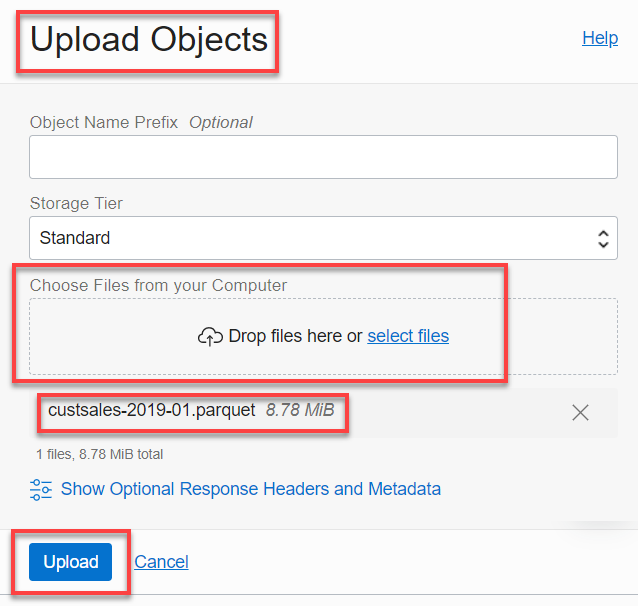
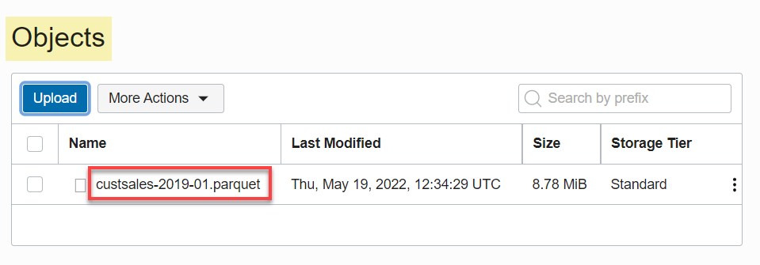

# How do I upload my files to Object Storage?

Duration: 2 minutes

## Upload Files to an Object Storage Bucket

You can upload your files to an Object Storage bucket as follows:

1. Open the **Navigation** menu in the Oracle Cloud console and click **Storage**. Under **Object Storage & Archive Storage**, click **Buckets**.

2. On the **Buckets** page, select the compartment that contains your bucket from the **Compartment** drop-down list in the **List Scope** section. Make sure you are in the region where your bucket was created.

3. On the **Buckets** page, click the bucket's name link to which you want to upload the files. The **Bucket Details** page is displayed.

  

4. Scroll down the page to the **Objects** section, and then click **Upload**.

5. In the **Upload Objects** panel, you can drag and drop a single or multiple files into the **Choose Files from your Computer** field or click **select files** to choose the file(s) that you want to upload from your computer. In this example, we selected a file name `custsales-2019-01.parquet` that we will upload to our Public bucket.

  

6. Click **Upload** to upload the selected file to the bucket.

7. When the file is uploaded, click **Close** to close the **Upload Objects** panel. The **Bucket Details** page is re-displayed. The newly uploaded file is displayed in the **Objects** section.

  

8. To return to the **Buckets** page, click **Object Storage** in the breadcrumbs.

## Learn More

* [Explore more about Object Storage in Oracle Cloud.](https://docs.oracle.com/en-us/iaas/Content/Object/home.htm)
