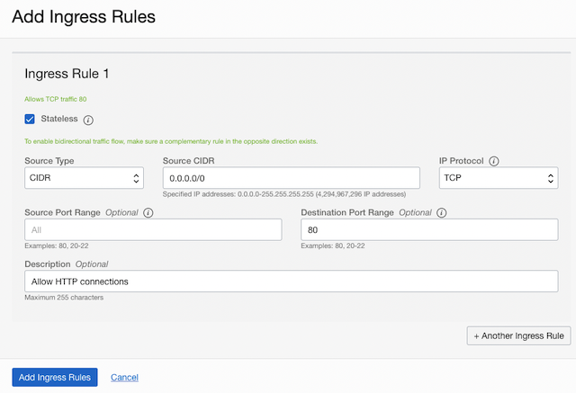

# How can I configure the VNC to allow ingress traffic on port 80?
Duration: 10 minutes

## Create an Ingress Rule for your VCN - example port 80

Follow these steps to select your VCN's public subnet and add the ingress rule.

1. Open the navigation menu and click Networking, and then click Virtual Cloud Networks.
   
2. Select the VCN you created with your compute instance.
   
3. With your new VCN displayed, click <your-subnet-name> subnet link.
    The public subnet information is displayed with the Security Lists at the bottom of the page. A link to the Default Security List for your VCN is displayed.

4.  Click the Default Security List link.
        The default Ingress Rules for your VCN are displayed.

5.  Click Add Ingress Rules.
        An Add Ingress Rules dialog is displayed.

6.  Fill in the ingress rule with the following information.
        Fill in the ingress rule as follows:

        -   Stateless: Checked
        -   Source Type: CIDR
        -   Source CIDR: 0.0.0.0/0
        -   IP Protocol: TCP
        -   Source port range: (leave-blank)
        -   Destination Port Range: 80
        -   Description: Allow HTTP connections
    
       Click Add Ingress Rules. Now HTTP connections are allowed. 

       

7.  Click Add Ingress Rules.
    Now HTTP connections are allowed. 

You have successfully created an ingress rule that makes your instance available from the internet.

## Learn More

* [Example: Install WordPress on an Ubuntu Instance](https://docs.oracle.com/en-us/iaas/developer-tutorials/tutorials/wp-on-ubuntu/01-summary.htm)
* [Networking Documentation](https://docs.oracle.com/en-us/iaas/Content/Network/Concepts/overview.htm)

