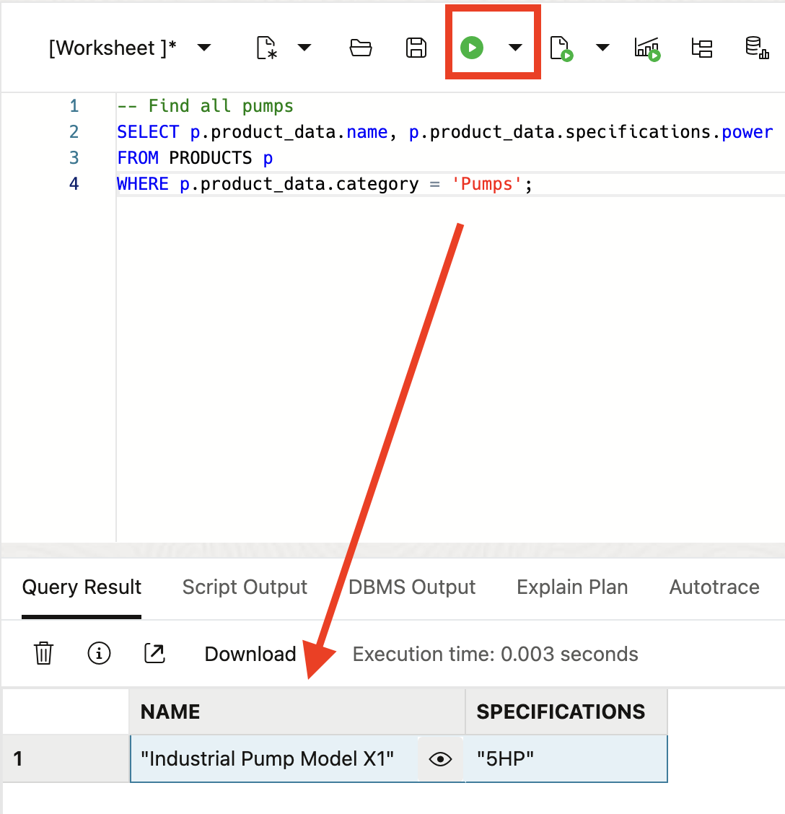

# QuickStart Demo

## Try JSON in Oracle AI Database

This QuickStart provides hands-on code snippets to get you started with JSON and Relational Duality in Oracle AI Database. You can copy and run these SQL commands in your Oracle environment.

### Business Case Example

#### Manufacturing: Product Catalogs and Inventory Management

Manufacturers can manage complex product specifications, track inventory levels, and handle hierarchical data efficiently using JSON documents and duality views in Oracle AI Database. The following steps will show you how!

### Step 1: Create a Table for JSON Data

1. Log in to your ADB instance and open SQL worksheet

    


2. Create a table to store JSON documents. This example creates a product catalog table for a manufacturing company.
    
    ```sql
    <copy>
    DROP TABLE products;
    CREATE TABLE products (
        id NUMBER GENERATED ALWAYS AS IDENTITY PRIMARY KEY,
        product_data JSON
    );
    <copy>
    ```

    


### Step 2: Insert JSON Documents

1. Insert JSON data representing manufacturing products with nested specifications.
    
    ```sql
    <copy>
    INSERT INTO products (product_data) VALUES (
        JSON('{
            "name": "Industrial Pump Model X1",
            "category": "Pumps",
            "manufacturer": "Acme Manufacturing",
            "specifications": {
                "power": "5HP",
                "voltage": "480V",
                "flow_rate": "100 GPM",
                "materials": ["stainless steel", "cast iron"]
            },
            "inventory": {
                "quantity": 150,
                "location": "Warehouse A",
                "reorder_point": 50
            },
            "pricing": {
                "list_price": 2500.00,
                "discount_eligible": true
            }
        }')
    );
    <copy>
    ```

2. Insert JSON data for manufacturing products
    
    ```sql
    <copy>
    INSERT INTO products (product_data) VALUES (
        JSON('{
            "name": "Conveyor Belt System C2",
            "category": "Conveyors",
            "manufacturer": "TechConvey Inc",
            "specifications": {
                "length": "50ft",
                "width": "24in",
                "belt_type": "modular plastic",
                "speed": "200 ft/min"
            },
            "inventory": {
                "quantity": 25,
                "location": "Warehouse B",
                "reorder_point": 10
            },
            "pricing": {
                "list_price": 15000.00,
                "discount_eligible": false
            }
        }')
    );
    <copy>
    ```
    

### Step 3: Query JSON Data

1. Use SQL/JSON functions to query the JSON documents.
    ```sql
    <copy>
    -- Find all pumps
    SELECT p.product_data.name, p.product_data.specifications.power
    FROM products p
    WHERE p.product_data.category = 'Pumps';
    <copy>
    ```
    

2. Find any low inventory products
    ```sql
    <copy>
    -- Find products with low inventory
    SELECT p.product_data.name, p.product_data.inventory.quantity
    FROM products p
    WHERE p.product_data.inventory.quantity < p.product_data.inventory.reorder_point;
    <copy>
    ```
    

3. Extract nested values 
    ```sql
    <copy>
    -- Extract nested values
    SELECT p.product_data.name,
        JSON_VALUE(p.product_data, '$.pricing.list_price') as price,
        JSON_VALUE(p.product_data, '$.inventory.location') as location
    FROM products p;
    <copy>
    ```
    

### Step 4: Create a Duality View

1. Create a duality view that provides relational access to the JSON data.

    ```sql
    <copy>
    CREATE OR REPLACE JSON DUALITY VIEW products_dv AS
    SELECT JSON {
        '_id' : p.id,
        'name' : JSON_VALUE(p.product_data, '$.name'),
        'category' : JSON_VALUE(p.product_data, '$.category'),
        'manufacturer' : JSON_VALUE(p.product_data, '$.manufacturer'),
        'specifications' : JSON_VALUE(p.product_data, '$.specifications'),
        'inventory' : JSON_VALUE(p.product_data, '$.inventory'),
        'pricing' : JSON_VALUE(p.product_data, '$.pricing')
    }
    FROM products p;
    <copy>
    ```
2. Congratulations, your JSON Duality View was created successfully!
     
    

### Step 5: Query the Duality View

1. Access the same data through the duality view as a JSON collection.

    ```sql
    <copy>
    -- Select all products as JSON
    SELECT * FROM products_dv;
    <copy>
    ```
    

    ```sql
    <copy>
    -- Find products by category using JSON path
    SELECT * FROM products_dv
    WHERE JSON_VALUE(data, '$.category') = 'Pumps';
    <copy>
    ```
    
    
2. Update the `products` inventory using duality view
    ```sql
    <copy>
    -- Update inventory through the duality view
    UPDATE products_dv
    SET data = JSON_TRANSFORM(data, SET '$.inventory.quantity' = 140)
    WHERE JSON_VALUE(data, '$.name') = 'Industrial Pump Model X1';
    <copy>
    ```
    

Congratulations, you have successfully completed the QuickStart Demo on JSON in Oracle Database!

## Acknowledgements
* **Author** - Linda Foinding, Database Product Management
* **Contributors** - Kevin Lazarz, William Masdon, Pat Sheppard, Francis Regalado, Brianna Ambler
* **Last Updated By/Date** - Linda Foinding, September 2025
