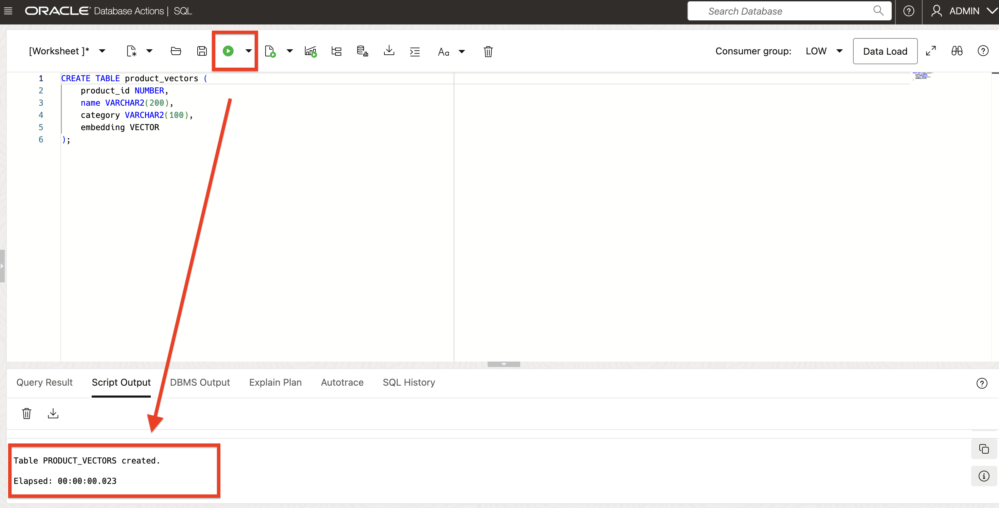

# QuickStart Demo

## Try AI Vector Search in Oracle Database 23ai

This QuickStart provides hands-on code snippets to get you started with AI Vector Search. You can copy and run these SQL commands in your Oracle Database 23ai environment.

### Prerequisites

- Oracle Database 23ai with AI Vector Search enabled.
- For ONNX models, load the prebuilt `DEMO_MODEL`

### Business Case Example

#### Retail: Product Recommendations and Customer Insights

Retailers can enhance product discovery by finding similar items or understanding customer preferences through vector search on product descriptions and reviews. The following steps will show you show!

### Step 1: Check Model Existence and Perform Example Search

1. Check if the ONNX model called `DEMO_MODEL` exists.
    
    ```sql
    <copy>
    DECLARE
        model_count INT;
    BEGIN
        -- Check if the DEMO_MODEL exists
        SELECT count(*) INTO model_count
        FROM all_mining_models
        WHERE model_name = 'DEMO_MODEL';

        -- If the model exists, output a message
        IF (model_count > 0) THEN
            DBMS_OUTPUT.PUT_LINE('DEMO_MODEL exists, proceed to the next step for using it.');
        ELSE
            DBMS_OUTPUT.PUT_LINE('DEMO_MODEL does not exist, please load the model.');
        END IF;
    END;
    /
    <copy>
    ```
2. DEMO_MODEL exists, proceed to the next step for using it

    

### Step 2: Create a Table with a Vector Column

1. Create a table to store vectors. The VECTOR datatype is new in Oracle Database 23ai.
    ```sql
    <copy>
    -- Create table for product embeddings
    CREATE TABLE product_vectors (
        product_id NUMBER,
        name VARCHAR2(200),
        category VARCHAR2(100),
        embedding VECTOR
    );
    <copy>
    ```        
2. Validate the results

    

### Step 3: Generate Embeddings
1. Use the built-in embedding function to convert text into vectors. Now that the model is loaded, you can generate embeddings.
    ```sql
    <copy>
    -- Insert product data with embeddings
    INSERT INTO product_vectors (product_id, name, category, embedding)
    VALUES (
        1,
        'Wireless Bluetooth Headphones',
        'Electronics',
        dbms_vector_chain.utl_to_embedding(
            'Wireless Bluetooth Headphones with noise cancellation',
            JSON('{"provider":"database","model":"DEMO_MODEL","dimensions":384}')
        )
    );
    <copy>
    ```
    

2. Insert 10 additional rows into the product_vector table
    ```sql
    <copy>
    INSERT INTO product_vectors (product_id, name, category, embedding)
    VALUES (
        2,
        'Smartphone Case',
        'Accessories',
        dbms_vector_chain.utl_to_embedding(
            'Protective smartphone case with screen protector',
            JSON('{"provider":"database","model":"DEMO_MODEL","dimensions":384}')
        )
    );

    INSERT INTO product_vectors (product_id, name, category, embedding)
    VALUES (
        3,
        'Running Shoes',
        'Footwear',
        dbms_vector_chain.utl_to_embedding(
            'Comfortable running shoes with cushioning',
            JSON('{"provider":"database","model":"DEMO_MODEL","dimensions":384}')
        )
    );

    INSERT INTO product_vectors (product_id, name, category, embedding)
    VALUES (
        4,
        'Coffee Maker',
        'Appliances',
        dbms_vector_chain.utl_to_embedding(
            'Automatic coffee maker with programmable timer',
            JSON('{"provider":"database","model":"DEMO_MODEL","dimensions":384}')
        )
    );

    INSERT INTO product_vectors (product_id, name, category, embedding)
    VALUES (
        5,
        'LED Desk Lamp',
        'Lighting',
        dbms_vector_chain.utl_to_embedding(
            'Adjustable LED desk lamp with USB charging port',
            JSON('{"provider":"database","model":"DEMO_MODEL","dimensions":384}')
        )
    );

    INSERT INTO product_vectors (product_id, name, category, embedding)
    VALUES (
        6,
        'Yoga Mat',
        'Sports',
        dbms_vector_chain.utl_to_embedding(
            'Non-slip yoga mat with carrying strap',
            JSON('{"provider":"database","model":"DEMO_MODEL","dimensions":384}')
        )
    );

    INSERT INTO product_vectors (product_id, name, category, embedding)
    VALUES (
        7,
        'Wireless Mouse',
        'Electronics',
        dbms_vector_chain.utl_to_embedding(
            'Ergonomic wireless mouse with long battery life',
            JSON('{"provider":"database","model":"DEMO_MODEL","dimensions":384}')
        )
    );

    INSERT INTO product_vectors (product_id, name, category, embedding)
    VALUES (
        8,
        'Backpack',
        'Bags',
        dbms_vector_chain.utl_to_embedding(
            'Waterproof backpack with multiple compartments',
            JSON('{"provider":"database","model":"DEMO_MODEL","dimensions":384}')
        )
    );

    INSERT INTO product_vectors (product_id, name, category, embedding)
    VALUES (
        9,
        'Blender',
        'Appliances',
        dbms_vector_chain.utl_to_embedding(
            'High-speed blender for smoothies and soups',
            JSON('{"provider":"database","model":"DEMO_MODEL","dimensions":384}')
        )
    );

    INSERT INTO product_vectors (product_id, name, category, embedding)
    VALUES (
        10,
        'Sunglasses',
        'Accessories',
        dbms_vector_chain.utl_to_embedding(
            'Polarized sunglasses with UV protection',
            JSON('{"provider":"database","model":"DEMO_MODEL","dimensions":384}')
        )
    );

    INSERT INTO product_vectors (product_id, name, category, embedding)
    VALUES (
        11,
        'Notebook',
        'Stationery',
        dbms_vector_chain.utl_to_embedding(
            'Lined notebook with hardcover and elastic closure',
            JSON('{"provider":"database","model":"DEMO_MODEL","dimensions":384}')
        )
    );
    <copy>
    ```
    

### Step 4: Perform a similarity search

1. Execute the vector search query using VECTOR_DISTANCE for product recommendations based on the embeddings
    ```sql
    <copy>
    DECLARE
        CURSOR product_cursor IS
            SELECT product_id, name, category,
                VECTOR_DISTANCE(
                    embedding,
                    dbms_vector_chain.utl_to_embedding(
                        'Portable music headphones with good sound quality',
                        JSON('{"provider":"database","model":"DEMO_MODEL","dimensions":384}')
                    ),
                    COSINE
                ) AS similarity_score
            FROM product_vectors
            ORDER BY similarity_score;

        product_id NUMBER;
        name VARCHAR2(200);
        category VARCHAR2(100);
        similarity_score NUMBER;
    BEGIN
        DBMS_OUTPUT.PUT_LINE('Using DEMO_MODEL for vector-based operations...');

        -- Open the cursor and fetch results
        OPEN product_cursor;
        LOOP
            FETCH product_cursor INTO product_id, name, category, similarity_score;
            EXIT WHEN product_cursor%NOTFOUND;

            -- Output the result for each row (for debugging or checking)
            DBMS_OUTPUT.PUT_LINE('Product ID: ' || product_id || ', Name: ' || name || ', Category: ' || category || ', Similarity Score: ' || similarity_score);
        END LOOP;

        -- Close the cursor
        CLOSE product_cursor;
    END;
    /
    <copy>
    ```
2. Congratulations, you have succesfully completed your first AI Vector Search similarity search!

    

These snippets demonstrate the core concepts and practical applications. For production use, consider security, error handling, and performance tuning.

## Walkthrough

(placeholder for walkthrough video)
[](youtube:REPLACE_WITH_VIDEO_ID)

## Acknowledgements
* **Author** - Linda Foinding, Database Product Management
* **Contributors** - Kevin Lazarz, William Masdon, Pat Sheppard, Francis Regalado, Brianna Ambler
* **Last Updated By/Date** - Linda Foinding, September 2025
